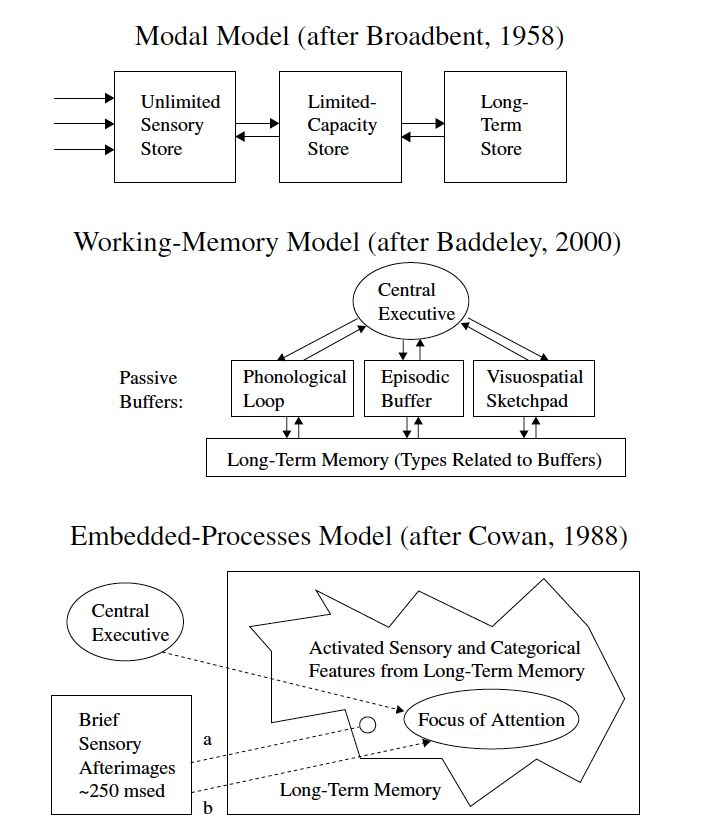

# Theoretical Background and Rationale {#intro}

## What is melodic dictation? and Why?

Melodic dictation is the process in which an individual hears a melody, retains it in memory, and then uses their knowledge of Western musical notation to recreate the mental image of the melody on paper in a limited time frame.
For many, becoming proficient at this task is at the core of developing one's aural skills [@karpinskiModelMusicPerception1990].
For over a century, music pedagogues have valued melodic dictation^[In his highly influential book _Aural Skills Acquisition: The Development of Listening, Reading, and Performing Skills in College-Level Musicians_, @karpinskiAuralSkillsAcquisition2000 documents this sentiment in music pedagogy circles by highlighting poetic adages from Romantic composer Robert Schumann in the mid 19th century through 21st century music educator Charles Elliott in the opening of his book, thus providing concrete examples of the belief that improving one's aural skills, or _ear_, is a highly sought after advanced skill.] which is evident from the fact that most aural skills texts with content devoted to honing one's listening skills have sections on melodic dictation [@karpinskiAuralSkillsAcquisition2000].
Additionally, any school accredited by the National Association of Schools of Music in North America requires students to learn this skill  [@NationalAssociationSchools2018 §VIII.6.B.2.A].

Yet despite this tradition and ubiquity, the rationales as to _why_ it is important for students to learn this ability often comes from some sort of appeal to tradition or underwhelming anecdotal evidence.
The argument tends to go that time spent learning to take melodic dictation results in increases in near transfer abilities after an individual acquires a certain degree of proficiency learning to take melodic dictation. 
Rationales given for why students should learn melodic dictation has even been described by Gary Karpinski as being based on "comparatively vague aphorisms about mental relationships and intelligent listening" [@karpinskiModelMusicPerception1990, p.192], thus leaving the evidence for the argument for learning to take melodic dictation not being well supported. 

Some researchers have taken a more skeptical stance and asserted that the rationale for why we teach melodic dictation deserves more critique.
For example, Klonoski in writing about aural skills education aptly questions "What specific deficiency is revealed with an incorrect response in melodic dictation settings?" [@klonoskiImprovingDictationAuralSkills2006].
Earlier researchers like Potter, in their own publications, have noted how they have been baffled that many musicians do not actually keep up with their melodic dictation abilities after the class ends [@potterIdentifyingSucessfulDictation1990], but presumably go on to have successful and fulfilling musical lives. 
Additionally, suggesting that people who can hear music and then are unable to write it down, thus are unable to think _in_ music [@karpinskiAuralSkillsAcquisition2000], seems somewhat exclusionary to musical cultures that do not depend on any sort of written notation.

Though despite this skepticism towards the topic, melodic dictation remains at the forefront of many aural skills classrooms.
The act of becoming better at this skill may or may not lead to large in increases in far transfer of ability, but used as a pedagogical tool, teaching students to take melodic dictation brings with it concepts that have been deemed relevant to the core of undergraduate music training.
While there has not been extensive research on melodic dictation research in recent years-- in fact @paneyEffectDirectingAttention2016 notes that since 2000, only four studies were published that directly examined melodic dictation-- this skill set sits on the border between literature on learning, melodic perception, memory, and music theory pedagogy.
Understanding and modeling exactly how melodic dictation works remains as a untapped watershed of knowledge for the field of music theory, music education, and music perception and is deserving of much more attention. 

In this chapter I examine literature both directly and indirectly related to melodic dictation by first reviewing the prominent four step model put forth by Karpinski in order to establish and describe what melodic dictation is.
After describing his model, I then critique what this model lacks and clarify what is missing by providing a taxonomy of parameters that presumably would contribute to an individual's ability to take melodic dictation.
Using this taxonomy, I then review relevant literature and assert that the next steps forward in understanding how melodic dictation works come from examing the process both experimentally and computationally.
It has been nearly two decades since _Aural Skills Acquistion_ was first published as the first major step to finally build a bridge between the field of music cognition and music theory pedagogy [@davidbutlerWhyGulfMusic1997a; @karpinskiAuralSkillsAcquisition2000; @klonoskiPerceptualLearningHierarchy2000] and as with all public works, they need to be maintained?^[Yes I know this is an awful metaphor and I will change it eventually] 

### Describing Melodic Dictation 

Much of the foundational theoretical work on the topic of melodic dictation comes from Gary Karpinski.
Summarized most recently in his _Aural Skills Acquisition_ [@karpinskiAuralSkillsAcquisition2000]-- though first presented in an earlier article [@karpinskiModelMusicPerception1990]-- Karpinski proposes a four-step model of melodic dictation.^[This four stage process sythesizes earlier research where in Karpinski 1990 he notes two other models of melodic dictation, one from Rogers where he says there are 2 processes, another from Thomas who says there are 15] 

The four steps of Karpinski's model include

1. Hearing
2. Short Term Melodic Memory
3. Musical Understanding 
4. Notation

and occur as a looping process depicted in Figure \@ref(fig:flowchart).
The model is discussed extensively in both this original article [@karpinskiModelMusicPerception1990] and throughout the third chapter in his book [@karpinskiAuralSkillsAcquisition2000].

```{r flowchart, echo=FALSE, fig.cap="Karpinski Idealized Flowchart of Melodic Dictation",fig.align='center', out.width="100%"}
knitr::include_graphics("img/karpinski31.png")
```

Karpinski's **hearing** stage involves the initial perceptions of the sound at the psychoacoustical level and the listener's _attention_ to the incoming musical information.
If the listener is not actively engaging in the task because of factors such as "boredom, lack of discipline, test anxiety, attention deficit disorder, or any number of other causes" then any further processes later down the model will be detrimentally effected. 
Karpinski notes that these types of interferences are normally "beyond the traditional jurisdiction of aural skills instruction", but I will later argue that the concept of willful attention, when re-conceptualized as working memory, may actually play a larger role in the melodic dictation process than is claimed here.  

The **short-term melodic memory** stage in his process is where musical material is held in active memory.
From Figure 1 it appears that the stage is not conceptualized as an active process where something like active rehearsal would occur, but rather just consists soley of passive mental representation.
Though Karpinski does not posit any sort of active process in the short term melodic memory stage, he does suggest there are two separate memory encoding mechanisms, one for contour, and one for pitch.
He arrives at these two mechanisms by using both empirical qualitative interview evidece as well as noting literature from music perception that supports this claim for contour [@dowlingScaleContourTwo1978;@dewittRecognitionNovelMelodies1986] and literature suggesting that memory for melodic material is dependant on enculturation [@ouraMemoryMelodiesSubjects1988;@handelListeningIntroductionPerception1989; @dowlingExpectancyAttentionMelody1990]. 
Since its publication in 2000, this area of research has expanded with other reearchers also demonstrating the effects of musical acculturation via exposure [@eerolaExpectancySamiYoiks2009; @stevensMusicPerceptionCognition2012;@pearceAuditoryExpectationInformation2012].

In describing the short term melodic memory stage, Karpinksi also details two processes that he believes to be nesscary for this part of melodic dictation: extractive listening and chunking.
Noting that there is probably some sort of capacity limit to the perception of musical material, citing Miller [-@millerMagicalNumberSeven1956], Karpinski explains how each strategy might be used.
Extractive listening is the process in which someone dictating the melody will selectivly remember only a small part of the melody in order to lessen the load on memory. 
Chunking is the process in which smaller musical elements can be fused together in order to expand how much information can be actively held in memory and manipulated.
The concept of chunking is very helpful as a pedagogical tool, but as detailed below, is a complicated concept to pin down how it works.

After some musical material is extracted, then represented in memory, the next step in the process is **musical understanding**.
At this point in the dictation the dictator needs to take the extracted musical material that is represented in memory and the use their music theoretic knowledge in order to comprehend any sort of hierarchical relationships between notes, common rhythmic groupings, or any sorts of tonal functions.
This is the point in the process where solimization of either or both pitch and rhythm, and musical material might be understood in terms of relative pitch.
In the model solimization takes place later, but it is worth questioning if it is possible to dissacociate relative pitch relations from the qualia of the tones themselves [@arthurPerceptualStudyScaledegree2018].
For Karpinski, the more quickly what is represented in musical memory can be understood, the more quickly it can then be tranlated at the final step of notation.

**Notation**, the final step of the dictation loop, requires that the individual taking the notation have sufficient knowledge of Western musical notation so that they are able to translate their musical understanding into written notation.
This last step is ripe for errors and has proved problematic for researchers attempting to study dictation [@taylorStrategiesMemoryShort1983;@klonoskiImprovingDictationAuralSkills2006].
It is also worth highlighting is that it is difficult to notate musical material if the individual who is dictating does not have the requisite musical category and knowledge for the sounds.
Lack of this knowledge will limit an individual's ability to translate what is in their short term melodic memory into notation, even if it is perfectly represented in memory!

The final parts of the chapter, Karpinski notes that other factors like **tempo**, the **length and number of playings**, and the **duration between playings** will also play a role in determining how an individual will perform on a melodic dictation.
While this framework can help illuminate this cognitive process and help pedagogues understand how to best help their students, presumably there are many more factors that contribute to this process.
The model as it stands is not detailed enough for explanatory purposes and lacks in two areas that would need to be expanded if this model were to be explored experimentally and computationally.

First, having a single model for melodic dictation assumes that all individuals are likely to engage in this sequential ordering of events.
This could in fact be the case^[And in his Figure 3.1 he does caption it as an _idealized_ dictation process], but there is research from music perception [@goldmanImprovisationExperiencePredicts2018a] and other areas of memory psychology such as work on expert chess players [@laneChessKnowledgePredicts2018] that suggests that as individuals gain more expertise, their processing and categorization of information changes. 
Additionally, different individuals will most likely have different experiences dictating melodies based on their own past listening experience, an area that Karpinski refers to when citing literature on musical enculturation based on statistical exposure. 
The model does not have any flexibility in terms of individual differences.

Second, the model presumes the same sequence of events for every melody.
As a general heurstic for communicating the process, this process is generalizable, but intuition would suggest that treating all melodies the same is not going to lead to having a robust model.
For example, on page 103, Karpinski suggest that two listenings should be adequate for a listener with few to no chunking skills to listen to be able to dictate a melody of twelve to twenty notes. 
This process might generalize to many tonal melodies, but presumably different strategies in recognition would be involved in dictating the two melodies of equal length shown in Figure \@ref(fig:shortmelody1) and \@ref(fig:shortmelody2).

```{r shortmelody1, echo=FALSE, fig.cap="Tonal Melody",fig.align='center', out.width="80%"}
knitr::include_graphics("img/musicalexamples/MMD_Figure2-1.png")
```

```{r shortmelody2, echo=FALSE, fig.cap="Atonal Melody",fig.align='center', out.width="80%"}
knitr::include_graphics("img/musicalexamples/MMD_Figure2-1.png")
```

Presumably different people with different levels of abilities will perform differently on different melodies and while helpful as a pedaogogical tool, this one size-fits-all approach to melodic dictation is not robust.
This agnosticism for both variability for melodic and individual differences serves as a stepping off point for this study.
In order to have a more through understanding of melodic dictation, there needs to be a model that is able to accomodate the exhaustive differences at both the individual and musical levels.
Additionally, the model should be able to be operationalized so that it can be explored in both experimental and computational settings.
By explicitly stating variables thought to contribute and noting how melodic dictation works, it will give the community a better sense of the melodic dictation process, which will then enable a more through understanding of melodic perception and subsequently allow for better teaching practices in aural skills classrooms.

At this point, it is worth stepping back and noting that the sheer amount of variables at play here is cumbersome and almost haphazard.
In order to better understand and organize factors thought to contribute to this process, it would advantagous for future research to taxonomize the multitude of features thought to contribute to melodic dictation.
In doing this, it wil allow for a clearer picture of what factors might contribute and what literatures to explore in order to learn more about them.

The taxonomy that I propose appears in Figure \@ref(fig:taxonomy) and bifucates the possible factors thought to affect an individual's ability to take melodic dictation into two categories: **individual** parameters and **musical** parameters.
Each of these two categories can then be split again into **cognitive** and **environmental** parameters as well as **structural** and **experimental factors** respectively.
Below I expand on what these categories entail, then explore each in depth.

```{r taxonomy, echo=FALSE, fig.cap="Taxonomy of Factors Contributing to Aural Skills",fig.align='center', out.width="80%"}
knitr::include_graphics("img/taxonomy4.png")
```

The **individual** parameters split broadly into **cognitive factors**, or factors of people that are relatively consistent with people over time and could be understood as largely being governed by _nature_.
The other category of this division consist of factors that change with training and exposure and could be understand as largely being governed by _nurture_.
This second set of parameters are the **environmental** factors.
These categories are not deterministic, nor exclusive, and almost inevitably interact with one another.^[Could footnote this interaction and talk about how AP people generally need to have genetic predisposition, fixed pitch instrumetn in house, and start at early age CITATION FOR THAT?]

For example, it would be possible to imagine an individual with higher cognitive ability, the oppertunity to have a high degree of training early on in their musical career, and personality traits that are associated with higher learning aptitudes.
This individual's musical perception abilities might be markedly different than someone with lower cognitive abilities, no opertunity for individualized training, come from a lower socio-economic status, and not have a general inclination to even take music lessons.
This variability at the individual level might then lead to differences in their ability to take melodic dictation.

Complementing the individual differences, there would also be differences at the **musical** level which in turn divides into two categories.
On one hand exists the **structural aspects** of the melody itself.
These are aspects of the melody that would remain invariant when written down on a score.
Parameters in this category would include features generated by the interval structure of the pitches over time that allow the melody to be categorically distinct from other melodies.
These structural features are then complimented by the **experimental features** which are emergent properties of the structrual relation of the pitches over time based on performance pratice choices.
Examples of these parameters would include, key, tempo, note density, timbral qualities, and the amount of times a melody is played during a melodic dictation or emergent properties like a melody's tonalness as computed through various metrics. 
This division is not an exhaustive, categorical divide.
One could imagine exceptions to these rules where a melody is tranformed to the minor key, ornamented, and then played with extenive rubato and experienced as a phenomenologically similiar experience.

Given all of these parameters that could contribute to the melodic dictation process, the remainder of this chapter will exploring literature using this taxonomy as a guide.
The chapter conculdes with a reflection on operationalizing each of these factors and problems that can arise in modeling and reminds the reader about the dangers of statistical reification.
These are important to note since from an empirical standpoint, both the task as well as the process of melodic dictation as depicted by Karpinksi resemble something that could be operationalized as both an experiment, as well as a computational model and if understood this way will be subjectd to the same types of critique. 

## Individual Factors

### Cognitive

Research from cognitive psychology suggests that individuals differ in their perceptual and cognitive abilities in ways that are both stable throughout a lifetime and are not easily influened by short term traning.
When investigated on a large scale, these abilities-- such as general intelligence or working memory capacity-- predict a wealth of human behavior on a large scale ranging from longevity, annual income, ability to deal with stressful life events, and even the onset of Alzheimer's disease [@ritchieIntelligenceAllThat2015; @unsworthAutomatedVersionOperation2005]. 
Given the strength and generality of these predictors, it is worth investigating the extent that these abilities might contribute when investigating any modeling of melodic dictation.
It is imporant to understand the degree to which these cognitive factors might influence aural skills abilities in order to ensure that the types of assesments that are given in music schools validly measure abilities that individuals have the ability to improve upon.
If it is the case that much of the variance in a student's aural skills grades can be attributed to something the student has little control over, this would call for a serious upheaval of the current model of aural skills teaching and assesment.

Recently there has been a surge of interest in this area ^[DO I CITE THINGS HERE LIKE THAT WORK OF NANCY ROGERS, LEIGH VAN HANDLE, THE UTAH GUY, GARY KARPINSKIS ICMPC, THE FORM AT SMPC] which could be attributed to the fact that educators are picking up on the fact that cognitive abilities are powerful predictors and need to be understood since they inevitably will play a role in pedagogical settings. 

Before diving into a discussion regarding differences in cognitive ability, I should note that sometimes ideas regarding differences in cognitive ability been hostily received (citation against people talking about IQ) and for good reasons.
Research in this area can and has been taken advantage to further specious ideologies, but often arguments that assert meaningful differences in cognitive abilities between groups are founded on statistical misunderstandings and have been debunked in other literature [@gouldMismeasureMan1996].
Considering that, it then becomes very difficult to maintain a scientific commitment to the theory of evolution [@darwinOriginSpecies1859] and not expect variation in all aspects of human behavior, with cognition falling within that umbrella.
Even given this statement, measuring a theoretical construct such as an aspect of cognition desereves to be examined since the ability to validly and reliably measure an individual's cognitive ability is a fundmental assumption of this study.

### Measuring Intelligence

Attempting to measure and quantify aspects of cognition go back over a century.
Even before concepts of intelligence were posited by Charles Spearman and his conception of _g_ [@spearmanGeneralIntelligenceObjectively1904], scientists were interested in establishing links between an individual's mental capacities and some sort of physical manifestation.
The origins of this area of research have been critiqued on the basis that the early work implicitly tended to validate preconceptualized beliefs on the superiority of certain groups of peoples and used methodlogies that today would be considered risible.

* For example, BROCA thought he could get at intelligence by measuring skulls AND MORTON 
* Or Spitzka who post hoc measured eminance and brain size page 127

While not immediatly relevant to current thinking in cognitive psychology, work from both Broca and XXX was continued by the American herediterian school of IQ (page 187 in Gould) and the early research done by Alfred Binet on IQ took inspiration from Broca.
This lineage of ideas has often been used to tarnish systematic investigations into differences in cognitive ability, which from their outset were to initially funded by the French governement to identify children struggling in the classroom so that they could be given special attention. 

Bient was the initial developer of the idea of an intelligence quotient or IQ^[divide mental age by chronological age then multiply by 100] and provided one of the first ways to attempt to quantify a theoretical concept that was not capable of being manifested in the physical world.
It was also around the same time that researchers like Cyril Burt and Charles Spearmean began developing their new theories of intelligence founded on the reification of factor analysis.
In developing a battry of tests whose performance on one subtest could often reliabily predict performance on another-- a manifestation referred to as the postive manifold-- Spearman and Burt put forth a separate conception of intelligence based on the ability to solve problems without any sort of background information and referred to this ability a _g_ for general intellgience. 

Though seemingly unrelated to the current state of thinking about cognitive abilities, Binet's and Spearman's ideologies about what intelligence is and how to measure it still represent two of the larger schools on cognitive ability.
On one hand their idea that cognitive abilities are based upon a steady growth of incoming information that someone is able to manipulate once they retrieve from long term memor; on the other hand there is a school of thought that there is some sort of measureable construct, _g_ that aids in the process of solving problems that do not depend on any sort of contextuxal information. 
Conceptualizing cognitive ability as these two different constructs inevitably leads to different types of measurements and subsequently what these constructs are then able to predict in terms of human behavior. 

Without detailing entire histories of both lines of thought, Binet's conceptulization manifested into an argument for general crystallized intelligence or _Gc_, or the ability to solve problems based on previously acquired skills.
Spearman and Burt's ideas about _g_ school reflect a belief that individuals have some sort of latent cognitive ability to draw on to perform mental tasks.
The cognitive psychology literature has noted that _g_ often shares a statistically equivalent relationship to idea conceptualized as general fluid intelligence _Gf_, or the ability to solve problems in novel situations Cattell, 1971; Horn, 1994).
This distinction between _Gf_ and _Gc_ is different than that of _g_, but again it should be noted that _Gf_ and _g_ share a statistically identical relationship Matzke, Dolan, and Molenaar (2010).
These conceptions of intelligenec and cognitive ability aslo differ from more current theories that sythesize these previous areas of research [@kovacsProcessOverlapTheory2016].

Even though both of these constructs are powerful predictors on a large scale and do predict things like educational success, income, and even life expectancy [@ritchieIntelligenceAllThat2015]-- even when other variables like socioeconomic status are held constant. 
Yet despite this, only conceptualizing cognitive abilities in terms of intelligence does not fully explain the diversity of human cognition.

Another large area in the field of cognitive psychology is the area of working memory capacity.
In addition to concepts of intelligence, be it _Gf_  or _Gc_, the working memory capacity literature also is directly relevant to work on melodic dictation for reasons discussed below. 

### Working Memory Capacity

Working memory is one of the most investigated concepts in the cognitive psychology literature.
According to Nelson Cowan, the term working memory generally refers to 

> the relatively small amount of information that one can hold in mind, attend to, or, technically speaking, maintain in a rapidly accessible state at one time. The term working is mean to indicate that mental work requires the use of such information. (p.1) [@cowanWorkingMemoryCapacity2005]

The term, like most concepts in science, does not have an exact definition, nor does it have a definitive method of measurement.
While there is no universally recognized first use of the term, researchers began to postulate that there was some sort of system that mediated incoming sensory information with the world with the information in long term storage using modular models of memory in the mid-twentieth century. 
Summarized in [@cowanWorkingMemoryCapacity2005], one of the first modal models of memory was proposed by [@broadbentPerceptionCommunication1958] and later expanded by [@atkinsonHUMANMEMORYPROPOSED1968].
As seen in Figure \@ref(fig:wmmodels), both models here posit incoming information that is then put into some sort of limited capacity store.
These modal models were then expanded on by Baddeley and Hitch [@baddeleyWorkingMemory1974] in their 1974 chapter with the name _Working Memory_, where they proposed a system with an central executive module that was able to carry out active maintenance and rehearsal of information that could be stored in either a phonological store for sounds or a visual sketchpad for images.

```{r wmmodels, echo=FALSE, fig.cap="Schematics of Models of Working Memory taken from Cowan, 2005", fig.align='center'}

```


Later revisions of their model also incorporated an episodic buffer [@baddeleyEpisodicBufferNew2000] where the modules were explicitly depicted as being able to interface with long term memory in the rehearsal processes.
The model has even been expanded upon by other researchers throughout its lifetime.
The most relevant to this study is by [@berzWorkingMemoryMusic1995], who postulated adding a musical rehearsal loop to the already established phonological loop and visual spatial sketchpad.
While Berz is most likely correct in asserting that the nature of storing and processing musical information is different to that of words or pictures and there has been experimental evidence to suggest this [@williamsonMusiciansNonmusiciansShortterm2010] that has been interpreted in favor of multiple loops [@wollnerAttentionalFlexibilityMemory2016] , it does introduce the theoretical problem of multiple stores which has been addressed by other researchers.

In addressing the problem of explicitly stating which rehearsal loops do and do not exist, Nelson Cowan proposed a separate model [@cowanEvolvingConceptionsMemory1988; @cowanWorkingMemoryCapacity2005] dubbed the Embedded Process Model which do not claim the existence of any domain specific module (e.g. positing a phonological loop, visual spatial sketchpad) but is rather based on an exhaustive model that did away with the problem of asserting specific buffers for new types of information.

In Cowan's own words comparing his model from that of Baddeley:

> The aim was to see if the description of the processing structure could be exhaustive, even if not complete, in detail. By analogy, consider two descriptions of a house that has not been explored completely. Perhaps it has only been examined from the outside. Baddeley's (1986) approach to modeling can be compared with hypothesizing that there is a kitchen, a bathroom, two equal-size square bedrooms, and a living room. This is not a bad guess, but it does not rule out the possibllity that there actually are extra bedrooms or bathroom, that the bedroom space is apportioned into two rooms very different in size, or that other rooms exist in the house. Cowan's (1988) apporach, on the other hand, can be compared with hypothesizing that the house includes food preparating quarters, sleeping quarters, batroom/toilet quarters, and other living quarters. It is meant to be exhaustive in that nothing was left out, even though it is noncommital on the details of some of the rooms. p.42 Cowan, 2005.

The system is depicted in the bottom tier of TABLE X, and conceptualizes the limited amount of information that is readily available as being in the focus of attention, with activated sensory and categorical features of what is in the focus of attention to be accessible nearby.
Moving further from the locus of attention is long term memory, whose content can be turned to by using the central executive to access non-immediately available information. 
In contrast to the modular approaches, Cowan's framework does not require the researchers to specify exactly how and where each the incoming information is being stored which makes it advantageous for studying complex stimuli such as music and melodies.

In addition to having multiple frameworks for studying working memory capacity, there is also the problem of limits to the working memory system, often referred to as the working memory capacity. 
Most popularized by Miller in his famous [@millerMagicalNumberSeven1956] speech turned article, Miller suggests out of jest that the number 7 might be worth investigating, which has been used as a point of reference for many researchers since then. 
It is worth nothing that Miller has since gone on record as noting that using 7 (plus or minus 2) was a rhetorical device used to string together his speech [@millerHistoryPsychologyAutobiography1989]. 
Nevertheless, while the number seven is most likely a red herring, it did inspire a large amount of research on capacity limits.
In the decades since the number 7 has been reduced to about 4 [@cowanMagicalMysteryFour2010] and research around capacity limits has been investigated using a variety of novel tasks, most noteable the complex span task CITATION.   
When used as predictors in both higher and lower cognitive tasks, measures of working memory capacity predict performance well and additionally tend to be stable across a lifetime [@unsworthAutomatedVersionOperation2005].

#### Parallels Between Working Memory and Melodic Dictation

Given its predictive strength as well as its direct similarity to tasks of melodic dictation, a in depth look at the literature is warranted.   
Clearly an individual's ability to take in sensory information, maintain it in memory, actively carry out other tasks (like notating said melody) are almost identical to tasks of working memory capacity. 
Before venturing onward from this striking parallel, tasks investigating working memory capacity differ from melodic dictation tasks in a few key ways.
The first is that musical information is always sequential: a melodic dictation task would never require the student to recall the pitches back in scrambled orders.
Serial order recall is an important characteristic in the scoring and analyzing of working memory tasks [@conwayWorkingMemorySpan2005], but musical tones do not appear in random order and are normally in discernable chunks as discussed by Karpinski[@karpinskiAuralSkillsAcquisition2000].
The use of chunks is pervasive in much of the memory literature, but often is used as more of a heuristic to help explain that information in the environment and why it is often grouped together.
Of the problems with chunking, most are related to music and have relevance to melodic dictation.
Below I review the problems with chunking noted by Cowan [@cowanWorkingMemoryCapacity2005], and any pertitant music psychology literature. 

1. _Chunks may have a hierarchical organization._ Tonal music has historically been understood to be hierarchical [@krumhanslCognitiveFoundationsMusical2001; @meyerEmotionMeaningMusic1956; @schenkerFreieSatz1935] with the study for memory for tones being confounded by some pitches being undestood by their relation to structurally more important tones. 
2. _The working memory load may be reduced as working memory shifts between levels in hierarchy._ If an individual understands a chunk to be something such as a major triad, the load on working memory would be less since it that information could be understood as a singular chunk. 
3. _Chunks may be the endpoints of a continuum of associations._ Pairing a group of tones together that might be functionally anomolous like... 
4. _Chunks may include asymmetrical information._ More tonal possibilities are possible from a stable note like tonic or dominant, whereas in a tonal context, a raised scale degree #$\hat{4}$ when understood in a functional context would be taken as having stricter transitional probabilities (#$\hat{4} \rightarrow \hat{5}$). 
5. _There may be a complex network of associations._ If a set of pitches sounds like a similar set of pitches from long term memory , the information coming in can not be understood as being separate units of working memory.
6. _Chunks may increase in size rapidly over time._ Three tones that are seemingly unrelated when incoming like E4, G5, C5 might enter sensory perception as three different tones, but then be fused together when they are understood as one chunk-- a first inverstion major triad. 
7. _Information in working memory may benefit from rapid storage in long term memory._ Given the amount of patterns that an individual learns and can understand, as soon as something is fused, it could be encoded in long term memory, especially if there is a salient feature in the incoming melodic information such as the immediate recognition of a mode or cadence.

The points by Cowan are important to acknowledge in that it it not possible to directly lift work and paradigms from working memory capcacity to work in music perception.
That said, the enormous amount of theoretical frameworks put forward by the working memory liteature when understood in conjunction with theories in music psychology such as implicit statistical learning [@saffranStatisticalLearningTone1999] can provide for new, fruitul theories.
Past reserachers have noted the strength and predictive abilities of literature from the working memory capacity as aiding research in music perception.
In ending his article positing a musical memory loop to be annexed to the Baddley and Hitch modular model of working memory, Berz [@berzWorkingMemoryMusic1995] captures the power of this concept in the last sentence of his article and warns future reserachers that

> Individual differences portrayed in some music aptitude tests may [sic] represent not talent or musical intelligence but ability, reflecting differences in working memory capacity. p. 362

Berz's assertion has not been exhausivly tested since first published in 1995, but the subject of music, memory, and cognitive abilities has been the focus of research of both psychologists and musicologists alike.
Below I survey literature bordering on both music, as well as cognitive abiltity.

#### Working Memory Capacity and Music 

Of the papers in the music science literature that specifically investigates working memory, each uses different measures, though but all tend to converge on two general findings.
The first is that there are some sort of enhanced memory capabilities in individuals with musical training.
The second is that working memory capacity, however it is measured, often plays a significant role in musical tasks.
Evidence for the first point appears most convincingly in a recent meta analyses by Talamini and colleagues [@talaminiMusiciansHaveBetter2017] who demonstrated via three separate meta-analyses that musicians outperform their non-musical counterparts on tasks dealing with long-term memory, short-term memory, as well as working memory.
The authors also noted that the effects were the strongest in working memory tasks where the stimuli were tonal, which again suggests an advantage of exposure and understanding of the hierarchical organization of musical materials.
In this meta-analyss and others investigating music and cognitive ability, it is important to be reminded that the direction of causality still from these studies cannot be determined using these statistical methodologies.
While it might seem that musical training tends to lead to these increases, it is also possible that higher functioning individuals will self select into musical activities.
Even if there is no seletion bias in engaging with musical activity it also remains a possiblity that of the people that do engage with musical activity, the higher functioning individuals will be less likely to quit over a lifetime.

In terms of musical performance abilities, working memory capacity has also been shown to be a significant predictor.
Kopiez and Lee suggested that working memory capacity should to contribute to sight reading tasks based on research where they found measures of working memory capacity, as measured by a matrix span task, to significantly correlated with many of their measures hypothesized to be related to sight reading ability in pianists at lower difficulty grading [@kopiezDynamicModelSkills2006; @kopiezGeneralModelSkills2008]. 

Following up on this work on sight reading, Meinz and Hambrick [@meinzDeliberatePracticeNecessary2010] found that working memory capacity, as measured by an operation span task, a reading span task, rotation span task, and a matrix span task was able to predict a small amount of variance $R^2=.074(0.067)$ above and beyond that of deliberate practice alone $R^2=.451(.441)$ in a sight-reading task.
More recently, two studies looking at specific sub groups of musicians have shown working memory capacity to significantly contribute to models of performances on musical tasks related to novel stimuli.
[@wollnerAttentionalFlexibilityMemory2016] found that although no differences were found between pianists and conductors in measures of working memory capacity as measured via a set of span tasks, conductors showed superior performance in their attention flexibility. 
Following up on this line of research [@nicholsScoreOneJazz2018] used the same battery of working memory tasks and found that jazz musicians excelled over their classically trained counterparts in a task which required them to hear notes and reproduce them on the piano.
The authors also noted that of their working memory battery, based on standard operation span methods [@engleWorkingMemoryCapacity2002], that the auditory dictation condition scored surprisingly low and further research might consider further work on dictation abilities. 
Additionally [@colleyWorkingMemoryAuditory2018] found that working memory capacity, as measured by a backwards digit span and operation span, to be successful predictors in a tapping task requiring sensory motor prediction abilities.
As mentioned above, each of these tasks where working memory was a significant predictor of performance occured where the task involved active enagement with novel musical material.

The growing evidence in this field suggests that the advantage of working memory capacity to be greatest in both musically trained people, dealing with novel information, using tonal materials.
Since all three of these factors are related to melodic dictation, it would seem sensible to continue to include these measures in tasks of musical perception and continue Berz's assertion that research in music percetion could inadvertently be picking up on individual differences in working memory abilities.

### General Intelligence

As discussed above, the idea of IQ or intelligence has a long history that is bothgood and bad.
When used as a predictor in models it often serves to predict traits that society values like longevity and general income so given its ability to predict in more domain general settings, surveying literature where it applies to musical activity is a worthy task.
Below I use the term intelligence as a catch all term to avoid the historical context of IQ and specify where availible which measure was actually used.
Before surveying the literature here it is also worth noting that reserach on music and intelligence is not as developed as some of the larger studies looking at intelligence which provides problems for both establishing causal directionality, as well as controlling for other factors like self theories of ability, socioeconomic status, and personality [@mullensiefenInvestigatingImportanceSelftheories2015]. 

#### Papers that suggest GF plays a role

* Redo this structure 

As reviewed in @schellenbergMusicNonmusicalAbilities2017, both children and adults who engage in musical activity tend to score higher on general measurses of intelligence than their non-musical peers (Gibson, Folley and Park, 2009; Hille et al., 2011; Schellenberg, 2011a; Schellenberg and Mankarious, 2012) with the duration of training sharing a relationship with the extent of the increases in IQ (Degé, Kubicek and Schwarzer, 2011a; Degé, Wehrum, Stark and Schwarzer, 2015; Corrigall and Schellenberg, 2015; Corrigall, Schellenberg and Misura, 2013; Schellenberg, 2006).
Though many of these studies are correlational, they also have made attempts to control for confounding variables like socio-economic status and parental involvment in out of school activities. (Corrigall et al., 2013; Degé et al., 2011a; Schellenberg, 2006, 2011a, 2011b; Schellenberg and Mankarious, 2012).
Schellenberg notes the problem of smaller sample sizes in his review (Corrigall and Trainor, 2011; Parbery-Clark et al., 2011; Strait, Parbery-Clark, Hittner and Kraus, 2012) in that studies that are typically smaller do not reach statistical significance. 
Schellenberg also references evidence that when professional musicians are matched with non-musicians from the general population there do not seem to be these associations (CITE). 
Schellenberg's review suggests the current state of the literature points to support the hypothesis that higher functioning kids that take music lessons and they tend to stay in lessons longer. 
Additionally, Schellenberg remains skeptical of any sorts of causal factors regarding increases in IQ (e.g., François et al., 2013; Moreno et al., 2009) noting methodlogical problems like how short exposure times were in studies claiming increases in effects or researchers who not holding pre-exisiting cognitive abilitis constant (Mehr, Schachner, Katz and Spelke, 2013).


* [@corrigallMusicTrainingCognition2013]
* [@corrigallMusicTrainingCognition2013a]
* [@swaminathanRevisitingAssociationMusic2017]

### Environmental 

Standing in contrast to factors that individuals do not have a much control over such as the size of their working memory capacity or factors related to their general fluid intelligence, most of the factors we believe contribute to someone's ability to take melodic dictation have to deal with factors related to training and the environment.
In fact, one of the tacit assumptions of getting a music degree revolves around the belief that with deliberate and attentive practice, that an individual is able to move from novice to expertise in their chosen domain.
The idea that time invested results in beneficial returns is probably best exemplified by work produced by @ericssonRoleDeliberatePractice1993 that suggests that performance at more elite levels results from deliberate practice.
Below I review literature that supports this argument, since it's no doubt that someone has to engage in something to be good at it. 

### Musical Training 

* Papers that suggest practicing makes you better? 

* It almost seems redundant to review literature in support of music practice leading to better results.

* List of those papers here

### Aural Training 

In additon to individuals differeng in their general musical abilities-- however they are defined-- individuals also differ in their abilities at the level of their aural skills.
Though not heavily researched in the past few decades [@furbyEffectsPeerTutoring2016], there has been specific research looking at explaining how people do in aural skills examinatons. 
@harrisonEffectsMusicalAptitude1994 examined the effect of aural skills training on undergraduate students by creating a latent variable model investigating musical aptitude, academic ability, musical expertise, and motivation to study music in a sample of 142 undergraduate students and claimed to be able to explain 73% of the variance in aural skills abilities using the variables measured. 
Work from Colin Wright's dissertation found that ... [@wrightInvestigatingAuralCase2016]

These are things that people have suggested people trying to do : 
As noted in @furbyEffectsPeerTutoring2016, researchers in the past have suggested a variety of techniques for improving their abilities in melodic dictation by isolating rhythm and melody [@bantonRoleVisualAuditory1995; @blandSightSingingMelodic1984; @rootMethodicalSightSingingLessons1931; WILSON], listening attentively to the melody before writing [@bantonRoleVisualAuditory1995], recognizing patterns [@bantonRoleVisualAuditory1995; @blandSightSingingMelodic1984; @rootMethodicalSightSingingLessons1931] and silently vocalizing while dictating [@klonoskiImprovingDictationAuralSkills2006]. 

### Sight Singing 

Often described as the other side of the same coin of melodic dictation, sight singing is an area of music pedagogy research that has had sparse attention paid to it given its prevelance in school of music curricula.
Recently [@fournierCognitiveStrategiesSightsinging2017a] catalouged and categorized 14 different sub categories into four larger main cateogories while also providing commenatary on some of the current state of aural skills.
Of the four large categories, they group them into reading mechanisms, sight singing, readings skills acquiskiton, and learnign support. 

FIX HERE 

The authors note a line of research that has documented that university students are often unprepared to sight-read single lines of music (Asmus, 2004; Davidson, Scripp & Welsh, 1988; Fournier, 2015; Thompson, 2004; Vujović & Bogunović, 2012) even though it is, like dictation, thought of as a means for deeper musical understanding. (DeBellis, 2005; Karpinski, 2000; Ottman, 1956; Rogers, 2004; Scripp, 1995; Scripp & Davidson, 1994)
The authors of Fournier et. al also note that sight-reading has been an active area of research due to the often reported relationship that performance on sight reading often predicts several studies have shown links between academic success in sight-singing and predictors such as entrance tests (Harrison, 1987, 1990, 1991; Ottman, 1956; Rodeheaver, 1972; Schleuter, 1983), academic ability (Chadwick, 1933; Harrison, 1990, 1991; Harrison, Asmus, & Serpe, 1994; Rodeheaver,1972), and musical experience (Brown, 2001; Dean, 1937; Furby, 2008; Harrison, 1990, 1991; Harrison et al., 1994; Thostenson, 1967).

Taken as a whole, the research tends to suggesting that learning to be a fluid and compotent sight reader helps musicians hone their skills by bootstrapping other musical skills since the skills needed for sightreading touch on many of the skills used in musical performance like pattern matching and listening for small changes in intonnation.
Each of these individual factors  contributes in a small and significant way and additionally will interact with the other half of the taxonomy: musical parameters.

## Musical Parameters

Transitioning to the other half of the taxonomy on figure X, the other main source of variation on any study looking at melodic perception, and consequently studies of melodic dictation, is the effect of the melody itself.
I find it safe to assume that not all melodies are equally difficult to dictate and assert that variance in the difficulty the melody can partitioned between both **structural** and **experimental** aspects of a melody.
As noted above, there is not a strict deliniation between these two categories since once could imagine drastic maniuplations in experimental parameters in order to result in a phenomenologically different experience of melody.
Questions of transformations of melodies and musical similarity fall have been addressed in ohter research [@cambouropoulosHowSimilarSimilar2009; @wigginsModelsMusicalSimilarity2007] but are beyond the scope of this study.

### Structural 

The notion that the music as represented by a score is able to provide insights towards understanding aspects about music is not new to music theory and anlaysis.
Heinrich Schenker argued for an undertanding of tonal music [@schenkerFreieSatz1935] that asserted hierarchical relationships of notes on the musical surface in the early 20th century and has since been expanded upon by theorists over the past century SALTZER, SCHAKTER, ROTHSTEIN.
Leonard Meyer in his _Emotion and Meaning in Music_ [@meyerEmotionMeaningMusic1956] continued some of these lines of thought and was the first who put forward the idea that tethered the struture that earlier theorists wrote about and suggested that in addition to this struture being fundamental to the perception of the piece that there were also responsible for some aspects of the emotion and meaning listeners found in the piece.

Meyer's work since inspired a line of reserach investigating the perception of the structural aspects of music could be understood with the work of Eugene Narmor [@narmourAnalysisCognitionBasic1990; @narmourAnalysisCognitionMelodic1992], Glenn Schellenberg [@schellenbergSimplifyingImplicationRealizationModel1997], Elizabeth Hellmuth Margulis [@margulisModelMelodicExpectation2005], David Huron  [@huronSweetAnticipation2006] and have inpsired computational, machine learning approaches to expectational frameworks in with work by Marcus Pearce [@pearceAuditoryExpectationInformation2012].

* WHAT IS THE POINT OF ALL THIS RESERACH SETNECE

These general models of melodic perception tend suggest that Meyer was correct in his assertion that computational methodologies could be used to better understand question of melodic perception and strucuture and that there are links between the structure of the music and its perception.^[This whole section sucks]

Turning to studies examining melodic dictation with a focus on musical structure, the first study to examine it extensively was Ortmann in 1933 [@ortmannTonalDeterminantsMelodic1933].
Ortamnn used a series of twenty five-note melodies in order to examine the effects of repetition, pitch direction, conjunct-disjunct motion (contour), interval size, order, and chord structure, all of which he deems to be the _determinants_ of an individual's ability to dictate melodic material.
Though Ortmann did not use any statistical methods to model his data, he did assert that each of his determinants contributed to an individual's ability to dictate musical material.
This work was extended by [@taylorStrategiesMemoryShort1983] which additionally incoporated using musical skill as a predictor and additionally found evidence that these factors contributed to individual dictation abilities in a sample of 122 undergraduate students.  

Although the literature is generally sparce compared to other areas of music cognition, literature exploring the effects of structural characteristics on memory does exist.
Long found that length, tonal structure, contour, and individual traits all contribute to performance on melodic dictation examinations and found that structure and tonalness to have significant, albeit small predictive powers in modeling [@longRelationshipsPitchMemory1977].
One problem with studies such as [@longRelationshipsPitchMemory1977] is that they sometimes would make conspicuous methodloogical decisions such as elimnating individuals who were bad singers for the example.
Not only does this reduce the spectrum of ability levels (assuming that singing ability correlates with dictation ability, a finding since which has been established [@norrisRelationshipSightSinging2003]), but is additinally flawed in that it is at odds both with the intuition that an individual's singing ability cannot be taken as a direct representation of their mental image of the melody and is probably more related to the ability to have motor control over the vocal tract [@pfordresherPoorPitchSingingAbsence2007].

Other researchers have also put forward other paramters thought to contribute like tempo [@hofstetterComputerBaesedRecognitionPerceptual1981]
tonality [@dowlingScaleContourTwo1978] [@longRelationshipsPitchMemory1977] [@pembrookInterferenceTranscriptionProcess1986] [@ouraMemoryMelodiesSubjects1988]
interval motion [@ortmannTonalDeterminantsMelodic1933; @pembrookInterferenceTranscriptionProcess1986]
length of melody [@longRelationshipsPitchMemory1977; @pembrookInterferenceTranscriptionProcess1986]
number of presentations [@hofstetterComputerBaesedRecognitionPerceptual1981] [[@pembrookInterferenceTranscriptionProcess1986]] 
context of presentation [@schellenbergEffectTonalRhythmicContext1985]
listener experience [@longRelationshipsPitchMemory1977; @ouraMemoryMelodiesSubjects1988] [@schellenbergEffectTonalRhythmicContext1985; @taylorStrategiesMemoryShort1983]
familarity of style [@schellenbergEffectTonalRhythmicContext1985]

@pembrookInterferenceTranscriptionProcess1986 provides an extensive detailing of a systematic study to melodic dictation where they used tonality, melody length, and type of motion as variables in their experiment.
They additionally also restricted their experimental melodies to those that were singable.
The authors found all three variables to be significant predictors with tonality explaining 13% of the variance, length explaining 3% of the variance and type of motion explaining 1% of the variance.
The paper also claims that people on average can hear and remember 10-16 notes, which is worth commenting that these 10--16 notes are dependent on the experimental context of the melodies played with the quarter note set to 90 beats per minute. 

Given the lack of consistent methodlogies in adminstration and scoring of these experiments it becomes difficult to find ways to generalize basic findings like expected effect sizes-- especially when the original materials and data have not been recorded-- but there is often interesting theoretical insights to be gleaned. 
For example [@ouraConstructingRepresentationMelody1991a] used a sample of eight people to suggest that when taking melodic dictation, individuals use a system of pattern matching that interfaces with their long term memory in order to complete dictation tasks. 
While this paper does not bring with it exhaustive evidence supporting this claim, the idea is explored in detail in Chapter 6 the idea of pattern matching is used in conjunction with Cowan's embeded process model of working memory. 

More recently the music education community has also began to do research around melodic dictation using both qualitative and quantitiatve methdologies.
[@paneyTeachingMelodicDictation2014] interviewed high school teachers on methods they used to teach melodic dictation and [@gillespieMelodicDictationScoring2001] has done work on investigating methods as to best score melodic dictation.
Other work by [@pembrookSendHelpAural1990] surveyed various methodlogies used by instructurs in aural skills settings. 
Some of these studies consider aural skills as a totality like 
[@norrisRelationshipSightSinging2003] who provided quantiative evidence to suggest most aural skills pedagoge's intuition that there is some sort of relationship between melodic dictation and sight singing. 
Looking at the notorious subset of students with absolute pitch (AP), [@dooleyAbsolutePitchCorrelates2010] provided evidence demonstrated that students with AP tend to outperform their non-AP colleagues in tests of dication.

[SOME OF THESE ARE CLEARLY EXPERIMENTAL AND NEED TO BE PUT THERE]

Continuing exploring the pedagogical liteature, Naton Buonviri and colleagues have also made melodic dictation a central focus of some recent papers.
@paneyTeachingMelodicDictation2014 interviewed high school teachers on methods that they used to teach melodic dictation.
@buonviriEffectsMusicNotation2015 interviewed six sophomore music majors to find sucessful strategies that students enaged with when completing melodic dications. 
@paneyEffectDirectingAttention2016 reported beneficial effects to direct student's attention and guide them through melodic dictation exercises suggesting that some sort of mental organizaton of the dication process is helpful. 
@buonviriMelodicDictationInstruction2015 found that having students sing a preparatory singing pattern after hearing the target melody, essentially a distractor task, hindered performance on melodic dictation.
@buonviriEffectsPreparatorySinging2015... 
@buonviriEffectsMusicNotation2015 found no effects of test presentation format (visual versus aural-visual) using a melodic memory paradigm.
@buonviriEffectsTwoListening2017 reported no significant advatage to listening strategies while partaking in a melodic dictation test. 

#### Recent Computational Musicology Work papers and findings

Using symbolic features of the melodies themselves is not a novel approach as noted in the above literature attempting to predict performance on melodic dictations.
Much of this work pre-dates recent advances in computational musicology such as the advent of technology like David Huron's Humdrum [@huronHumdrumToolkitReference1994] and Michael Cutberth's Music21 [@cuthbertMusic21ToolkitComputerAided2010] which now allows music researchers to systematically digitize symbolic musical material.
In addition to creating accesible frameworks for encoding, the computational power availble exponentially exceeds that of what was availble in the 20th century and has opened up new possibilities in the computational modeling of music.

While I reserve a longer discussion on the histories of computational musicology for the fourth chapter, relevant to this study is the additional ways it is now possible to abstract features from symbolic melodies beyond what was capable in studies such as @ortmannTonalDeterminantsMelodic1933 and @taylorStrategiesMemoryShort1983.

An abstracted feature of a melody is an emergent property of the melody that results from performing some sort of calculation on the melody? 
This type of feature abstraction is in contrast to much of the work done in the field of music information retrivial which often relies on the recorded audio for feature abstraction and is addressed under Experimental features LINK THAT IN!. 
Abstracted symbolic features of melodies can largely be conceptualized as being **static** or **dynamic**.
The above papers tended to use more simplisitc methods of figuring out parameters such as counting the notes by hand but with the advent of new encoding systems and more powerful computing power it is now possible to take on much more rigerious computational analyses. 

#### Static Views of Computational Features/ FANTASTIC

Static features of melodies work by summerizing some aspect of the melody as if it were to be experience in suspended animation.
Using static features helps quantify something that might be intuitive about a melody or piece of encoded music.
For example, something like David Huron's contour class used in a study investigating melodic arches [@huronMelodicArchWestern1996] using the Essen Folk Song Collection [@schaffrathEssenFolkSong1995] can only be understood as a feature of the melody itself once the melody has been sounded and is recalled would be a static feature of a melody.
Other examples include a melody's global note density, normalized pairwise variability index (CITATION), and a melody's tonalness as calculated by one of the various key profile algorithms (KRUMHANSL,ALBRECT AND SHANAHAN)
These measures are useful when describing melodies and are predictive of various behavioral phenomena as detailed below, but at this point it has not been well established to what degree these summary features can be directly related to aspects of human behavior.

The quintessential and most comprehensive toolbox example of this is Daniel Müllensiefen's Feature ANalysis Technology Accesing STatistics (In a Corpus) or FANTASTIC [@mullensiefenFantasticFeatureANalysis2009].
FANTASTIC is software that is capable summerizing musical material at for monophonic melodies.
In additon to computing 37 features such as contour variation, tonalnesss, note density, note length, and measures inspired by computational linguistics (THAT BOOK OF GERAINT), FANTASTIC also calculates m-types (melodic-rhyhmic motives) that are based on the frequency distributions of melodic segements found genres of music.
This is inspired by fact that repeition is key structure of music [@huronSweetAnticipation2006]

Work using the FANTASTIC toolboox has been sucessful in predicting court case decisions [@mullensiefenCourtDecisionsMusic2009], predicting chart sucesses of songs on the Beatles' _Revolver_  [@kopiezAufSucheNach2011], memory for old and new melodies in signal detection experiments [@mullensiefenRoleFeaturesContext2014], memory for earworms [@jakubowskiDissectingEarwormMelodic2017; @williamsonEarwormsThreeAngles2012], memorability of pop music hook [@balenCorpusAnalyisTools2015].
In experimental studies, FANTASTIC has also been used to determine item difficulty [@bakerPerceptionLeitmotivesRichard2017; @harrisonModellingMelodicDiscrimination2016] and has even been the basis of the development of a computer assistted platform for studying memory for melodies [@rainsfordMUSOSMUsicSOftware2018].

#### Dynamic 

In addition to using summary based features on melodies, it is also possible to model the perception of musical materials by using a dynamic approach that is dependent on the unfolding of musical material.
First explored in CONKLIN, and then first published as a dynamic model of expectation in his doctoral dissertation, Marcus Pearce's Informaton Dynamics Of Melody IDyOM models musical expectancy using various information theoretic concepts inspired by Claude Shannon (SHANNON).
The model takes an unsupervised machine learning approach and calculates the information content of the amount of DECLARED n-grams in the corpus. 
As a model exploring expection for melody IDyOM has has been applied to a variety of settings LIST THEM HERE.
The domain general application of IDyOM has given creedence to Meyer's assertion that the enculturation of musical styles stems from statistical exposure to melodies and be somewhat refelective of the cogitive processes used in muscical perception.
IDyOM has also been recently extended to look at expectation in multi-part chorales (SAUVE WORK) and expectations of harmony (HARRISON WORK).

[@pearceAuditoryExpectationInformation2012a; @pearceStatisticalLearningProbabilistic2018] 

The advantage of using a dynamic approach is that it theoretically reflects real time perception of music with the structural characeristics of the music mapping on to real human behavior.

### Experimental

* Advantage of vocal melodies paper | Weiss 2015
* Voice is better than instruments Weiss Trehub Schellenberg 2012
* Engaging, conspecific signal Weiss Peretz 2019 , not due to expressivity. even see this in amusics. 
- Not affected by musical training or exposure 
* MIR stuff
* Stuff out of education stuff that is also experimental 

* WM W LVH, two span tasks and claim it effects langauge tasks
* WM Halpern 2017 with pearce, LTM stuff , re look this up

## Modeling and Polymorphism of Ability 

Given the current state of cognitive psychology and psychometrics, as well as recent advances in computational musicology, the possibilities for now operationalizing and then modeling aspects of melodic dictation are as advanced as they ever have been.
Given that we can now assign numbers to basically every factor that is thought to contribute to this process from concepts of musicianship, to features of a melody, to the variable size in an individual's working memory capacity all of these thigns can be put into some sort of model.
While this will bring the community closer to formally modeling all of this and lead to a clearer understanding, before going ahead and doing this it is worth pointing out that many of the concepts discussed above are highly complex concepts like musicianship and tonalness and rest on lots of assumptions.
Musicianship, for example, or any measure of musical training is not something that can be measured directly such as a person's height or weight, but has to be inferred based on the logical assumptions of the person doing the measurments.
So while the rest of this study will rely on this, it is important to note that people shouldn't confuse abstracted concepts with real things.

The most illustrative example of this comes from a study by HARRISON ET AL who created a latent variable model of aural skills that was able to predict 74% of the variance in aural skills performance.
This latent trait that the authors created may be helpful in explaining the patterns of covariance in data, but this would be to reifiy a statistical abstraction as an ontologically true idea.
This idea has been discussed before critqiuing ideas such as _g_ [@gouldMismeasureMan1996; @kovacsProcessOverlapTheory2016] and has recently been the subject of critique in music psychology OUR GOLDMSI PAPER. 

The same arguments put forward in this literature also are relevant here.
In order to have a complete, causal model of _how_ melodic dictation works, it is important to understand melodic dictation as a set of musical abilities that are related to other musical abilities, though may not be related.
This idea is not new even in music psychology, the past two decades have seen calls for a more polymorphic definition of musical ability [@levitinWhatDoesIt2012; @peretzModularityMusicProcessing2003] which in its modeling will require more concrete ways of defining how it works than just correlating variable together that are helpful at prediction without saying exactly how that process happens. 

## Conclusions

In this chapter I first described what is melodic dictation using Karpinki's verbal model, noted what the things were that were missing from this model as a stepping off point, then went on to suggest a taxonomy of these based on what already has done. 
I suggest there are both individual as well as musical features that need to be understood in order to have a comprensive understanding of melodic dictation.
Of the two sets of features, individual features can be either cognitive or environmental and musical features can be either structural or experimental.
This taxonomy does not consist of exclusive categories and certainly permits  interactions between any and all of the levels.

It would be impossible given the scope of this study to effectively quantify each and every factor and how it interacts at every level, but the degree to which there is the most literature and you can get the most bang for you buck seems like the obvious stepping off point.
Rest of this dissertation will systehsize these areas and put forth novel research contributing to the modeling and subsequent understanding of melodic dictation.
Understanding melodic dictation will help with both understanding melodic perception and help our pedagogy.

### Add In 


* [@hansenWorkingMemoryMusical2013]
* Dowling 1991 [@dowlingTonalStrengthMelody1991] 
