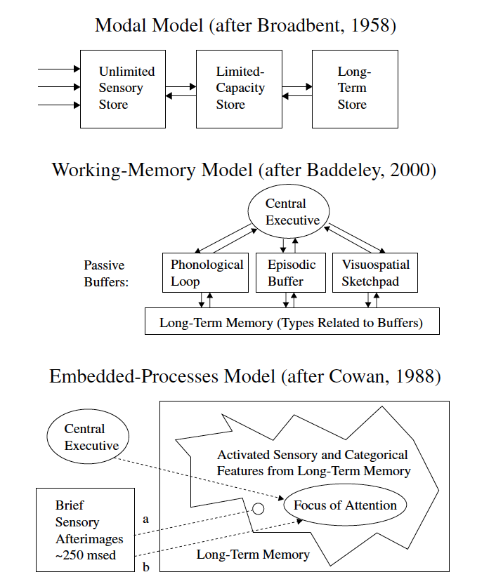

# Theoretical Background and Rationale {#intro}

## Melodic Dictation

Melodic dictation is the process in which an individual hears a melody, retains it in memory, and then uses their knowledge of Western musical notation to recreate the mental image of the melody on paper in a limited time frame.
For many, becoming proficient at this task is at the core of developing one's aural skills [@karpinskiModelMusicPerception1990].
For over a century, music pedagogues have valued melodic dictation^[In his highly influential book _Aural Skills Acquisition: The Development of Listening, Reading, and Performing Skills in College-Level Musicians_, @karpinskiAuralSkillsAcquisition2000 documents this sentiment in music pedagogy circles by highlighting poetic adages from Romantic composer Robert Schumann in the mid 19th century through 21st century music educator Charles Elliott in the opening of his book, thus providing concrete examples of the belief that improving one's aural skills, or _ear_, is a highly sought after advanced skill.] which is evident from the fact that most aural skills texts with content devoted to honing one's listening skills have sections on melodic dictation [@karpinskiAuralSkillsAcquisition2000].

Yet despite this tradition and ubiquity, the rationales as to _why_ it is important for students to learn this ability often comes from some sort of appeal to tradition or underwhelming anecdotal evidence.
The argument tends to go that time spent learning to take melodic dictation results in increases in near transfer abilities after an individual acquires a certain degree of proficiency learning to take melodic dictation. 
Rationales given for why students should learn melodic dictation has even been described by Karpinski as being based on "comparatively vague aphorisms about mental relationships and intelligent listening" [@karpinskiModelMusicPerception1990, p.192], thus leaving the evidence for the argument for learning to take melodic dictation not being well supported. 

Some researchers have taken a more skeptical stance and asserted that the rationale for why we teach melodic dictation deserves more critique.
For example, Klonoski in writing about aural skills education aptly questions "What specific deficiency is revealed with an incorrect response in melodic dictation settings?" [@klonoskiImprovingDictationAuralSkills2006].
Earlier researchers like Potter, in their own publications, have noted how they have been baffled that many musicians do not actually keep up with their melodic dictation abilities after their formal education ends [@potterIdentifyingSucessfulDictation1990], but presumably go on to have successful and fulfilling musical lives. 
Additionally, suggesting that people who can hear music and then are unable to write it down, thus are unable to think _in_ music [@karpinskiAuralSkillsAcquisition2000], seems somewhat exclusionary to musical cultures that do not depend on any sort of written notation.

Though despite this skepticism towards the topic, melodic dictation remains at the forefront of many aural skills classrooms.
The act of becoming better at this skill may or may not lead to large in increases in far transfer of ability, but used as a pedagogical tool, the practice of learning to take melodic dictation intersects with concepts deemed relevant to the core of undergraduate music training.
While there has not been extensive research on melodic dictation research in recent years-- in fact @paneyEffectDirectingAttention2016 notes that since 2000, only four studies were published that directly examined melodic dictation-- this skill set sits on the border between literature on music learning, melodic perception, memory, and music theory pedagogy.
Understanding and modeling exactly how melodic dictation works remains as a untapped watershed of knowledge for the field of music theory, music education, and music perception and is deserving of more attention. 

In this chapter I examine literature both directly and indirectly related to melodic dictation by first reviewing the prominent four step model put forth by Karpinski in order to establish and describe what melodic dictation is.
After describing his model, I then critique what this model lacks and clarify what is missing by providing a taxonomy of parameters that presumably would contribute to an individual's ability to take melodic dictation.
Using this taxonomy, I then review relevant literature and assert that the next steps forward in understanding how melodic dictation works come from examining the process both experimentally and computationally.
It has been nearly two decades since _Aural Skills Acquisition_ was first published as the first major step to finally build a bridge between the field of music cognition and music theory pedagogy [@davidbutlerWhyGulfMusic1997a; @karpinskiAuralSkillsAcquisition2000; @klonoskiPerceptualLearningHierarchy2000] and as with all public works, this infrastructure deserves attention and support.

### Describing Melodic Dictation 

The foundational pedagogical work on melodic dictation comes from the work of Gary Karpinski.
Summarized most recently in his _Aural Skills Acquisition_ [@karpinskiAuralSkillsAcquisition2000]-- though first presented in an earlier article [@karpinskiModelMusicPerception1990]-- Karpinski proposes a four-step model of melodic dictation.

The four steps of Karpinski's model include

1. Hearing
2. Short Term Melodic Memory
3. Musical Understanding 
4. Notation

and occur as a looping process which I have reproduced depicted in Figure \@ref(fig:flowchart).
The model is Karpinski's take on previous attempts to summarize the process that Karpinski notes has ranged from Michael Roger's assertion of only needing two steps, to Ronald Thomas who claimed as many as 15 steps, to similar models proposed by Colin Wright that model inner hearing as a five step model [@wrightInvestigatingAuralCase2016].
Karpinski's model is discussed extensively in both the original article [@karpinskiModelMusicPerception1990] and throughout the third chapter in his book [@karpinskiAuralSkillsAcquisition2000].
I have reproduced his model in \@ref(fig:flowchart).

```{r flowchart, echo=FALSE, fig.cap="Karpinski Idealized Flowchart of Melodic Dictation",fig.align='center', out.width="100%"}
knitr::include_graphics("img/karpinski31.png")
```

Karpinski's hearing stage involves the initial perceptions of the sound at the psychoacoustical level and the listener's attention to the incoming musical information.
If the listener is not actively engaging in the task because of extrinsic factors such as "boredom, lack of discipline, test anxiety, attention deficit disorder, or any number of other causes pp. 65" then any further processes later down the model will be detrimentally affected. 
Karpinski notes that these types of interferences are normally "beyond the traditional jurisdiction of aural skills instruction pp. 65", but I will later argue that the concept of willful attention, when re-conceptualized as working memory, may actually play a larger role in the melodic dictation process as it is modeled here.  

The short-term melodic memory stage in this process references the point in a melodic dictation where musical material is held in active memory.
From Figure \@ref(fig:flowchart) and Karpinski's writing on the model, this stage is not explicitly declared as any sort of active process akin to a phonological loop [@baddeleyEpisodicBufferNew2000] where something like active rehearsal would occur, but describes where in the sequential order melodic information is represented.
Though Karpinski does not posit any sort of active process in the short term melodic memory stage, he does suggest there are two separate memory encoding mechanisms, one for contour, and one for pitch.
He arrives at these two mechanisms by using both empirical qualitative interview evidence, as well as noting literature from music perception that supports this claim for contour [@dowlingScaleContourTwo1978;@dewittRecognitionNovelMelodies1986] and literature suggesting that memory for melodic material is dependent on enculturation [@ouraMemoryMelodiesSubjects1988;@handelListeningIntroductionPerception1989; @dowlingExpectancyAttentionMelody1990]. 
Since its publication in 2000, this area of research has expanded with other researchers also demonstrating the effects of musical acculturation via exposure [@eerolaExpectancySamiYoiks2009; @stevensMusicPerceptionCognition2012;@pearceAuditoryExpectationInformation2012;@pearceStatisticalLearningProbabilistic2018a].

In describing the short term melodic memory stage, Karpinski also details two processes that he believes to be necessary for this part of melodic dictation: extractive listening and chunking.
Noting that there is a capacity limit to the perception of musical material, citing Miller [-@millerMagicalNumberSeven1956], Karpinski explains how each strategy might be used.
Extractive listening is the process in which someone dictating the melody will selectively remember only a small part of the melody in order to lessen the load on memory. 
Chunking is the process in which smaller musical elements can be fused together in order to expand how much information can be actively held in memory and manipulated.
The concept of chunking is very helpful as a pedagogical tool, but as detailed below, is a complicated concept to formalize.

After musical material is extracted and then represented in memory, the next step in the process is musical understanding.
At this point in the dictation, the individual taking the dictation needs to mentalize the extracted musical material that is represented in memory and the use their music theoretic knowledge in order to comprehend any sort of hierarchical relationships between notes, common rhythmic groupings, or any sorts of tonal functions.
This is the point in the process where solimization of either or both pitch and rhythm, and musical material might be understood in terms of relative pitch.
While Karpinski reserves his discussion of solmization for the musical understanding phase, it is worth questioning if it is possible to disassociate relative pitch relations that would be 'understood' in this phase from the qualia of the tones themselves [@arthurPerceptualStudyScaledegree2018].
For Karpinski, the quicker what is represented in musical memory can be understood, the quicker it can then be translated at the final step of notation.

Notation, the final step of the dictation loop, requires that the individual taking the notation have sufficient knowledge of Western musical notation so that they are able to translate their musical understanding into written notation.
This last step is ripe for errors and has proved problematic for researchers attempting to study dictation [@taylorStrategiesMemoryShort1983;@klonoskiImprovingDictationAuralSkills2006].
It is also worth highlighting is that it is difficult to notate musical material if the individual who is dictating does not have the requisite musical category and knowledge for the sounds.
Lack of this knowledge will limit an individual's ability to translate what is in their short term melodic memory into notation, even if it is perfectly represented in memory.

The final parts of the chapter, Karpinski notes that other factors like tempo, the length and number of playings, and the duration between playings will also play a role in determining how an individual will perform on a melodic dictation.
While this framework can help illuminate this cognitive process and help pedagogues understand how to best help their students, presumably there are many more factors that contribute to this process.
The model as it stands is not detailed enough for explanatory purposes and lacks in two areas that would need to be expanded if this model were to be explored experimentally and computationally.

First, having a single model for melodic dictation assumes that all individuals are likely to engage in this sequential ordering of events.
This could in fact be the case^[And in his Figure 3.1 he does caption it as an _idealized_ dictation process], but there is research from music perception [@goldmanImprovisationExperiencePredicts2018a] and other areas of memory psychology such as work on expert chess players [@laneChessKnowledgePredicts2018] that suggests that as individuals gain more expertise, their processing and categorization of information changes. 
Additionally, different individuals will most likely have different experiences dictating melodies based on their own past listening experience, an area that Karpinski refers to when citing literature on musical enculturation based on statistical exposure. 
The model does not have any flexibility in terms of individual differences.

Second, the model presumes the same sequence of events for every melody.
As a general heuristic for communicating the process, this model serves as an excellent didactic tool.
Though when this model is applied to more diverse repertoire, this same set of strategies performed in this order might prove to be inefficient. 
For example, on page 103 of his text, Karpinski suggest that two listenings should be adequate for a listener with few to no chunking skills to listen to be able to dictate a melody of twelve to twenty notes. 
This process might generalize to many tonal melodies, but presumably different strategies in recognition would be involved in dictating the two melodies of equal length shown in Figure \@ref(fig:shortmelody1) and \@ref(fig:shortmelody2).
If asked to dictate \@ref(fig:shortmelody1), long term memory processes might begin to play a role much sooner during this task. 
If asked to dictate \@ref(fig:shortmelody2), establishing a tonal center to act as a perceptual scaffolding for relative relationships might prove to be more difficult. 
Presumably different people with different levels of abilities will perform differently on different melodies and while helpful as a pedagogical tool, this generalized approach to melodic dictation could be more robust.

```{r shortmelody1, echo=FALSE, fig.cap="Tonal Melody",fig.align='center', out.width="80%"}
knitr::include_graphics("img/musicalexamples/MMD_Figure2-1.png")
```

```{r shortmelody2, echo=FALSE, fig.cap="Atonal Melody",fig.align='center', out.width="80%"}
knitr::include_graphics("img/musicalexamples/MMD_Figure3-1.png")
```

This agnosticism for both variability for melodic and individual differences serves as a stepping off point for this study.
In order to have a more complete understanding of melodic dictation, there needs to be a model that is able to accommodate the exhaustive differences at both the individual and musical levels.
Additionally, the model should be able to be operationalized so that it can be explored in both experimental and computational settings.
By explicitly stating variables thought to contribute and noting how melodic dictation works, it will give the community a better sense of the melodic dictation process, which will then enable a more complete understanding of melodic perception and subsequently allow for better teaching practices in aural skills classrooms.

### Taxonomizing

At this point, it is worth stepping back and noting that the sheer amount of variables at play here is cumbersome and haphazard.
In order to better understand and organize factors thought to contribute to this process, it would be advantageous to taxonomize the multitude of features thought to contribute to melodic dictation.
In doing this, it will allow for a clearer picture of what factors might contribute and what literatures to explore in order to learn more about them.

The taxonomy that I propose appears in Figure \@ref(fig:taxonomy) and bifurcates the possible factors thought to affect an individual's ability to take melodic dictation create both individual parameters and musical parameters.
These categories are recursively partitioned into cognitive and environmental parameters as well as structural and experimental factors respectively.
Below I expand on what these categories entail, then explore each in-depth.

```{r taxonomy, echo=FALSE, fig.cap="Taxonomy of Factors Contributing to Aural Skills",fig.align='center', out.width="80%"}
knitr::include_graphics("img/taxonomy4.png")
```

The individual parameters are split broadly into cognitive factors and environmental factors,
Factors in the cognitive domain are assumed to be relatively consistent over time. 
Factors in the environmental domain can change with training and exposure.
These categories are not deterministic, nor exclusive, and almost inevitably interact with one another.

For example, it would be possible to imagine an individual with higher cognitive ability, the opportunity to have a high degree of training early on in their musical career, and personality traits that lead them to enjoy engaging with a task like melodic dictation.
This individual's musical perception abilities might be markedly different than someone with lower cognitive abilities, no opportunity for individualized training, and not have a general inclination to even take music lessons.
This variability at the individual level might then lead to differences in their ability to take melodic dictation.

Complementing the individual differences, there would also be differences at the musical level which in turn divides into two categories.
On one hand exists the structural aspects of the melody itself.
These are aspects of the melody that would remain invariant when written down on musical notation that can only capture pitch changes over time.
Parameters in this category would include features generated by the interval structure of the pitches over time that allow the melody to be perceived as categorically distinct from other melodies.
These structural features are then complimented by the experimental features which are emergent properties of the structural relation of the pitches over time based on performance practice choices.
Examples of these parameters would include, key, tempo, note density, tonalness,  timbral qualities, and the amount of times a melody is played during a melodic dictation. 
This division is not an exhaustive, categorical divide.
One could imagine exceptions to these rules where a melody is transformed to the minor key, ornamented, and then played with extensive rubato and experienced as a phenomenologically distinct, yet similar experience.
This division of structural and experimental features is morphologically similar to Leonard Meyer's primary and secondary musical features [@meyerEmotionMeaningMusic1956].

Given all of these parameters that could contribute to the melodic dictation process, the remainder of this chapter will exploring literature using this taxonomy as a guide.
The chapter concludes with a reflection on operationalizing each of these factors and problems that can arise in modeling and reminds the reader about the dangers of statistical reification.
These are important to note since from an empirical standpoint, both the task as well as the process of melodic dictation as depicted by Karpinski resemble something that could be operationalized as both an experiment, as well as a computational model.

## Individual Factors

### Cognitive

Research from cognitive psychology suggests that individuals differ in their perceptual and cognitive abilities in ways that are both stable throughout a lifetime and are not easily influenced by short term training.
When investigated on a large scale, these abilities-- such as general intelligence or working memory capacity-- predict a wealth of human behavior on a large scale ranging from longevity, annual income, ability to deal with stressful life events, and even the onset of Alzheimer's disease [@ritchieIntelligenceAllThat2015; @unsworthAutomatedVersionOperation2005]. 
Given the strength and generality of these predictors, it is worth investigating the extent that these abilities might contribute when investigating any modeling of melodic dictation since melodic dictation depends on perceptual abilities.
It is important to understand the degree to which these cognitive factors might influence aural skills abilities in order to ensure that the types of assessments that are given in music schools validly measure abilities that individuals have the ability to improve.
If it is the case that much of the variance in a student's aural skills academic performance can be attributed to something the student has little control over, this would call for a serious upheaval of the current model of aural skills teaching and assessment.

Recently there has been a surge of interest in work exploring how cognitive factors are related to abilities in music school.
This interest is probably best explained by the fact that educators are picking up on the fact that cognitive abilities are powerful predictors and need to be understood since they inevitably will play a role in pedagogical settings. 

Before diving into a discussion regarding differences in cognitive ability, I should note that sometimes ideas regarding differences in cognitive ability been negatively received and for good reasons.
Research in this area can and has been taken advantage to further specious ideologies, but often arguments that assert meaningful differences in cognitive abilities between groups are founded on statistical misunderstandings and have been debunked in other literature [@gouldMismeasureMan1996].
Considering that, it then becomes very difficult to maintain a scientific commitment to the theory of evolution [@darwinOriginSpecies1859] and not expect variation in all aspects of human behavior, with cognition falling within that umbrella.
Even given this statement, measuring a theoretical construct such as an aspect of cognition deserves to be examined since the ability to validly and reliably measure an individual's cognitive abilities is a fundamental assumption of this study.

Attempting to measure and quantify aspects of cognition date back over a century.
Even before concepts of intelligence were posited by Charles Spearman via his conception of _g_ [@spearmanGeneralIntelligenceObjectively1904], scientists were interested in establishing links between latent constructs they presumed to exist in the real world-- yet were impossible to measure directly like intelligence-- and physical manifestations in that could be measured such as body morphology [@gouldMismeasureMan1996].
While scholars like Gould have documented and critiqued much of the history of early psychometrics^[Gould puts forward a complete, yet very charged reading of the early history of cognitive testing and his writings on the subject have been accused of falling prey to the same logic he rails against [@warneStephenJayGould2019]], central to this study are two important schools of thought on intelligence testing commonly discussed in the current literature.

The first ideology originates from Cyril Burt and Charles Spearman who, in developing the statistical tool of factor analysis, posited that a construct of general intelligence exists as a part of human cognition and can be quantified.
Burt and Spearman claimed that a general intelligence factor existed in human cognition from evidence they found developing a batty of cognitive tests whose performance on one subtest could often reliably predict performance on another.
This phenomena of multiple related tests predicting each other's performance is a manifestation referred to as the positive manifold.
Spearman and Burt asserted that an individual's ability to solve problems without contextual background information could be understood as general intelligence or _g_. 

Broadly speaking, the second ideology here stems from work by Alfred Bienet who instead of conceptualizing intelligence as a monolithic whole, partitioned intelligence into what have now become understood as differences in general crystallized intelligence or ( _Gc_ ) and general fluid intelligence ( _Gf_ ).
General crystallized intelligence is the ability to solve problems given prior contextual information.
General fluid intelligence is the ability to solve problems in novel contexts [@cattellAbilitiesTheirGrowth1971; @jhornTheoryFluidCrystalized1994] . 
Comparing _Gf_ and _Gc_ to _g_, the cognitive psychology literature has noted that _g_ often shares a statistically equivalent relationship to idea conceptualized as general fluid intelligence _Gf_.
This distinction between _Gf_ and _Gc_ is different than that of _g_, but again it should be noted that _g_ shares a statistically identical relationship with constructs such as _Gf_ [@matzkeIssuePowerIdentification2010].
These conceptions of intelligence and cognitive ability also differ from more current theories that synthesize these previous areas of research [@kovacsProcessOverlapTheory2016] using models that do not require taking an ontological stance of entity realism [@borsboomTheoreticalStatusLatent2003].

Even though both of these constructs are powerful predictors on a large scale and do predict things like educational success, income, and even life expectancy [@ritchieIntelligenceAllThat2015] when other variables like socioeconomic status are held constant, only conceptualizing cognitive abilities in terms of even a handful of latent constructs still does not fully explain the diversity of human cognition.
Regardless of their origin, neglecting the predictive power of these variables in pedagogical settings would be a methodological oversight in attempting to explain variance in performance. 

Another second area in the field of cognitive psychology worth of examination is working memory capacity.
In addition to concepts of intelligence, be it _Gf_  or _Gc_, the working memory capacity literature directly relates to work on melodic dictation for reasons discussed below. 

Working memory is one of the most investigated concepts in the cognitive psychology literature.
According to Nelson Cowan, the term working memory generally refers to 

> the relatively small amount of information that one can hold in mind, attend to, or, technically speaking, maintain in a rapidly accessible state at one time. The term working is mean to indicate that mental work requires the use of such information. (p.1) [@cowanWorkingMemoryCapacity2005]

The term, like most concepts in science, does not have an exact definition, nor does it have a definitive method of measurement.
While there is no universally recognized first use of the term, researchers began to postulate that there was some sort of system that mediated incoming sensory information with the world with the information in long term storage using modular models of memory in the mid-twentieth century. 
Summarized in [@cowanWorkingMemoryCapacity2005], one of the first modal models of memory was proposed by [@broadbentPerceptionCommunication1958] and later expanded by [@atkinsonHUMANMEMORYPROPOSED1968].
As seen in Figure \@ref(fig:wmmodels) taken from @cowanWorkingMemoryCapacity2005, both models here posit incoming information that is then put into some sort of limited capacity store.
These modal models were then expanded on by Baddeley and Hitch [@baddeleyWorkingMemory1974] in their 1974 chapter with the name _Working Memory_, where they proposed a system with an central executive module that was able to carry out active maintenance and rehearsal of information that could be stored in either a phonological store for sounds or a visual sketchpad for images.

```{r wmmodels, echo=FALSE, fig.cap="Schematics of Models of Working Memory taken from Cowan, 2005", fig.align='center'}

```


Later revisions of their model also incorporated an episodic buffer [@baddeleyEpisodicBufferNew2000] where the modules were explicitly depicted as being able to interface with long term memory in the rehearsal processes.
The model has even been expanded upon by other researchers throughout its lifetime.
The most relevant to this study is by @berzWorkingMemoryMusic1995, who postulated the addition of a musical rehearsal loop to the already established phonological loop and visual spatial sketchpad.
While Berz is most likely correct in asserting that the nature of storing and processing musical information is different to that of words or pictures and there has been experimental evidence to suggest this [@williamsonMusiciansNonmusiciansShortterm2010] that has been interpreted in favor of multiple loops [@wollnerAttentionalFlexibilityMemory2016], it does introduce the theoretical problem of determining how and why incoming sensory information is partitioned into the respective loops.
Additionally, models that assert some sort of Central Executive component to attend to materials held in a sensory buffer also face the infinite regress homunculus problem.
Stated more clearly, if the Central Executive system is what attends to information in the sensory buffers, what attends to the Central Executive?  

In addressing the problem of explicitly stating which rehearsal loops do and do not exist, Nelson Cowan proposed a separate model [@cowanEvolvingConceptionsMemory1988; @cowanWorkingMemoryCapacity2005] dubbed the Embedded Process Model which do not claim the existence of any domain specific module (e.g. positing a phonological loop, visual spatial sketchpad) but is rather based on an exhaustive model that did away with the problem of asserting specific buffers for specific types of information.

In Cowan's own words comparing his model from that of Baddeley Hitch model:

> The aim was to see if the description of the processing structure could be exhaustive, even if not complete, in detail. By analogy, consider two descriptions of a house that has not been explored completely. Perhaps it has only been examined from the outside. Baddeley's (1986) approach to modeling can be compared with hypothesizing that there is a kitchen, a bathroom, two equal-size square bedrooms, and a living room. This is not a bad guess, but it does not rule out the possibility that there actually are extra bedrooms or bathroom, that the bedroom space is apportioned into two rooms very different in size, or that other rooms exist in the house. Cowan's (1988) approach, on the other hand, can be compared with hypothesizing that the house includes food preparation quarters, sleeping quarters, bathroom/toilet quarters, and other living quarters. It is meant to be exhaustive in that nothing was left out, even though it is noncommittal on the details of some of the rooms. p.42 Cowan, 2005.

The system is depicted in the bottom tier of \@ref(fig:wmmodels), and conceptualizes the limited amount of information that is readily available as being in the focus of attention, with activated sensory and categorical features of what is in the focus of attention to be accessible nearby.
Moving further from the locus of attention is long term memory, whose content can be turned to by using the central executive to access non-immediately available information.
The central executive system in this case acts as a spotlight on what is represented in long term memory, rather than a module used to direct attention to specific sensory information.
In contrast to the modular approaches, Cowan's framework does not require the researchers to specify exactly how and where each the incoming information is being stored which makes it advantageous for studying complex stimuli such as music and melodies.

In addition to having multiple frameworks for studying working memory capacity, there is also the problem of limits to the working memory system, often referred to as the working memory capacity. 
Most popularized by Miller in his famous [@millerMagicalNumberSeven1956] speech turned article, Miller suggests out of jest that the number 7 might be worth investigating, which has been used as a point of reference for many researchers since then. 
It is worth nothing that Miller has since gone on record as noting that using 7 (plus or minus 2) was a rhetorical device used to string together his speech [@millerHistoryPsychologyAutobiography1989]. 
Nevertheless, while the number seven is most likely a red herring, it did inspire a large amount of research on capacity limits.
In the decades since the number 7 has been reduced to about 4 [@cowanMagicalMysteryFour2010] and research around capacity limits has been investigated using a variety of novel tasks, most notable the complex span task [@unsworthAutomatedVersionOperation2005; @unsworthComplexWorkingMemory2009].   
When used as predictors in both higher and lower cognitive tasks, measures of working memory capacity predict performance well and additionally tend to be stable across a lifetime [@unsworthAutomatedVersionOperation2005].

#### Parallels Between Working Memory and Melodic Dictation

Given its predictive strength as well as its direct similarity to tasks of melodic dictation, an in depth look at the literature is warranted.   
Clearly an individual's ability to take in sensory information, maintain it in memory, actively carry out other tasks (like notating a melody) are almost identical to tasks of working memory capacity. 
Before venturing onward from this striking parallel, tasks investigating working memory capacity differ from melodic dictation tasks in a few key ways.
The first is that musical information is always sequential: a melodic dictation task would never require the student to recall the pitches back in scrambled orders.
Serial order recall is an important characteristic in the scoring and analyzing of working memory tasks [@conwayWorkingMemorySpan2005], but musical tones do not appear in random order and are normally in discernible chunks as discussed by Karpinski [@karpinskiAuralSkillsAcquisition2000].
The use of chunks is pervasive in much of the memory literature, but often is used as more of a heuristic to help explain that information in the environment and why it is often grouped together.
Of the problems with chunking, most are related to music and have relevance to melodic dictation.
Below I review the problems with chunking noted by Cowan [@cowanWorkingMemoryCapacity2005], and any pertinent music psychology literature. 

1. _Chunks may have a hierarchical organization._ Tonal music has historically been understood to be hierarchical [@krumhanslCognitiveFoundationsMusical2001; @meyerEmotionMeaningMusic1956; @schenkerFreieSatz1935] with the study for memory for tones being confounded by some pitches being understood by their relation to structurally more stable tones. 
2. _The working memory load may be reduced as working memory shifts between levels in hierarchy._ If an individual understands a chunk to be something such as a major triad, the load on working memory would be less since it that information could be understood as a singular chunk. 
3. _Chunks may be the endpoints of a continuum of associations._ Given tonal music's sequential and statistical properties, two tones might be able to be loosely associated given a context which would make the tones fall between being identified as two tones and one distinct chunk. 
4. _Chunks may include asymmetrical information._ More tonal possibilities are possible from a stable note like tonic or dominant, whereas in a tonal context, a raised scale degree #$\hat{4}$ when understood in a functional context would be taken as having stricter transitional probabilities (#$\hat{4} \rightarrow \hat{5}$). 
5. _There may be a complex network of associations._ If a set of pitches sounds like a similar set of pitches from long term memory , the information coming in cannot be understood as being separate units of working memory.
6. _Chunks may increase in size rapidly over time._ Three tones that are seemingly unrelated when incoming like E4, G5, C5 might enter sensory perception as three different tones, but then be fused together when they are understood as one chunk-- a first inversion major triad. 
7. _Information in working memory may benefit from rapid storage in long term memory._ Given the amount of patterns that an individual learns and can understand, as soon as something is fused, it could be encoded in long term memory, especially if there is a salient feature in the incoming melodic information such as the immediate recognition of a mode or cadence.

The points by Cowan are important to acknowledge in that it is not possible to directly lift work and paradigms from working memory capacity to work in music perception.
That said, the enormous amount of theoretical frameworks put forward by the working memory literature when understood in conjunction with theories in music psychology such as implicit statistical learning [@saffranStatisticalLearningTone1999] can provide for new, fruitful theories.
Past researchers have noted the strength and predictive abilities from the working memory capacity literature as aiding research in music perception.
In ending his article positing a musical memory loop to be annexed to the Baddley and Hitch modular model of working memory, Berz [@berzWorkingMemoryMusic1995] captures the power of this concept in the last sentence of his article and warns future researchers that

> Individual differences portrayed in some music aptitude tests may [sic] represent not talent or musical intelligence but ability, reflecting differences in working memory capacity. p. 362

Berz's assertion has not been exhaustively tested since first published in 1995, but the subject of music, memory, and cognitive abilities has been the focus of research of both psychologists and musicologists alike.
Below I survey literature bordering on both music, as well as cognitive ability.

#### Working Memory Capacity and Music 

Of the papers in the music science literature that specifically investigates working memory, each uses different measures, though but all tend to converge on two general findings.
The first is that there are some sort of enhanced memory capabilities in individuals with musical training.
The second is that working memory capacity, however it is measured, often plays a significant role in musical tasks.
Evidence for the first point appears most convincingly in a recent meta analyses by Talamini and colleagues [@talaminiMusiciansHaveBetter2017] who demonstrated via three separate meta-analyses that musicians outperform their non-musical counterparts on tasks dealing with long-term memory, short-term memory, as well as working memory.
The authors also noted that the effects were the strongest in working memory tasks where the stimuli were tonal, which again suggests an advantage of exposure and understanding of the hierarchical organization of musical materials.
In this meta-analyses and others investigating music and cognitive ability, it is important to be reminded that the direction of causality still from these studies cannot be determined using these statistical methodologies.
While it might seem that musical training tends to lead to these increases, it is also possible that higher functioning individuals will self select into musical activities.
Even if there is no selection bias in engaging with musical activity it also remains a possibility that of the people that do engage with musical activity, the higher functioning individuals will be less likely to quit over a lifetime.

In terms of musical performance abilities, working memory capacity has also been shown to be a significant predictor.
Kopiez and Lee suggested that working memory capacity should to contribute to sight reading tasks based on research where they found measures of working memory capacity, as measured by a matrix span task, to significantly correlated with many of their measures hypothesized to be related to sight reading ability in pianists at lower difficulty grading [@kopiezDynamicModelSkills2006; @kopiezGeneralModelSkills2008]. 

Following up on this work on sight reading, Meinz and Hambrick [@meinzDeliberatePracticeNecessary2010] found that working memory capacity, as measured by an operation span task, a reading span task, rotation span task, and a matrix span task was able to predict a small amount of variance $R^2=.074(0.067)$ above and beyond that of deliberate practice alone $R^2=.451(.441)$ in a sight-reading task.
More recently, two studies looking at specific sub-groups of musicians have shown working memory capacity to significantly contribute to models of performances on musical tasks related to novel stimuli.
@wollnerAttentionalFlexibilityMemory2016 found that although no differences were found between pianists and conductors in measures of working memory capacity as measured via a set of span tasks, conductors showed superior performance in their attention flexibility. 
Following up on this line of research @nicholsScoreOneJazz2018 used the same battery of working memory tasks and found that jazz musicians excelled over their classically trained counterparts in a task which required them to hear notes and reproduce them on the piano.
The authors also noted that of their working memory battery, based on standard operation span methods [@engleWorkingMemoryCapacity2002], that the auditory dictation condition scored surprisingly low and further research might consider further work on dictation abilities. 
Additionally, @colleyWorkingMemoryAuditory2018 found that working memory capacity, as measured by a backwards digit span and operation span, to be successful predictors in a tapping task requiring sensory motor prediction abilities.
As mentioned above, each of these tasks where working memory was a significant predictor of performance occurred where the task involved active engagement with novel musical material.

The growing evidence in this field suggests that the advantage of working memory capacity to be greatest in both musically trained people, dealing with novel information, using tonal materials.
Since all three of these factors are related to melodic dictation, it would seem sensible to continue to include these measures in tasks of musical perception and continue Berz's assertion that research in music perception could inadvertently be picking up on individual differences in working memory abilities.

As discussed above, the idea of IQ or intelligence has a long and complex history.
When used as a predictor in statistical models, it often serves to predict traits that society values like longevity and general income so given its ability to predict in more domain general settings, surveying literature where it applies to musical activity warrants attention.
Below I use the term intelligence as a catch all term to avoid the historical context of IQ and specify where available which measure was actually used.
Before surveying the literature here it is also worth noting that research on music and intelligence is not as developed as some of the larger studies looking at intelligence which provides problems for both establishing causal directionality, as well as controlling for other factors like self theories of ability, socioeconomic status, and personality [@mullensiefenInvestigatingImportanceSelftheories2015]. 

As reviewed in @schellenbergMusicNonmusicalAbilities2017, both children and adults who engage in musical activity tend to score higher on general measures of intelligence than their non-musical peers [@gibsonEnhancedDivergentThinking2009; @hilleAssociationsMusicEducation2011; @schellenbergExaminingAssociationMusic2011; @schellenbergMusicTrainingEmotion2012] with the duration of training sharing a relationship with the extent of the increases in IQ [@corrigallPredictingWhoTakes2015; @degeMusicLessonsIntelligence2011; @schellenbergLongtermPositiveAssociations2006].
Though many of these studies are correlational, they also have made attempts to control for confounding variables like socio-economic status and parental involvement in out of school activities [@corrigallAssociationsLengthMusic2011; @degeMusicLessonsIntelligence2011; @schellenbergExaminingAssociationMusic2011; @schellenbergMusicTrainingEmotion2012]
Schellenberg notes the problem of smaller sample sizes in his review [@corrigallAssociationsLengthMusic2011; @parbery-clarkMusicalExperienceAging2011; @straitMusicalTrainingEarly2012] in that studies that are typically smaller do not reach statistical significance. 
Schellenberg also references evidence that when professional musicians are matched with non-musicians from the general population there do not seem to be these associations [@schellenbergLongtermPositiveAssociations2006]. 
His review suggests the current state of the literature points to support the hypothesis that higher functioning kids that take music lessons and they tend to stay in lessons longer. 
Additionally, Schellenberg remains skeptical of any sorts of causal factors regarding increases in IQ [@francoisMusicTrainingDevelopment2013; @morenoMusicalTrainingInfluences2009] noting methodological problems like how short exposure times were in studies claiming increases in effects or researchers who not holding pre-existing cognitive abilities constant [@mehrTwoRandomizedTrials2013].
Continued work by Swaminithan, Schellenberg, and Khalil continue to support evidence for this selection bias in training resulting in higher cognitive abilities among musicians [@swaminathanRevisitingAssociationMusic2017].

### Environmental 

Standing in contrast to factors that individuals do not have a much control over such as the size of their working memory capacity or factors related to their general fluid intelligence, most of the factors music pedagogues believe contribute to someone's ability to take melodic dictation are related to what I have put forward as environment factors.
In fact, one of the tacit assumptions of any formal education revolves around the belief that with deliberate and attentive practice, that an individual is able to move from novice status to some level of expertise in their chosen domain.
The idea that time invested results in beneficial returns is probably best formalized by work produced by @ericssonRoleDeliberatePractice1993 that suggests that performance at more elite levels results from deliberate practice.

As noted in studies above such as @meinzDeliberatePracticeNecessary2010, deliberate practice is is able to explain variance in task performance, but again other research suggests more variables are at play.
@dettermanMoreComprehensiveTheory1999 propose that three factors, general intelligence, domain specific ability, and practice are the cornerstones of developing expertise in music.
The first of their three is not malleable, while the former two are presumed to be plastic.
This reasoning has been explored by researchers such as @ruthsatzBecomingExpertMusical2008, who investigated these assertions and provided empirical evidence to support this notion using a hierarchical multiple regression modelling and concluded that each of these variables does in fact contribute significantly to the target variable of musical performance.
Other researchers have since commented on these expertise models like @mosingPracticeDoesNot2014 who have asserted that a genetic component, rather than those listed above best explain variance on musical ability.

One major problem with interpreting literature like the studies mentioned above is the general lack of agreement on what constitutes musical behaviors.
At a very high level, many of the aforementioned studies take a parochial view of what it means to engage in musical activity, a problem which is only exacerbated by not having uniform psychometric measurements [@bakerExaminingMusicalSophistication2018a; @talaminiMusiciansHaveBetter2017].
Interpreting this data then becomes difficult as what it means to be proficient at a musical task is culturally dependent.
Investigating musical talent as if were a universal is a problem well documented in both the ethnomusicological and music education literature [@blackingHowMusicalMan2000; @murphyHowFarTests1999].

### Aural Training 

In addition to individuals differing in their general musical abilities-- however they are defined-- individuals also differ in their abilities at the level of their aural skills.
The same problems that arise in operationalizing musicianship are apparent in defining aural skills.
Reviewing the literature, I take aural skills to encompass the many skills often taught in music school, not restricting those skills to any particular sets of exercises.
Some researchers like Chenttee [@chenetteReframingAuralSkills2019] have taken stricter definitions attempting to state only skills that engage working memory capacity are those that are truly aural, but this operationalization would limit this review's scope. 

Though not as heavily researched in the past few decades [@furbyEffectsPeerTutoring2016], there has been specific research looking at modeling how individuals perform in aural skills examinations. 
@harrisonEffectsMusicalAptitude1994 examined the effect of aural skills training on undergraduate students by creating a latent variable model investigating musical aptitude, academic ability, musical expertise, and motivation to study music in a sample of 142 undergraduate students and claimed to be able to explain 73% of the variance in aural skills abilities using the variables measured. 

Work from Colin Wright's dissertation took a mixed methods approach investigating correlations between aural ability and their degree success as well as interviewing university students regarding their the importance of aural skills education.
In his work he found a general positive correlation between aural ability and measures of degree success.

While results are still mixed regarding how best to measure and assess this ability, the near ubiquity of aural skills education has resulted in many investigations of how people might improve their ability.
As noted in @furbyEffectsPeerTutoring2016, researchers in the past have suggested a variety of techniques for improving their abilities in melodic dictation by isolating rhythm and melody [@bantonRoleVisualAuditory1995; @blandSightSingingMelodic1984; @rootMethodicalSightSingingLessons1931], listening attentively to the melody before writing [@bantonRoleVisualAuditory1995], recognizing patterns [@bantonRoleVisualAuditory1995; @blandSightSingingMelodic1984; @rootMethodicalSightSingingLessons1931] and silently vocalizing while dictating [@klonoskiImprovingDictationAuralSkills2006].
Interpreting a clear best path forward from these studies again remains difficult due to the sheer amount of variables at play.

Often described as the other side of the same coin of melodic dictation, sight singing is an area of music pedagogy research that has received some attention, yet probably not the extent is deserved given its prevalence in school of music curricula.
Recently @fournierCognitiveStrategiesSightsinging2017a cataloged and categorized 14 different strategies that students used when learning to sight read.
The authors organized their 14 categories into four larger main categories and suggested that aural skills pedagogues should employ their framework in their aural skills pedagogy.

Similar to commentaries in literature on melodic dictation, @fournierCognitiveStrategiesSightsinging2017a also note a line of research that has documented that university students are often unprepared to sight-read single lines of music [@asmusMusicTeachingMusic2004; @thompsonPitchInternalizationStrategies2003] even though it is, like dictation, thought of as a means for deeper musical understanding  [@karpinskiAuralSkillsAcquisition2000; @rogersTeachingApproachesMusic2004]. 
@fournierCognitiveStrategiesSightsinging2017a also note that sight-reading has been an active area of research due to the often reported relationship that performance on sight reading often predicts several studies have shown links between academic success in sight-singing and predictors such as entrance tests [@harrisonValidityMusicalAptitude1987], academic ability, and musical experience [@harrisonEffectsMusicalAptitude1994].

Taken as a whole, the research tends to suggesting that learning to be a fluid and competent sight reader helps musicians hone their skills by bootstrapping other musical skills since the skills needed for sight-reading touch on many of the skills used in musical performance like pattern matching and listening for small changes in intonation.
While the above literature suggests there are empirical grounds to consider these individual factors in predicting how well an individual will do in melodic dictation, these factors will invariably interact with the other half of the taxonomy: the musical parameters.

## Musical Factors

Transitioning to the other half of the taxonomy on Figure \@ref(fig:taxonomy), the other main source of variance in any study investigating melodic dictation is the effect of the melody itself.
I find it safe to assume that not all melodies are equally difficult to dictate and assert that variance in the difficulty the melody can partitioned between both structural and experimental aspects of a melody.
As noted above, there is not a strict delineation between these two categories since once could imagine manipulations in experimental parameters in order to result in a phenomenologically different experience of melody.
Questions of transformations of melodies and musical similarity fall have been addressed in other research [@cambouropoulosHowSimilarSimilar2009; @wigginsModelsMusicalSimilarity2007] and are beyond the scope of this study.

### Discussing Structure

The assumption that a musical score is able to provide insights towards meaningful understanding is a core tenant of music theory and analysis.
Throughout the 20th Century, music theorists have almost exclusively relied on musical scores as their central point of reference in their work.
According to Clarke [@clarkeWaysListeningEcological2005]-- though also discussed by others-- this structuralist approach to music lays at the foundation of many academic discussions, possibly stemming from latent assumptions regarding absolutism in music.
General interest in structure has been a dominant part of the discourse as evidenced from the extensive lines of thought emanating from Heinrich Schenker [@schenkerFreieSatz1935;@salzerStructuralHearingTonal1982;@schachterSchenkerStudies2006; @schenkerSchenkerStudies1990] and variations on linking what one might colloquially refer to as "the notes" to some sort of musical meaning is the lifeblood of music theory.
While issues surrounding "the notes" as they pertain to discourse have been central to large debates within the musicological community [@agawuHowWeGot2004;@kermanContemplatingMusicChallenges1986], tethering "the notes" to being able help to directly explain certain phenomenological listening experiences in music received much of its theoretical framework from the work of Leonard Meyer and assertions he put forward in _Emotion and Meaning in Music_ [@meyerEmotionMeaningMusic1956].
In his text, Meyer posits that much of a listener's experience in music can be understood by considering a listener's expectations.

Research in Meyer's tradition inspired work investigating the perception via the work of Eugene Narmour [@narmourAnalysisCognitionBasic1990; @narmourAnalysisCognitionMelodic1992], Glenn Schellenberg [@schellenbergSimplifyingImplicationRealizationModel1997], Elizabeth Hellmuth Margulis [@margulisModelMelodicExpectation2005], and David Huron  [@huronSweetAnticipation2006].
Meyer has also been the cited source of inspiration for recent, successful implementations of models of human auditory cognition like that of Marcus Pearce's Information Dynamics of Music [@pearceConstructionEvaluationStatistical2005;@pearceStatisticalLearningProbabilistic2018a] which derives from information theoretic models of musical perception put forward by Ian Witten and Darrel Conklin [@conklinMultipleViewpointSystems1995].

Though even prior to Meyer and Schenker, one of the earliest researchers that sought to make an explicit link between "the notes" and perception comes from outside the dominant academic discourse on music.
The first study to examine link between what might be understood as "the notes" and an aspect of perception was was Otto Ortmann in 1933 [@ortmannTonalDeterminantsMelodic1933]. 
Ortmann used a series of twenty five-note melodies in order to examine the effects of repetition, pitch direction, conjunct-disjunct motion (contour), interval size, order, and chord structure, all of which he deems to be the determinants of an individual's ability to recall melodic material.
Though Ortmann did not use any statistical methods to model his data, he did assert that each of his determinants contributed to an individual's ability to dictate musical material.
This work was extended by @taylorStrategiesMemoryShort1983 which additionally incorporated using musical skill as a predictor and subsequently found evidence that these factors contributed to individual dictation abilities in a sample of 122 undergraduate students.

What Ortmann referred to as determinants are structural aspects of the melody that can then be mapped to some aspect of perception. 
While Ortmann uses the term determinants, for the rest of this dissertation I instead adopt the term feature which better reflects current terminology used to talk about these aspects of a melody. 
Given Ortmann's design of using isorhythmic five tone sequences, his detriments-- or features-- under my taxonomy from Figure \@ref(fig:taxonomy) would generally include only structural aspects.
Were Ortmann to increase the tempo of the tones he presented, change the timbre of their instrumentation, or maybe give participants more attempts to give their responses, he would have then been adjusting what I am referring to as the experimental parameters.
In the section below, I first explore literature that set out to understand certain structural aspects of the musical side of my taxonomy, then begin to introduce studies that incorporate more parameters.

As with the above problems listed in attempting to measure latent psychological constructs, similar problems also arise in operationalizing many of the musical constructs in the experiments from above.
Unlike individual features, since musical scores can be digitized, attempting create more objective measurements for musical features is more straightforward than that of measuring latent variables.
One way to do this is to use symbolic features of the melodies themselves as a variable to be measured.
Unfortunately, much of the work from computational musicology such as David Huron's Humdrum toolbox [@huronHumdrumToolkitReference1994] or Michael Cutberth's Music21 [@cuthbertMusic21ToolkitComputerAided2010] pre-dates some of the earlier experimental work, but as these computations are more straightforward than considering larger experimental designs, I begin with them here. 

While I reserve a longer discussion on the histories of computational musicology for CHAPTER LINK IN, relevant to this review are the additional ways it is now possible to abstract features from symbolic melodies beyond what was capable in studies such as @ortmannTonalDeterminantsMelodic1933 and @taylorStrategiesMemoryShort1983.

### Abstracted Features

An abstracted symbolic features of a melody are emergent properties of the melody that results from performing a calculation on the melody when digitized into discrete, computer readable tokens.
Abstracted symbolic features of melodies can largely be conceptualized as being static or dynamic.
Static features of melodies are obtained by summarizing some aspect of the melody as if it were to be experience in suspended animation.
For example, a static feature of a melody might the melody's range as calculated by the number of half steps from the lowest to the highest note or the number of notes in a melody.
Using static features helps quantify something that might be intuitive about a melody or piece of encoded music.
For example, David Huron's contour class used in a study investigating melodic arches [@huronMelodicArchWestern1996] using the Essen Folksong Collection [@schaffrathEssenFolkSong1995] can only be understood as a feature of the melody itself once the melody has been sounded and is recalled would be a static feature of a melody.
Other examples include a melody's global note density, normalized pairwise variability index [@grabeDurationalVariabilitySpeech2002], and a melody's tonalness as calculated by one of the various key profile algorithms [@krumhanslCognitiveFoundationsMusical2001].
These measures are useful when describing melodies and are predictive of various behavioral phenomena as detailed below, but at this point it has not been well established to what degree these summary features can be directly related to aspects of human behavior.

The quintessential and most comprehensive toolbox example of this is Daniel Mllensiefen's Feature ANalysis Technology Accessing STatistics (In a Corpus) or FANTASTIC [@mullensiefenFantasticFeatureANalysis2009].
FANTASTIC is software that is capable summarizing musical material at for monophonic melodies.
In addition to computing 38 features such as contour variation, tonalnesss, note density, note length, and measures inspired by computational linguistics [@manningFoundationsStatisticalNatural1999].
FANTASTIC also calculates m-types (melodic-rhythmic motives) that are based on the frequency distributions of melodic segments found genres of music.

Work using the FANTASTIC toolbox has been successful in predicting court case decisions [@mullensiefenCourtDecisionsMusic2009], predicting chart successes of songs on the Beatles' _Revolver_  [@kopiezAufSucheNach2011], memory for old and new melodies in signal detection experiments [@mullensiefenRoleFeaturesContext2014], memory for ear worms [@jakubowskiDissectingEarwormMelodic2017; @williamsonEarwormsThreeAngles2012], memorability of pop music hook [@balenCorpusAnalyisTools2015].
In experimental studies, FANTASTIC has also been used to determine item difficulty [@bakerPerceptionLeitmotivesRichard2017; @harrisonModellingMelodicDiscrimination2016] and has even been the basis of the development of a computer assisted platform for studying memory for melodies [@rainsfordMUSOSMUsicSOftware2018].

In addition to using summary based features on melodies, it is also possible to model the perception of musical materials by using a dynamic approach that is dependent on the unfolding of musical material.
First explored in by Witten and Conklin [@conklinMultipleViewpointSystems1995], and then implemented as a dynamic model of human auditory cognition in his doctoral dissertation, Marcus Pearce's Information Dynamics Of Melody IDyOM models musical expectancy using various information theoretic concepts.
The model takes an unsupervised machine learning approach and calculates the information content based on multiple pre-specified viewpoints[@pearceConstructionEvaluationStatistical2005]. 
As a model exploring exception for melody IDyOM has has been successful in modeling human responses to expectation, melodic boundary formation, and even measurements of cultural proximity [@pearceAuditoryExpectationInformation2012; @pearceStatisticalLearningProbabilistic2018a].
The domain general application of IDyOM has given credence to Meyer's assertion that the enculturation of musical styles stems from statistical exposure to melodies and be somewhat reflective of the cognitive processes used in musical perception.
IDyOM has also been recently extended to look at expectation in polyphonic work [@sauvePredictionPolyphonyModelling2017] and expectations of harmony [@harrisonDissociatingSensoryCognitive2018].
The advantage of using a dynamic approach, as opposed to a static one, is that a dynamic approach theoretically reflects real-time perception of music with the structural characteristics of the music mapping on to real human behavior since expectancy values are calculated for every musical event.

While the field of computational musicology built models for quantifying these aspects of melody, work that is generally more aligned with research in music education takes a more ecological approach to inspecting how musical features affect perception. 
For example, Long found that length, tonal structure, contour, and individual traits all contribute to performance on melodic dictation examinations and found that structure and tonalness to have significant, albeit small predictive powers in modeling [@longRelationshipsPitchMemory1977].
One problem with studies such as @longRelationshipsPitchMemory1977 is that these studies like Long's make conspicuous methodological decisions such as eliminating individuals from their sample who met their criteria for bad singers.
Not only does this reduce the spectrum of ability levels (assuming that singing ability correlates with dictation ability, a finding since which has been established [@norrisRelationshipSightSinging2003]), but is additionally flawed in that it is at odds both with the intuition that an individual's singing ability cannot be taken as a direct representation of their mental image of the melody. 
In fact, singing ability might more relate to the ability to have motor control over the vocal tract rather than pitch imagery abilities [@pfordresherPoorPitchSingingAbsence2007].

Other researchers have also put forward other parameters thought to contribute like tempo [@hofstetterComputerBaesedRecognitionPerceptual1981], tonality [@dowlingScaleContourTwo1978;@longRelationshipsPitchMemory1977;@pembrookInterferenceTranscriptionProcess1986;@ouraMemoryMelodiesSubjects1988], interval motion [@ortmannTonalDeterminantsMelodic1933; @pembrookInterferenceTranscriptionProcess1986], length of melody [@longRelationshipsPitchMemory1977; @pembrookInterferenceTranscriptionProcess1986], number of presentations [@hofstetterComputerBaesedRecognitionPerceptual1981;@pembrookInterferenceTranscriptionProcess1986], 
context of presentation [@schellenbergEffectTonalRhythmicContext1985],
the background of the listener [@longRelationshipsPitchMemory1977;@ouraMemoryMelodiesSubjects1988;@schellenbergEffectTonalRhythmicContext1985; @taylorStrategiesMemoryShort1983] as well as familiarity with a musical style [@schellenbergEffectTonalRhythmicContext1985].
Again we have a listing of studies that consider both structural and experimental aspects of the taxonomy.

@pembrookInterferenceTranscriptionProcess1986 provides an extensive detailing of a systematic study to melodic dictation where they used tonality, melody length, and type of motion as variables in their experiment.
They additionally also restricted their experimental melodies to those that were singable.
The authors found all three variables to be significant predictors with tonality explaining 13% of the variance, length explaining 3% of the variance and type of motion explaining 1% of the variance.
The paper also claims that people on average can hear and remember 10-16 notes with the quarter note set to 90 beats per minute. 

Given the lack of consistent methodologies in administration and scoring of these experiments it becomes difficult to find ways to generalize basic findings like expected effect sizes-- especially when the original materials and data have not been recorded-- but there is often interesting theoretical insights to be gleaned. 
For example @ouraConstructingRepresentationMelody1991a used a sample of eight people to suggest that when taking melodic dictation, individuals use a system of pattern matching that interfaces with their long term memory in order to complete dictation tasks. 
While this paper does not bring with it exhaustive evidence supporting this claim, the idea is explored in detail in Chapter 6 the idea of pattern matching is used in conjunction with Cowan's embedded process model of working memory.

Given all this peripheral literature on experiments that use structure, there are also ones that are specifically melodic dictation... 

More recently the music education community has also began to do research around melodic dictation using both qualitative and quantitative methodologies.
@paneyTeachingMelodicDictation2014 interviewed high school teachers on methods they used to teach melodic dictation and @gillespieMelodicDictationScoring2001 has done work on investigating methods as to best score melodic dictation.
Other work by @pembrookSendHelpAural1990 surveyed various methodologies used by instructors in aural skills settings. 
Some of these studies consider aural skills as a totality like @norrisRelationshipSightSinging2003 who provided quantitative evidence to suggest most aural skills pedagogue's intuition that there is some sort of relationship between melodic dictation and sight singing. 
Looking at the notorious subset of students with absolute pitch (AP), @dooleyAbsolutePitchCorrelates2010 provided evidence demonstrated that students with AP tend to outperform their non-AP colleagues in tests of dictation.

Continuing exploring the pedagogical literature, Nathan Buonviri and colleagues have also made melodic dictation a central focus of some recent papers.
@paneyTeachingMelodicDictation2014 interviewed high school teachers on methods that they used to teach melodic dictation.
@buonviriEffectsMusicNotation2015 interviewed six sophomore music majors to find successful strategies that students engaged with when completing melodic dictations and found... 
@paneyEffectDirectingAttention2016 reported beneficial effects to direct student's attention and guide them through melodic dictation exercises suggesting that some sort of mental organization of the dictation process is helpful. 
@buonviriMelodicDictationInstruction2015 found that having students sing a preparatory singing pattern after hearing the target melody, essentially a distraction task, hindered performance on melodic dictation.
@buonviriEffectsPreparatorySinging2015... 
@buonviriEffectsMusicNotation2015 found no effects of test presentation format (visual versus aural-visual) using a melodic memory paradigm.
@buonviriEffectsTwoListening2017 reported no significant advantage to listening strategies while partaking in a melodic dictation test. 

Not specific to computational musicology or that of the music education literature, other research from music perception has also claimed other experimental features might play a role in dictation.
For example both WEISS TREHUB AND SCHLLE WEISS 2015 found a general advantage for voice as a instrument to be recalled better than instrumental melodies.
This work has since been followed up by y WEISS PERTZ 2019 who found this similar effect in amusics-- individuals lacking in the ability to process musical sounds normally-- thus by ruling out "vocal expressiveness" as explaining the vocal superiority effect and suggesting the voice as being processed specially in perception.
Other work such as by XXX found that recall for instrumental sounds is increased with familiarity.
AUTHORS found trumpet and violin players were more likely to recall sounds based on their own background at a higher rate.
While this type of finding might seem obvious, when translated to the aural skills classroom this individual level experimental parameter advantage would privilege students who have had extensive piano playing, as melodic dictation tends to often be performed using a piano in the classroom.

As documented in this review of the literature on issues that contribute to an individual's ability to take melodic dictation, the problem is overwhelming.
Not only are there difficulties in finding adequate measures of latent psychological constructs assumed to exist and contribute like working memory capacity and musical training, but additionally the amount of musical variables at play that inevitable interact with one another is multifaceted.
Given all the variables that are at play and making stuff forward, going forward the only future work should look very specifically at things objectively as possible, avoid latent constructs whenever possible, and take a polymorphic view of musicianship n future modeling


## Polymorphism of Ability 

Given the current state of cognitive psychology and psychometrics, as well as recent advances in computational musicology, the possibilities for now operationalizing and then modeling aspects of melodic dictation are as advanced as they ever have been.
Given that we can now assign numbers to basically every factor that is thought to contribute to this process from concepts of musicianship, to features of a melody, to the variable size in an individual's working memory capacity all of these things can be put into some sort of model.
While this will bring the community closer to formally modeling all of this and lead to a clearer understanding, before going ahead and doing this it is worth pointing out that many of the concepts discussed above are highly complex concepts like musicianship and tonalness and rest on lots of assumptions.
Musicianship, for example, or any measure of musical training is not something that can be measured directly such as a person's height or weight, but has to be inferred based on the logical assumptions of the person doing the measurements.
So while the rest of this study will rely on this, it is important to note that people shouldn't confuse abstracted concepts with real things.

The most illustrative example of this comes from a study by HARRISON ET AL who created a latent variable model of aural skills that was able to predict 74% of the variance in aural skills performance.
This latent trait that the authors created may be helpful in explaining the patterns of covariance in data, but this would be to reify a statistical abstraction as an ontologically true idea.
This idea has been discussed before critiquing ideas such as _g_ [@gouldMismeasureMan1996; @kovacsProcessOverlapTheory2016] and has recently been the subject of critique in music psychology OUR GOLDMSI PAPER. 

The same arguments put forward in this literature also are relevant here.
In order to have a complete, causal model of how melodic dictation works, it is important to understand melodic dictation as a set of musical abilities that are related to other musical abilities, though may not be related.
This idea is not new even in music psychology, the past two decades have seen calls for a more polymorphic definition of musical ability [@levitinWhatDoesIt2012; @peretzModularityMusicProcessing2003] which in its modeling will require more concrete ways of defining how it works than just correlating variable together that are helpful at prediction without saying exactly how that process happens. 

## Conclusions

In this chapter I first described what melodic dictation is using Karpinski's model of melodic dictation.
Using his didactic model as a point of departure, I suggested what this model does not consider and then put forward a taxonomy of features meant to encompass what his model lacks.
I suggested there are both individual as well as musical features that need to be understood in order to have a comprehensive understanding of melodic dictation.
Of the two sets of features, individual features can be either cognitive or environmental and musical features can be either structural or experimental.
This taxonomy does not consist of exclusive categories and certainly permits interactions between any and all of the levels.
Using this taxonomy as a guide, I then survey relevant literature in order to discuss how a research might effectively effectively quantify each parameter of relevance.
Finally, I asserted that in order to provide a more cohesive research program going forward, research on melodic dictation should adopt a polymorphic view of musicianship in line with calls in the past to move away from high level modeling and focus as much as possible on the processes deemed relevant in the process. 
The rest of this dissertation will synthesize these areas and put forth novel research contributing to the modeling and subsequent understanding of melodic dictation.
