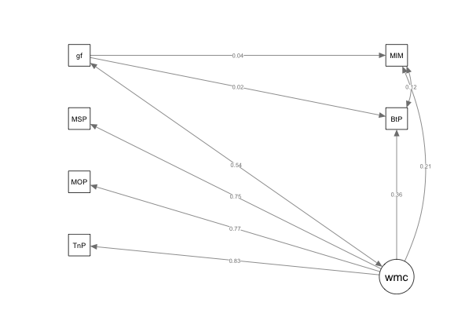

# Individual Differences

## Rationale 

The first two steps of Gary Karpinski's model of melodic dictation [@karpinskiAuralSkillsAcquisition2000; @karpinskiModelMusicPerception1990] rely exclusively on the mental representation of melodic information.
Karpinski conceptualizes the first stage of hearing as involving the physical motions of the tympanic membrane, as well as the listener's attention to the musical stimulus.
This stage is distinguished from that of short-term melodic memory that refers to the amount of melodic information that can be represented in conscious awareness.
Given that neither stage of the first two steps of Karpinski's model requires any sort of musical expertise, every individual with normal hearing and cognition should be able to partake in the first two steps of melodic dictation.
The ability to hear, then remember musical information is where all students of melodic dictation are presumed to begin their aural skills education.
From this baseline, students receive explicit education in music theory and aural skills to develop the ability to link what they hear to what can then be musically understood and consequently notated.

While the majority of beginning students of melodic dictation are assumed to start at the same level of ability, cognitive psychology research suggests that individual differences in cognitive ability exist and must be accounted for from a psychological and pedagogical perspective [@cowanWorkingMemoryCapacity2005; @ritchieIntelligenceAllThat2015].
In order to fully capture the diversity of listening abilities among students of melodic dictation, a complete account of melodic dictation must include individual differences in ability.
Understanding how differences at the individual level vary will also help pedagogues know what can be reasonably expected of students with different experiences and abilities.

Attempting to investigate all four parts of melodic dictation from hearing, to short-term melodic memory, to musical understanding, to notation is cumbersome from a theoretical perspective and practically infeasible due to the amount of variables that contribute to this process.
In order to obtain a clearer picture of what mechanisms contribute to this process, these steps must be be investigated in turn.
This chapter investigates the first two steps of the Karpinski model of melodic dictation [@karpinskiAuralSkillsAcquisition2000; @karpinskiModelMusicPerception1990] with an experiment examining individual factors that contribute to musical memory that do not depend on knowledge of Western musical notation.
Understanding which, if any, individual factors play a role in this process, will inform what can be reasonably expected of individuals when other musical variables are then introduced.

## Individual Differences

### Improving Musical Memory

Most aural skills pedagogy assumes students begin with approximately the same baseline listening and dictation abilities.
Assuming this baseline allows teachers to cover requisite information systematically and ensures that students are given the the same tools to enable their success in the classroom.
This assumption of similar baseline of abilities is implicit in the Karpinski model of melodic dictation.
The model provides a framework of mental choreography students are encouraged to build upon that is agnostic to individual differences; Karpinski's model assumes that all individuals, regardless of their background, will engage in the same process.
As students gain more knowledge in music theory, they build their musical understanding which in turn enables them to recognize more of the auditory scene they are focusing on.
In addition to learning explicit knowledge that facilitates their musical understanding, Karpinski suggests there are two other skills that students can develop in order to improve their short-term musical memory: extractive listening and chunking.
In Karpinski's own words: "Only one or both strategies can extend the capacity of short-term musical memory: (1) extractive listening and (2) chunking. (pp. 71)"

Karpinski defines extractive listening as "a combination of focused attention and selective memorization (p.70)".
Extractive listening requires students to be able to focus on the material they will be mentally representing and tune out other sources of stimulation that might distract the student.
In order to improve this ability, Karpinski suggests practicing listening to melodies and having students practice directing their attention to pre-determined set sequences of notes.
Students should slowly work towards being able to auralize the melody with other musical information still sounding. 
Karpinski claims that honing one's attention via this type of progressive practice will not only improve student's ability to dictate melodies, but will also help them with a host of other musical activity.
Further, Timothy Chenette has since proposed similar types of progressive loading aural exercises by co-opting standard cognitive tasks used in working memory paradigms [@chenetteReframingAuralSkills2019] in order to help students improve their ability to focus in the aural skills classroom. 

After students master the ability to selectively hear and retain a portion of a melody, the other way in which they can improve their dictation abilities is via chunking.
Chunking is a listener's ability to group smaller units of musical material into a larger group.
The idea of chunking derives from earlier work from Gestalt psychologists and was one of the initial mechanisms proposed by @millerMagicalNumberSeven1956 able to extend the finite window of memory.
The general idea is that if a collection of notes can be identified as its own discrete entity-- such as a descending major triad in first inversion-- the listener will only have to remember that one structure, rather than its component parts.
As discussed in the previous chapter in [Working Memory and Melodic Dictation], music's inherently sequential nature affords it many opportunities to find repeated patterns which can be labeled, musically understood, and thus chunked.
While stimuli that are inherently sequential are problematic for psychologists investigating capacity limits of working memory capacity [@cowanWorkingMemoryCapacity2005], students are expected to use chunking to their advantage in order to become more adept listeners.
As students learn to chunk more efficiently, they are able to process more musical information in their short-term musical memory.
With the development of both skills, students are presumed to increase their musical memory and ultimately improve their melodic dictation abilities.
But what evidence supports the assertion that individuals are able to improve on their ability to both learn and remember melodies?

### Memory for Melodies

Research findings from the memory for melody literature are mixed when considering how people vary in their ability to remember musical material [@halpernMemoryMelodies2010].
For example, no effect of an individual's musical training was found by @mcauleyPlayItAgain2004 in a paradigm where both musically trained and non-musically trained individuals were presented with melodies using a recognition paradigm task with melodies over the course of two days.
In a musical recognition task, @korenmanRoleFamiliarityEpisodic2004 found no effect of musicianship on memory.
Using a recognition paradigm, @munganLevelsofProcessingEffectsRemember2011 found an effect of musical training on melodic memory, but the significant effect reported was not found in correctly identifying melodies, but rather in correctly identifying melodies that they had not heard before.
@mullensiefenRoleFeaturesContext2014 reported no effects of musical training on their recognition paradigm experiment. 
They however did not include any expert participants in their sample and the focus of this particular study was to look at structural features of the melody, rather than individual level features.
Additionally, other studies have also found that musical expertise is not a successful predictor of melodic recognition [@demorestLostTranslationEnculturation2008; @halpernAgingExperienceRecognition1995]. 
As with much of the music psychology literature, one of the reasons that these studies may have not found a memory advantage for the more musically trained is that how musical training is measured varies widely from study to study [@talaminiMusiciansHaveBetter2017].
This inability to measure musical exposure additionally complicates controlling for the amount of variability of what might drive the memory effects in the models of musical memory.
When measured continuously using paradigms that require immediate recall and judgment, musical training does often predict memory for musical materials.

Using a stepwise modeling procedure, @harrisonModellingMelodicDiscrimination2016 consistently found evidence that musical training was a significant predictor of ability to perform well on a melodic discrimination task when developing an item response theory based test of melodic memory. 
Using regression modeling, Harrison et. al reported to be able to explain a large amount of the variance ($R^2 = 0.46$) when reporting response variability in a melodic discrimination task [@harrisonApplyingModernPsychometric2017a] when measuring musical training via the Goldsmith's Musical Sophistication Index [@mullensiefenMusicalityNonMusiciansIndex2014].
@bakerPerceptionLeitmotivesRichard2017 found musical training, when measured continuously, was able to be a significant predictor of sucessfull identification of musical material using a exposure-recall paradigm within a set of other predictor variables including participant's familiarity with the music and item level predictors.

Even despite mixed evidence suggesting different effects of musical training on an individual's ability to remember melodies, it is important to note that these studies do not specifically deal with melodic dictation, and thus cannot be used as a perfect comparison for a number of reasons.
The first is that melodic dictation is a much more complicated process that not only involves hearing a melody after a few iterations, but also its notation.
Seeing as students need to notate their melodies, which again is dependent on their knowledge of Western musical notation, melodic dictation is secondly a more cognitively demanding process than the previously mentioned studies on memory for melody which often only require a simple discrimination.

### Musician's Cognitive Advantage

While the above memory for melodies literature is mixed regarding the musician's advantage in memory for melodic material, there is research from cognitive psychology to support the evidence of an advantage of musical training in  perceptual tests.
Some researchers suggest that musicians have better cognitive abilities on a more domain general level, which could lead to better performance and explains differences in performance.
Work as reviewed in @schellenbergMusicNonmusicalAbilities2017 investigating the relationship between musical training and general intelligence suggests that both children and adults who engage in musical activity tend to score higher on general measures of intelligence than their non-musical peers [@gibsonEnhancedDivergentThinking2009; @hilleAssociationsMusicEducation2011; @schellenbergExaminingAssociationMusic2011; @schellenbergMusicTrainingEmotion2012].
Importantly, this association between intelligence and musical training comes with a correlation between duration of musical training and the extent of the increases in intelligence [@corrigallMusicTrainingCognition2013; @corrigallPredictingWhoTakes2015; @degeMusicLessonsIntelligence2011; @schellenbergLongtermPositiveAssociations2006].
While many of these studies are correlation, other researchers have further investigated this relationship in experimental settings attempting to control for confounding variables like socio-economic status and parental involvement in out-of-school activities [@corrigallMusicTrainingCognition2013; @degeMusicLessonsIntelligence2011; @schellenbergExaminingAssociationMusic2011; @schellenbergLongtermPositiveAssociations2006; @schellenbergMusicTrainingEmotion2012], but findings have been mixed.

Schellenberg [@schellenbergMusicNonmusicalAbilities2017] notes that in many of these studies there is a problem of too small of a sample size, in his review [@corrigallAssociationsLengthMusic2011; @parbery-clarkMusicalExperienceAging2011; @straitMusicalTrainingEarly2012] in that studies that are typically smaller might be underpowered to detect any effects. 
Also referenced in Schellenberg's review is evidence that when professional musicians are matched with non-musicians from the general population, these associations are non-existent [@schellenbergMusicTrainingSpeech2015]. 
Interpreting the current literature, Schellenberg puts forward the hypothesis that higher functioning children might self-select into music lessons and tend to stay in lessons longer which leads to the observed differences in intelligence. 
Additionally, Schellenberg remains skeptical of any sort of causal factors regarding increases in IQ [@francoisMusicTrainingDevelopment2013; @morenoMusicalTrainingInfluences2009] noting methodological problems such as short exposure times or researchers not holding pre-existing cognitive abilities constant [@mehrTwoRandomizedTrials2013].

In addition to general intelligence, another cognitive ability where musicians tend to exhibit superior performance is that of memory.
@talaminiMusiciansHaveBetter2017's meta-analysis investigating musical training and memory found not only a general advantage for musicians, but noted that musicians tended to perform better on memory tasks especially in cases where stimuli were short and tonal.
This musician advantage could derive from a musician's ability to chunk information more effectively based on past exposure via implicit learning practices [@ettlingerImplicitMemoryMusic2011; @rohrmeierImplicitLearningAcquisition2012].
This difference also might reflect the above mentioned self-selection of higher functioning individuals to partake in music, which then explains the differences in memory.

As noted above, much of the research at this point still focuses on higher level relationships and is progressively being improved upon by agreeing on how to measure what is actually driving these effects.
Until more concrete theories emerge that link specific musical traits to music ability, music psychology will not be able to put forward clearer models of causal effects [@bakerExaminingMusicalSophistication2018a].

### Relationship Established

Regardless of the direction of causality, the evidence discussed suggests that there is a relationship between musical training and cognitive ability.
Clearly cognitive ability is at play in many tasks of perception and production.
Presumably these abilities will interact with other variables of interest such as musical training as theorized by the researchers previously mentioned.
Even in studies outside of music, domain general cognitive abilities have been shown to be predictive above and beyond domain specific expertise.
In reviewing the current literature, [@hambrickDomainGeneralModelsExpertise2019] reiterate that while there is some evidence  of the time in many domain specific areas like chess, games, and music, the current state of the literature is not definitive enough to explain exactly how this phenomena works on a global level.

Though of all the studies mentioned thus far, one cognitive ability deserving of special attention is that of working memory.
As noted by [@berzWorkingMemoryMusic1995], many tests of memory-- such as the aforementioned tests--require the encoding and active manipulation of musical material.
In his 1995 article, Berz draws important parallels between working memory systems and music tests and postulated new loop specifically for musical information.

For example, @meinzDeliberatePracticeNecessary2010 found working memory to be predictive of performance in a sight reading task above and beyond that of deliberate practice.
Work by Kopiez [@kopiezDynamicModelSkills2006; @kopiezGeneralModelSkills2008] has additionally linked the importance of working memory to performance on sight reading tasks.
In multiple studies, Andrea Halpern and colleagues have also shown measures of working memory to be linked to performance in musical production tasks [@halpernEffectsTimbreTempo2008; @nicholsScoreOneJazz2018] and have even interpreted these findings in terms of Berz's memory loop. 
Other work by @harrisonModellingMelodicDiscrimination2016 has also made important links to an individual's ability to remember and recall musical information and working memory.
Harrison and colleagues put forward a cognitive model based on research in working memory that predicted which features of a melody-- based on theoretical considerations from working memory-- would be best at predicting behavioral performance.
They proposed that perceptual encoding, memory retention, similarity comparison, and decision-making could be used to contextualize differences in their memory recognition paradigm.
While they did find evidence to support this framework, they did not take any domain general measures of working memory capacity and thus were unable to conclude if domain general processes were able to better explain their data than using individual level musical, domain specific predictors.
Presumably any measure of musical perception ability should be able to explain above and beyond that of baseline cognitive abilities with a more established theoretical framework.

Additionally, @okadaIndividualDifferencesMusical2018 used a latent variable approach where they investigated executive function in a sample of 161 university students.
Using Miyake's conception of executive function [@miyakeNatureOrganizationIndividual2012; @miyakeUnityDiversityExecutive2000] and mixed effects modeling, Okada and Slevc found an effect of musical training as measured with the Goldsmiths Musical Sophistication Index (Gold-MSI) on the updating component of the executive functioning model, a construct often interpreted as similar to working memory capacity.
Okada and Slevc did not however link performance on their executive functioning tasks to an objective measure of musical performance implemented by the Gold-MSI.

### Dictation Without Dictation

Given the complex network of variables at play, in order to understand how these individual factors affect the first two steps of melodic dictation, a multivariate approach is needed.
In order to investigate the effects of individual factors on baseline, I must first assume that using a melodic discrimination paradigm can be used as a proxy for the first two steps of the Karpinski model of melodic dictation.
I argue that because melodic discrimination paradigms require perceptual encoding, memory retention, and two other cognitive manipulations of similarity comparison and decision making as argued by @harrisonModellingMelodicDiscrimination2016, this paradigms does in fact resemble the first two steps of the Karpinski model.
Karpinski's hearing and short-term musical memory could just as easily be described as perceptual encoding and memory retention.
Additionally, the requirement to execute a decision while representing musical information in memory-- Harrison and Müllensiefen's similarity comparison and decision making-- can be mapped on to later stages of Karpinski's model of musical understanding, and subsequently notation.

One of the most complete suites of measuring traits associated with musical behavior that additionally employs both objective and subjective measures of musical sophistication is the Goldsmiths Musical Sophistication Index [@mullensiefenMusicalityNonMusiciansIndex2014].
The Gold-MSI has a self-report questionnaire as well as two tests of objective ability and a timbre identification task.
One of the tests employs a beat detection paradigm, the other is a melodic discrimination paradigm.
Since both measures mirror tasks used in the aural skills classroom and the two are purported to measure different constructs, both will be used in this study.
Since its initial publication, adaptive short forms of the tests have been developed using item response theory [@harrisonApplyingModernPsychometric2017a].
These tests were not available for use at the time of this study's data collection. 

Assuming that a melodic discrimination task can then stand in for the first two steps of the Karpinski model, I can then model the relationships between performance on this musical memory task with individual level variables using structural equation modeling.
By doing this I can examine the extent to which factors contribute to the first two steps of melodic dictation.
    
### Cognitive Measures of Interest

Having previously established that many tests of musical ability and aptitude may in fact be tests of working memory [@berzWorkingMemoryMusic1995], one factor not yet accounted for in the memory for melodies literature is a domain general measure of working memory.
If working memory is conceptualized using Cowan's model of working memory as the window of attention [@cowanMagicalMysteryFour2010], measuring working memory would need to be operationalized using a task that implements both the retention and manipulation of information in memory.
This is commonly done with complex span tasks [@unsworthAutomatedVersionOperation2005].
Complex span tasks, unlike simple span tasks such as the _n-back_ paradigms, require both the retention and manipulation of items in memory and thus better reflect theoretically appropriate model of working memory [@cowanWorkingMemoryCapacity2005]. 

Additionally, since general intelligence is often predictive of performance on a host of cognitive tasks such as educational success, income, and even life expectancy [@ritchieIntelligenceAllThat2015] and has been theoretically related to working memory [@kovacsProcessOverlapTheory2016], this measure should also be accounted for when investigating individual features that contribute to the first two steps of melodic dictation using a standard paradigms of intelligence testing [@ravenManualRavenProgressive1994; @thurstonePrimaryMentalAbilities1938].
Finally, in response to claims made by  @okadaIndividualDifferencesMusical2018, having to need to account for specific covariates, this study also will track socioeconomic status and degree of education, variables used in previous music psychology research [@corrigallMusicTrainingCognition2013; @swaminathanRevisitingAssociationMusic2017].

### Structural Equation Modeling

Given the complex nature being investigated and the theoretical concepts at play such as working memory, general fluid intelligence, and musical sophistication conceptualized as a latent variable, it follows that the most appropriate method of parsing out the variance in this covariance structure would be to use some form of structural equation modeling [@beaujeanLatentVariableModeling2014].
Structural equation modeling uses latent variables-- theoretical constructs thought to exist, yet are not possible to measure directly-- by taking advantages of algerbraic systems originally developed by Sewall Wright [@wrightMethodPathCoefficents1934].
When used under the right conditions, the technique is powerful enough to determine causal mechanisms in closed systems [@pearlBookWhyNew2018], but this is not the case in this analysis. 

### Hypotheses

If I then assume that a same-different melodic memory paradigm is a stable proxy for the first two steps of Karpinski's model of melodic dictation, then data generated from both objective tests of the Goldsmiths' Musical Sophistication Index can serve as proxy for this measure of interest.
In this analyses, I will use a series of structural equation models in order to investigate how various individual factors contribute to an individual's memory for melody.
Following a step-wise procedure, these sets of analyses will provide a way to investigate what individual factors need to be accounted for in future research. 

Given a robust instrument for measuring musicality, and two well established cognitive measures as specifically defined below, this analysis seeks to investigate the degree to which these individual level variables are predictive of a task that is proxy to the first two steps of melodic dictation.
If a large proportion of the variance of musical memory can be attributed to training, then variables related to the Goldsmiths Musical Sophistication Index should be most predictive with the highest path coefficients and lead to the best model fit.
If instead cognitive factors do play a role, this should be evident in the path coeffecients.

## Overview of Experiment

### Participants

Two hundred fifty-four students enrolled at Louisiana State University completed the study. 
Students were mainly recruited in the Department of Psychology and the School of Music.
The criteria for inclusion in the analysis were no self-reported hearing loss, not actively taking medication that would alter cognitive performance, and the removal of any univariate outliers (defined as individuals whose performance on any task was greater than 3 standard deviations from the mean score of that task). 
Using these criteria, eight participants were not eligible due to self reporting hearing loss, one participant was removed for age, and six participants were eliminated as univariate outliers due to performance on one or more of the tasks of working memory capacity.
Thus, 239 participants met the criteria for inclusion. 
The eligible participants were between the ages of 17 and 43 (M = 19.72, SD = 2.74; 148 females). 
Participants volunteered, received course credit, or were paid $20.

### Materials

#### Cognitive Measures

All variables used for modeling approximated normal distributions. 
Processing errors for each task were positively skewed for the complex span tasks similar to @unsworthComplexWorkingMemory2009.
Positive and significant correlations were found between recall scores on the three tasks measuring working memory capacity (WMC) and the two measuring general fluid intelligence (Gf). 
The WMC recall scores negatively correlated with the reported number of errors in each task, suggesting that rehearsal processes were effectively limited by the processing tasks [@unsworthComplexWorkingMemory2009].

#### Measures

##### Goldsmiths Musical Sophistication Index Self Report (Gold-MSI)

Participants completed a 38-item self-report inventory and questions consisted of free response answers or choosing a
selection on a likert scale that ranged from 1-7. [@mullensiefenMusicalityNonMusiciansIndex2014]. 
The complete survey with all questions used can be found at goo.gl/dqtSaB.

##### Tone Span (TSPAN)

Participants completed a two-step math operation and then tried to remember three different tones in an alternating sequence (based upon @unsworthAutomatedVersionOperation2005). 
The three tones were modeled after @liEstimatingWorkingMemory2013 using frequencies outside of the equal tempered system (200Hz, 375Hz, 702Hz). 
The same math operation procedure as OSPAN was used. 
The tones was presented aurally for 1000ms after each math operation. 
During tone recall, participants were presented three different options, H M and L (High, Medium, and Low), each with its own check box.
Tones were recalled in serial order by clicking on each tone’s box in the appropriate order.
Tone recall was untimed.
Participants were provided practice trials and similar to OSPAN, the test procedure included three trials of each list length (3-7 tones), totaling 75 letters and 75 math operations.

##### Operation Span (OSPAN)

Participants completed a two-step math operation and then tried to remember a letter (F, H, J, K, L, N, P, Q, R, S, T, or
Y) in an alternating sequence [@unsworthAutomatedVersionOperation2005]. 
The same math operation procedure as TSPAN was used. 
The letter was presented visually for 1000ms after each math
operation. 
During letter recall, participants saw a 4 x 3 matrix of all possible letters, each with its own check box. 
Letters were recalled in serial order by clicking on each letter’s box in the appropriate order. 
Letter recall was untimed. 
Participants were provided practice trials and similar to TSPAN, the test procedure included three trials of each list length (3-7 letters), totalling 75 letters and 75 math operations.

##### Symmetry Span (SSPAN)

Participants completed a two-step symmetry judgment and were prompted to recall a visually-presented red square on a 4 X 4 matrix [@unsworthAutomatedVersionOperation2005]. 
In the symmetry judgment, participants were shown an 8 x 8 matrix with random squares filled in blank. 
Participants had to decide if the black squares were symmetrical about the matrix’s vertical axis and then click the screen. 
Next, they were shown a “yes” and “no” box and clicked on the appropriate box. 
Participants then saw a 4 X 4 matrix for 650 ms with one red square after each symmetry judgment. 
During square recall, participants recalled the location of each red square by clicking on the appropriate cell in serial order. 
Participants were provided practice trials to become familiar with the procedure. 
The test procedure included three trials of each list length (2-5 red squares), totalling 42 squares and 42 symmetry judgments.

##### Gold-MSI Beat Perception

Participants were presented 18 excerpts of instrumental music from rock, jazz, and classical genres [@mullensiefenMusicalityNonMusiciansIndex2014]. 
Each excerpt was presented for 10 to 16s through headphones and had a tempo ranging from 86 to 165 beats per
minute. 
A metronome beep was played over each excerpt either on or off the beat. 
Half of the excerpts had a beep on the beat, and the other half had a beep off the beat. 
After each excerpt was played, participants answered if the metronome beep was on or off the beat and provided their confidence: “I am sure”, “I am somewhat sure”, or “I am guessing”. 
The final score was the proportion of correct responses on the beat judgment.

##### Gold-MSI Melodic Memory Test

Participants were presented melodies between 10 to 17 notes long through headphones [@mullensiefenMusicalityNonMusiciansIndex2014].
There were 12 trials, half with the same melody and half with different melodies. 
During each trial, two versions of a melody were presented. 
The second version was transposed to a different key. 
In half of the second version melodies, a note was changed a step up or down from its original position in the structure of the melody. 
After each trial, participants answered if the two melodies had identical pitch interval structures.

##### Number Series

Participants were presented with a series of numbers with
an underlying pattern. 
After being given two example problems to solve, participants had 4.5 minutes in order to solve 15 different problems. 
Each trial had 5 different options as possible answers [@thurstonePrimaryMentalAbilities1938].

##### Raven’s Advanced Progressive Matrices

Participants were presented a 3 x 3 matrix of geometric patterns with one pattern missing [@ravenManualRavenProgressive1994]. Up to eight pattern choices were given at the bottom of the screen. 
Participants had to click the choice that correctly fit the pattern above. 
There were three blocks of 12 problems, totalling 36 problems. 
The items increased in difficulty across each block. 
A maximum of 5 min was allotted for each block, totalling 15 min. 
The final score was the total number of correct responses across the three blocks.

### Procedure

Participants in this experiment completed eight different tasks, lasting about 90 minutes in duration. 
The tasks consisted of the Gold-MSI self-report inventory, coupled with the Short Test of Musical Preferences [@rentfrowReMiEveryday2003], and a supplementary demographic questionnaire that included questions about socioeconomic status, aural skills history, hearing loss, and any medication that might affect their ability to perform on cognitive tests. 
Following the survey they completed three WMC tasks: a novel Tonal Span, Symmetry span, and Operation span task; a battery of perceptual tests from the Gold-MSI (Melodic Memory, Beat Perception, Sound Similarity) and two tests of general fluid intelligence (Gf): Number Series and Raven’s Advanced Progressive Matrices.

Each task was administered in the order listed above on a desktop computer. 
Sounds were presented at a comfortable listening level for the tasks that required headphones. 
All participants provided informed consent and were debriefed.
Only measures used in modeling are reported below.

### Results

#### Descriptive, Data Screening, Correlational

The goal of the analyses was to examine the relationships among the measures and constructs of WMC, general fluid intelligence, and musical sophistication (operationalized as the General score from the Gold-MSI), in relation to the two objective listening tests on the Gold-MSI. 
Before running any sort of modeling, data was inspected to ensure that in addition to outlier issues as mentioned above, the data exhibited normal distributions. 

Before running any modeling, I checked our data for assumptions of normality since violations of normality can strongly affect the covariances between items. 
While some items in Figure 1 displayed a negative skew, many of the individual level items from the self report scale exhibited high
levels of Skew and Kurtosis beyond the generally accepted ± 2 [@fieldDiscoveringStatisticsUsing2012], but none of the items with the unsatisfactory measures are used in the general factor.

#### Modeling

##### Measurement Model

I then fit a measurement model to examine the underlying structure of the variables of interest used to assess the latent constructs (general musical sophistication, WMC, general fluid intelligence) by performing a confirmatory factor analysis (CFA) using the lavaan package [@rosseelLavaanPackageStructural2012] using R [@teamLanguageEnvironmentStatistical2015]. 
Model fits can be found in table \@ref(exp2variables). 
For each model, latent factors were constrained to have a mean of 0 and variance of 1 in order to allow the latent covariances to be interpreted as correlations. 
Since the objective measures were on different scales, all variables were converted to z scores before running any modeling.

```{r measurementmodel, echo=FALSE, fig.cap="CFA Measurement Model",fig.align='center', out.width="100%"}
knitr::include_graphics("img/measurementModel.png")
```

```{r exp2variables, echo=FALSE}
Abbreviation <- c("gen" ,"wmc" ,"gf"  ,"zIS" ,"zHO" ,"zSB" ,"zDS" ,"zSH" ,"zJI" ,"zNI" ,"zRP" ,"zNCS","zNcV","zST" ,"zCP" ,"zAd" ,"zSI" ,"zWr" ,"zFr" ,"zTP" ,"zMS" ,"zMO" ,"zRA" ,"zAN")
Variable <- c("General Self-Report Musical Sophistication" ,"Working Memory Capacity" ,"General Fluid Intelligence" ,"Identify What is Special" ,"Hear Once Sing Back", "Sing Back After 2-3","Don’t Sing In Public", "Sing In Harmony ","Join In" ,"Number of Instruments" ,"Regular Practice","Not Consider Self Musician" ,"Never Complimented" ,"Self Tonal" ,"Compare Performances","Addiction" ,"Search Internet" ,"Writing About Music" ,"Free Time" ,"Tone Span" ,"Symmetry Span" , "Operation Span","Ravens","Number Series"
)

`Variable Table` <- data.frame(Abbreviation, Variable)


knitr::kable(
  `Variable Table`, booktabs = TRUE,
  caption = 'Variables Used In Modeling'
)
```

#### Structural Equation Models

Following the initial measurement model, I then fit a series of structural equation models in order to investigate both the degree to which factor loadings changed when variables were removed from the model as well as the model fits. 
I began with a model incorporating our three latent variables (general musical sophistication, WMC, general fluid intelligence) predicting our two objective measures (beat perception and melodic memory scores) and then detailed steps we took in order to improve model fit. 
For each model, I calculated four model fits: $\chi^2$ , comparative fit index (CFI), root mean square error (RMSEA), and Tucker Lewis Index (TLI). 
In general, a non-significant $\chi^2$ indicates good model fit, but is overly sensitive to sample size. 
Comparative Fit Index (CFI) values of .95 or higher are considered to be indicative of good model fits as well as Root Mean Square Error (RMSEA) values of .06 or lower, Tucker Lewis Index (TLI) values closer to 1 indicate a better fit [@beaujeanLatentVariableModeling2014].

After running the first model (Model 1), I then examined the residuals between the correlation matrix the model expects and our actual correlation matrix looking for residuals above .1. 
While some variables scored near .1, two items dealing with being able to sing (“I can hear a melody once and sing it back after hearing it 2 – 3 times” and “I can hear a melody once and sing it back”) exhibited a high level of correlation amongst the residuals (.41) and were removed for  Model 2 and model fit improved significantly ($\chi^2$ (41)=123.39, p < . 001). 

After removing the poorly fitting items, I then proceeded to examine if removing the general musical sophistication self-report measures would significantly improve model fit for Model 3. 
Fit measures for Model 3 can be seen in Table \@ref(ModelFits) and removing the self-report items resulted in a significantly better model fit (χ2 (171)=438.8, p < . 001). 
Following the rule of thumb that at least 3 variables should be used to define any latent-variable [@beaujeanLatentVariableModeling2014].
I modeled WMC as latent variable and Gf as a composite average of the two tasks administered in order to improve model fit. 
This model resulted in significant improvement to the model ($\chi^2$ (4)=14.37, p < . 001). 
Finally I examined the change in test statistics between Model 2 and a model that removed the cognitive measures-- a model akin to one of the original models reported in [@mullensiefenMusicalityNonMusiciansIndex2014]-- for Model 5. 
Testing between the two models resulted in a significant improvement in model fit ($\chi^2$ (78)=104.75, p < . 001). 
Figure \@ref(fig:model4) displays Model 4, our nested model with the best fit indices.

```{r ModelFits, echo=FALSE}

Models <- c("CFA","Model 1","Model 2","Model 3", "Model 4","Model 5")
df <- c(186,222,181,10,6,130)
chi <- c(533.60,586.30,462.90,24.11,9.74,358.16)
p <- c("> .001","> .001","> .001","> .05","> .14","> .001")
CFI <- c(0.83,0.83,0.86,0.97,0.99,0.83)
RMSEA <- c(0.09,0.08,0.08,0.08,0.51,0.10)
TLI <- c(0.81,0.80,0.83,0.94,0.97,0.80)

semDT <- data.frame(Models,df, chi,p, CFI, RMSEA, TLI)

knitr::kable(semDT, booktabs = TRUE, caption = "Model Fits")
```


```{r model1, echo=FALSE, fig.cap="Full Model, All Variables Included",fig.align='center', out.width="100%"}
knitr::include_graphics("img/sem1.png")
```

```{r model2, echo=FALSE, fig.cap="Full Model, Highly Correlated Residual Items",fig.align='center', out.width="100%"}
knitr::include_graphics("img/sem2.png")
```

```{r model3, echo=FALSE, fig.cap="Self Report Removed, Only Cognitive Measures",fig.align='center', out.width="100%"}

```

```{r model4, echo=FALSE, fig.cap="Cognitive Measures, Gf as Observed",fig.align='center', out.width="100%"}

```

```{r model5, echo=FALSE, fig.cap="General Self Report Only",fig.align='center', out.width="100%"}
knitr::include_graphics("img/sem5.png")
```


## Discussion

### Model Fits

#### Measurement Model 

After running a confirmatory factor analysis on the variables of interest, the model fit was below the threshold of what is considered a “good model fit” as shown in \@ref(ModelFits) with references to above model fits. 
This finding is to be expected since no clear theoretical model has been put forward that would suggest that the general musical sophistication score, when modeled with two cognitive measures should have a "good" model fit. 
This model was run to create a baseline measurement.

#### Structural Equation Model Fitting

Following a series of nested model fits, I was able to improve model fits on a series of structural equation models that incorporated both measures of working memory capacity and measures of general fluid intelligence.
Before commenting on new models, it is worth noting that Model 5 does not seem to align with the findings from the original 2014 paper by [@mullensiefenMusicalityNonMusiciansIndex2014]. 
While the correlation between the objective tasks is the same (r = .16), the factor loadings from this analysis suggest lower values for both Beat Perception (.37 original, .27 this paper) as well as Melodic Memory (.28 original, .18 this paper). 
Note that two items were removed dealing with melody for memory for this model; when those items were re-run with the data, the factor loadings did not deviate from these numbers.

The first two models I ran resulted in minor improvements to model fit. 
While the difference in models was significant ($\chi^2$ (41)=123.39, p < . 001), probably due to the number of parameters that were now not constrained, the relative fit indices of the models did not change for practical interpretation. 
It was not until the self-report measures were removed from the model, and then manipulated according to latent variable modeling recommendations, that was there a marked increase in the relative fit indices. 
Fitting the model with only the cognitive measures, I was able to enter the bounds of acceptable relative fit indices that were noted above. 
In order to find evidence that the cognitive models (Models 3 and 4) were indeed a better fit than using the General factor, I additionally ran a comparison between our adjusted measurement model and a model with only the self-report.
While both of the nested models were significantly different, the cognitive models exhibited superior relative fit indices.
Lastly, turning to \@ref(fig:model4), I note that the latent variable of working memory capacity exhibited much larger path coeffecient predicting the two objective, perceptual tests than our measure of general fluid intelligence. 
I also note that the path coeffeceent predicting the Beat Perception task ($r$ =.36) was higher than that of the Melodic Memory task ($r$ = .21). 
These rankings mirror that of the original [@mullensiefenMusicalityNonMusiciansIndex2014] paper and merit further examination in order to disentangle what processes are contributing to both tasks.

Given the results here that suggest that measures of cognitive ability play a significant role in tasks of musical perception, my analysis suggests that future research should consider taking measures of cognitive ability into account, so that other variables of interest are able to be shown to contribute above and beyond baseline cognitive measures.

### Relating to Melodic Dictation

This study sought to investigate the extent to which individual factors contributed to an individual's ability to perform the first two steps of melodic dictation.
In order to do this, I assumed that the first two steps of the Karpinski model-- hearing and short term melodic memory-- could be investigated by using a same-different melodic memory paradigm.
Both tasks require the dual activation of representing information in conscious awareness and completing a cognitive task.
Using this paradigm also allowed me to investigate the first to steps of Karpinski's model using both individuals with and without musical training. 

Overall, when interpreting the results I found evidence to corroborate claims made by @berzWorkingMemoryMusic1995 positing the importance of working memory in both tests of musical aptitude, and consequently the first two steps of melodic dictation as described by Karpinski.
Relatively, working memory seemed to dominate as the variable with the most explanatory power as derived from both the best overall model fits and highest path coefficients in the latent variable modeling.
This is not a surprising finding given the context, yet has major implications for future research in music perception.
If a domain general process is able to predict performance on a domain specific task (melodic memory) better than measures of self report and training, future studies in music perception will need to be able to demonstrate how the process they purport to be the driving factor behind their models explains their findings above and beyond working memory capacity.

Also worth discussing is why general fluid intelligence did not fare as well in the models above.
One reason that this might be is because general intelligence tests are designed in two ways differing from that of melodic dictation.
The first is that general fluid intelligence tests administered here do not have any time component to them.
While tasks like Raven's matrices [@ravenManualRavenProgressive1994] and the number series [@thurstonePrimaryMentalAbilities1938] tests are timed, the information is presented visually to participants.
The second is that general fluid intelligence is designed to measure abilities outside of the context of previously known information [@cattellAbilitiesTheirGrowth1971] and questions surrounding music perception depend on principles of statistical learning [@huronSweetAnticipation2006; @pearceStatisticalLearningProbabilistic2018a; @saffranStatisticalLearningTone1999], stylistic enculturation [@demorestLostTranslationEnculturation2008; @eerolaExpectancySamiYoiks2009; @meyerEmotionMeaningMusic1956], and music theory.
General fluid intelligence might be helpful at later stages of cognitive processing such as the musical understanding and notation phases of the Karpinski model, but their effect does not seem to be present here. 

From a pedagogical standpoint, this is important in that many teachers are aware that students will vary in terms of their working memory ability.
While it might be tempting to pathologize cognitive predictors deemed relevant in these contexts, further work specifically looking the load on memory is needed before claims are made about incoporating this as a way to diagnose problems with student performance.
One practical consideration for the classroom within the Karpinski framework that could be put forward would be to encourage students to listen for smaller chunks when using extractive listening.
Using a Cowan's model of working memory, students should extract smaller chunks so that they still have cognitive resources available in order to focus on the later stages of the Karpinski model (musical understanding and notation).
As attention is limited, not listening to more than you can hold will free up cognitive resources that might later be used in melodic dictation.
Further students could take up recommendations like that of @chenetteReframingAuralSkills2019 and focus on activities that might help them increase their ability to focus, knowing that this practice will most likely not increase their working memory.

Not only will these findings have relevance in the classroom, but they suggest that future work looking to do more robust modeling of melodic dictation must take into account the window of attention.
In chapter 7, I incorporate this finding into a computational model of melodic dictation and use the finite window of working memory as a perceptual bottleneck to constrain incoming musical information. 

In this chapter, I fit a series of structural equation models in order to investigate the degree to which baseline cognitive ability was able to predict performance on a musical perception task. 
My findings suggest that measures of working memory capacity are able to account for a large amount of variance beyond that of self report in tasks of musical perception.
