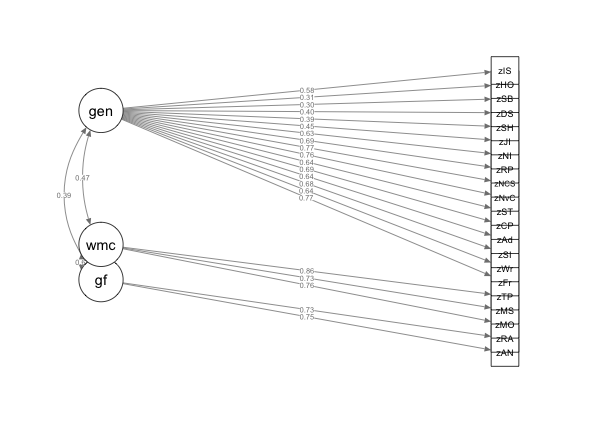
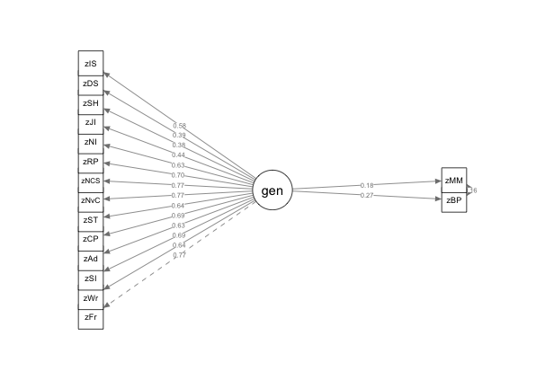

---
output:
  word_document: default
  html_document: default
---
# Individual Differences

## Rationale 

The first two steps of Gary Karpinski's model of melodic dictation [@karpinskiAuralSkillsAcquisition2000; @karpinskiModelMusicPerception1990] rely exclusively on the mental representation of melodic information.
Karpinski conceptualizes the first stage of _hearing_ as involving the physical motions on the tympanic membrane, as well as the listener's attention to the musical stimulus.
This stage is distinguished from that of _short-term melodic memory_ which refers to the amount of melodic information that can be represented in conscious awareness.
Given that neither stage of the first two steps of Karpinski's model requires any sort of musical expertise, every individual with normal hearing and cognition should be able to partake in the first two steps of melodic dictation.^[This whole model needs critique under the WMC literature. It's kind of strange to think that the act of something hitting your ear is different than attention (the way that Cowan thinks about WMC and again that you can split up the representation in memory from that of what the characteristics are of the melody like the meter and scale degrees, which have been argued to be part of intrinsic qualia) also there is a big problem here about stuff being actively rehearsed or not]
The ability to hear, then remember musical information is where all students of melodic dictation are presumed to start.
From this baseline, students recieve explicit education in music theory and aural skills and to develop the ability to link what is heard to what can then be musically understood and then notated.

While the majority of beginning students of melodic dictation are assumed to start at the same ability, recent reserach from music psychology suggests that individual differences in musical perception exist and must be accounted for from a psychological and pedagogical standpoint CITATIONS.
In order to fully capture the diversity of listening abilities amongst students of melodic dictation, a complete account melodic dictation music include individual differences in ability.
Understanding how differences at the individual level vary also will help pedagoges know what can be reasonably expected of students with different experiences and abilities.

Attempting to investigate all four parts of melodic dictation from hearing, to short-term melodic memory, to musical understanding, to notation is cumbersome both from a theoretical perspective and practically unfeasible due to the amount of variables that might contribute to this process.
In order to obtain a clearer picture of what mechanisms contribute to this process, these steps must be be investigated in turn.
This chapter investigates the first two steps of the Karpinski model with an experiment investigating individual factors that contribute to an individual's musical memory that do not depend on their knowledge of Western musical notation.
By understanding which, if any, individual factors play a role in this process, it will inform what can be reasonably expected of individuals when other musical variables are introduced.

## Individual Differences

### Improving Musical Memory

Most aural skills pedagogy assumes students begin with approximetly the same baseline.
This is an important assumption to the Karpinski model.
As noted in the previosu chapter, the Karpinksi model is agnostic as to who is taking the dictation.
According to Karpinski, students can develop two skills in order to improve their melodic dictation abilities: extractive listening and chunking.
In Karpinksi's own words:

> Only one or both or both stratgies can extend the capacity of short-term musical memory: (1) extractive listening and (2) chunking. (pp. 71)"

Karpinski defines extractive listening as "a combindation of focused attention and selective memorization (p.70)".
Extractive listening requires students to be able to focus in on the material they will be mentally representing andtune out other sources of stimulation that might distract the student.
In order to improve this ability, Karpinksi suggests practicing listening to melodies to melodies and having students practice directing their attention to certain sequences of notes and slowly working towards being able to auralize the melody with other musical information still sounding. 
Karpinski claims that honing one's attention via progrssive practice will not only improve student's ability to dictate melodies, but alo help them with a host of other muscial activity.
Further, Timothy Chenette has since proposed simlar types of progressive loading aural exercises by co-opting standard cognitive tasks used in working memory paradigms [@chenetteReframingAuralSkills2019] . 

After students master the ability to selectively hear and retain portion of a melody, the other way in which they can improve their dictation abilities is via the act of chunking.
Chunking is a listener's ability group musical materials into groups.
The idea of chunking derrives from earlier work from Gestalt psychologists and was one of the initial meachisms proposed by @millerMagicalNumberSeven1956 that he proposed was an able to extend the finite window of memory.
The general idea is that if a collection of notes can be identified as its own discrete entity, such as a descending triad, the listerer will only have to remember that one structure, rather than its component parts.
As discussed in the previous chapter in §XXX, music's inherently sequential nature affords it many oppertunites to find repeated patterns which can be labled, musicaly understood, and thus chunked.
While stimuli that are inherently sequetional are problems for researchers working in the working memory literature, students are expected to use these chunking to their advantage in order to become better listeners .
As students learn to chunk more, they are able to take in more muscial information into their short term musical memory.
With the increase of both skills, students are presumed to increase their musical memory and ultimatly improve their melodic dictation abilites.
But is there any literature support this claim?

### Memory for Melodies

Research findings from the memory for melody literature is mixed when considering the advantage to remembering melodies and musical training [@halpernMemoryMelodies2010].
This is not to say chunking and extractive memory are not pedagogically helpful, as the studies I am about to list do specifically address melodic dicttion.
For example, no effect of musicianship was found by @mcauleyPlayItAgain2004 in a paradigm where they presentd both musically trained and non-musically trained individuals melodies over the course of two days.
In a musical recognition task, [@korenmanRoleFamiliarityEpisodic2004] found no effect of musicianship on memory and using an old-new design, [@munganLevelsofProcessingEffectsRemember2011] found an effect of musical training, but not in correctly identifying melodies, but in correctly identifying songs that they had not heard before.
As with much of the music psychology literature, one of the reasons that these studies may have not found an effect is that that how musical training is measured varies widly from study to study [@talaminiMusiciansHaveBetter2017].
When measured continously using paradigms that require immediate recall and jugmenent, musical training does often predict memory for muscial mateirals.
Using regresion modeling, Harrison et. al reported an $R^2 = 0.459$ when reporting the response variablility in a melodic discrimination task [@harrisonApplyingModernPsychometric2017a] when using the Goldsmith's Musical Sophistication index.
@bakerPerceptionLeitmotivesRichard2017 found musical training, when measured continously, was able to be a significant predictor using a exposure-recall paradigm using more ecological stimuli.

* Mullensifen halpern 2x
* new fantastic paradigm

Even despite mixed evidence suggesting different effects that musical training has on an individual's ability to remember melodies, these studies do not specifically deal with melodic dictation, and thus cannot be used as a direct comparsion for a number of reasons.
The first is that melodic dictation is a much more complicated process that not only involves hearing a melody after a few iterations, but also its notation.
Seeing as melodic dictators need to notate their melodies, which again is dependant on their knowledge of Western musical notation, melodic dictation is secondly a more connitively demanding process than the previously mentioned studies on memory for melody which often only require a simple discrimination.

While the above memory for melodies literature is mixed regarding the musician's advantage, there is research from cognitive psychology to support that musicans do in fact have better cognitive abilities on a more domain general level, which could lead ot better performance.
Work as reviewed in @schellenbergMusicNonmusicalAbilities2017 investigating the relationship between musical training and general intelligence suggest that both children and adults who engage in musical activity tend to score higher on general measurses of intelligence than their non-musical peers (Gibson, Folley and Park, 2009; Hille et al., 2011; Schellenberg, 2011a; Schellenberg and Mankarious, 2012).
The finding importantly comes with it a correlation between duration of musical training and the extent of the increases in intelligence (Degé, Kubicek and Schwarzer!!!!!, 2011a; Degé, Wehrum, Stark and Schwarzer, 2015; Corrigall and Schellenberg, 2015; Corrigall, Schellenberg and Misura, 2013; Schellenberg, 2006).
While many of these studies are correlational, other researchers have further investigated this relationship in experimental settings in attempt to control for confounding variables like socio-economic status and parental involvment in out of school activities (Corrigall et al., 2013; Degé et al., 2011a; Schellenberg, 2006, 2011a, 2011b; Schellenberg and Mankarious, 2012), but findings have been mixed.

Schellenberg [@schellenbergMusicNonmusicalAbilities2017] notes that in many of these studies there is a problem of too small of a sample size in his review (Corrigall and Trainor, 2011; Parbery-Clark et al., 2011; Strait, Parbery-Clark, Hittner and Kraus, 2012) in that studies that are typically smaller do not reach statistical significance. 
Also referenced in Schellenberg's review is evidence that when professional musicians are matched with non-musicians from the general population these associations are NON EXISTANT (CITE SEE SCHELL 2015). 
Interpreting the current literature Schellenberg's puts forward the hypothesis that higher functioning kids self-select into music lessons and they tend to stay in lessons longer which leads to the observed differences in intelligence. 
Additionally, Schellenberg remains skeptical of any sorts of causal factors regarding increases in IQ (e.g., François et al., 2013; Moreno et al., 2009) noting methodlogical problems like how short exposure times were in studies claiming increases in effects or researchers who not holding pre-exisiting cognitive abilitis constant (Mehr, Schachner, Katz and Spelke, 2013).


Another congitive ability where musicians tend to be superior is that of memory.
[@talaminiMusiciansHaveBetter2017]'s meta-analysis looking at musica and memory found not only a general advantage of musicians, but noted that musicians tended to perform better on memory tasks especially in cases where stimuli were short and tonal.
This musican advantage could derive from a musician's ability to chunk information more effectively based on past exposure via implicit learning practices [@ettlingerImplicitMemoryMusic2011; @rohrmeierImplicitLearningAcquisition2012].
As noted above, much of the research at this point still very much focuses on higher level relationships, which is progressivly being improved upon by agreeing on how to measure music.
Though until more concrete theories emerge that link specific musical traits to music ability, music psychology will still suffer from less exact models. CITE SELF.

### Relationship Established

Regardless of the direction of causality, there is evidence to suggest that there is a relationship between muscial training and cognitive ability.
Clearly cognitive ability is at play in many task of perception and production and presumably these abilities would interact with other variables of interst such as musical training.
Even in studies outside of music, domain gerral cognitve abilities have been shown to be predictive above and beyond domain specific expertise.
In reviewing the current literature, [@hambrickDomainGeneralModelsExpertise2019] reiterate that while there is evidence some of the time in many domain specific areas like chess, games, and music, the current state of the literature is not definitve enough to explain exactly how this phenomea works on a global level.

Though of all the studies mentioned thus far, one cognitive ability deserving of special attention is that of working memory.
As noted by [@berzWorkingMemoryMusic1995], many tests of memory-- such as the tests above--require the encoding and active manipulation of musical material.
In his 1994 article, Berz draws important parallels between working memory systems and music tests and postulated new loop.
For example [@meinzDeliberatePracticeNecessary2010] found working memory to be predictive of performance in a sight reading task above and beyond that of deliberate practice.
Work by Kopiez [@kopiezDynamicModelSkills2006; @kopiezGeneralModelSkills2008] has has additoinally linked the importance of working memory to performance on sight reading tasks.
In multiple studies, Andrea Halpern has also shown measures of working memory to be linked to performance in muscial production tasks [@halpernEffectsTimbreTempo2008; @nicholsScoreOneJazz2018b] and has even interpreted these findings in terms of Berz's memory loop. 
Additionally, [@okadaIndividualDifferencesMusical2018a] used a a latent variable approach where they investigated executive function in a sample of 161.
Using Miyake conception of executive function and mixed effects modeling, Okda and Slevc found an effect of musical training as measures withe Goldsmiths Musical Sophisitcation Index on the updating component of the executive functioning model, a construct often interpreted as similar to working memory capacity.
Okada and Slevc did not howwever link performance on their executive functioning tasks to an objective measure of muscial performance implemented by the Goldsmiths Musical Sophistication Index.

So given the complex network of variables at play, in order to understand how these individual non training factors affect the first two steps of melodic dictation, need to take a multivariate approach.
In order to investigate the effects of individual factors on baseline, need to first assume that m4m can stand in for first two steps of melodic dictation.
Then by investigating how these factors relate using structural equaiton modeling, we will be able to see what, if any factors, contribute to the first tow steps here.
    
### Dictation without Dictation

One of the most popular paradigms used in music perception research, specifically the memory for melody literature, are same-different memory tasks [@halpernMemoryMelodies2010].
These tasks require individuals to hear a melody, retain it in memory, then hear a second melody either at the exact same pitch level, or transposed, and then make a judgment if the two melodies were the same or different.
It is important to note this type of task requires both rention of musical material and a secondary cognitive task: deciding if the melodies were identical or not.
In many ways, this type of task mirrors the first two steps of melodic dictation.
Same-different paradigms require individuals to first hear a finite amount of musical material, then while held in concious representation, perform some sort of mental action on the contents of memory by making a similarity judgment.
If one were to acknowledge these similariies in mental processes, using same-different paradigms could provide a way to investigate the first two steps of Karpinkski's model of melodic dictation in the general population which may or may not have musical training.

### Cognitive Measures of interest

Having previously established that many tests of musical ability and aptitude, may in fact be tests of working memory [@berzWorkingMemoryMusic1995], one factor not yet accounted for in many of the measures of musical memory might be working memory.
If operationalized as conceptualized as Cowan above [@cowanMagicalMysteryFour2010], one would have ot measure working memory using a task that uses both retention and manipulation of informaiton in memory, or a set of complex span tasks [@unsworthAutomatedVersionOperation2005].
Additionally, since general intelligence is often predictive of performance on a host of cognitive tasks LIST and has been theoretically related to working memory [@kovacsProcessOverlapTheory2016], this measure should also be accounted for.
Finally, in response to claims made by [@okadaIndividualDifferencesMusical2018a] having to need to account for specific covariates, it would also be good to keep track of things like socioeconomic status, degree of education, and OTHER VARIABLES.

### PATH Analysis here

Given the complex nature being investigated and the theoretical concepts at play such as working memory, general fluid intelligence, and musicial sophisticaiton conceputalized as a latent variable, it follows that the most appropriate method of parsing out the variance in this covariance structure would be to use some form of path analysis.
Path analysis is a type of analysis developed by XXXX which orignally assumed a closed algerbric system which could be used to parse out causal structures amongst covariance relationships WHY.
The sets of variables presented do not make up a closed system as orignally devided by XXX in his investigation of the heretibility of guinia pig traints PEARL PAGE, path analysis using structural equation modeling does allow insight into the degree that variables of interest contribute to complex causal relationships.

### Hypotheses

If I then assume that a same-different melodic memory paradigm is a stable proxy for the first two steps of Karpinski's model of melodic dictation, then data generated from both objective tests of the Goldsmiths' Musical Sophistication Index  can serve as proxy for this measure of interst.
In this analyses, I will use a series of structural equation models in order to investigate how various individual factors contribute to an individual's memory for melody.
Following a stepwise proceedure LIKE EE, these sets of analyses will provide a way what individual factors need to be accounted for in future research. 

Given a robust instrument for measuring musciality, and two well established cognive measrues as specifically defined, this study analysis seeks to investigate the degree to which these individual level variables are predictive of a task that is proxy to the first two steps of melodic dictation.

If a large proportion of the variance of musical memory can be attributed to training, then variables related to the Goldsmiths Musical Sophisitication Index should be most predictive with the highest path coeffecients and lead to the best model fit.
If instead cognitive factors do play a role, this should be evident in the path loadings.
Not an either or, more like a both. 

## Overview of Experiment

### Participants

Two hundred fifty-four students enrolled at Louisiana State University completed the study. 
Students were mainly recruited in the Department of Psychology and the School of Music.
The criteria for inclusion in the analysis were no self-reported hearing loss, not actively taking medication that would alter cognitive performance, and the removeal of any univariate outliers (defined as individuals whose performance on any task was greater than 3 standard deviations from the mean score of that task). 
Using these criteria, eight participants were not eligible due to self reporting hearing loss, one participant was removed for age, and six participants were eliminated as univariate outliers due to performance on one or more of the tasks of working memory capacity.
Thus, 239 participants met the criteria for inclusion. 
The eligible participants were between the ages of 17 and 43 (M = 19.72, SD = 2.74; 148 females). 
Participants volunteered, received course credit, or were paid $20.

### Materials

#### Cognitive Measures

All variables used for modeling approximated normal distributions. 
Processing errors for each task were positively skewed for the complex span tasks similar to @unsworthComplexWorkingMemory2009.
Positive and significant correlations were found between recall scores on the three tasks measuring working memory capacity (WMC) and the two measuring general fluid intelligence (Gf). 
The WMC recall scores negatively correlated with the reported number of errors in each task, suggesting that rehearsal processes were effectively limited by the processing tasks [@unsworthComplexWorkingMemory2009].

#### Measures

##### Goldsmiths Musical Sophistication Index Self Report (Gold-MSI)

Participants completed a 38-item self-report inventory and questions consisted of free response answers or choosing a
selection on a likert scale that ranged from 1-7. [@mullensiefenMusicalityNonMusiciansIndex2014]. 
The complete survey with all questions used can be found at goo.gl/dqtSaB.

##### Tone Span (TSPAN)

Participants completed a two-step math operation and then tried to remember three different tones in an alternating sequence (based upon @unsworthAutomatedVersionOperation2005). 
We modelled the three tones after @liEstimatingWorkingMemory2013 paper's using frequencies outside of the equal tempered system (200Hz, 375Hz, 702Hz). 
The same math operation procedure as OSPAN was used. 
The tones was presented aurally for 1000ms after each math operation. 
During tone recall, participants were presented three different options H M and L (High, Medium, and Low), each with its own check box.
Tones were recalled in serial order by clicking on each tone’s box in the appropriate order.
Tone recall was untimed.
Participants were provided practice trials and similar to OSPAN, the test procedure included three trials of each list length (3-7 tones), totalling 75 letters and 75 math operations.

##### Operation Span (OSPAN)

Participants completed a two-step math operation and then tried to remember a letter (F, H, J, K, L, N, P, Q, R, S, T, or
Y) in an alternating sequence [@unsworthAutomatedVersionOperation2005]. 
The same math operation procedure as TSPAN was used. 
The letter was presented visually for 1000ms after each math
operation. 
During letter recall, participants saw a 4 x 3 matrix of all possible letters, each with its own check box. 
Letters were recalled in serial order by clicking on each letter’s box in the appropriate order. 
Letter recall was untimed. 
Participants were provided practice trials and similar to TSPAN, the test procedure included three trials of each list length (3-7 letters), totalling 75 letters and 75 math operations.

##### Symmetry Span (SSPAN)

Participants completed a two-step symmetry judgment and were prompted to recall a visually-presented red square on a 4 X 4 matrix [@unsworthAutomatedVersionOperation2005]. 
In the symmetry judgment, participants were shown an 8 x 8 matrix with random squares filled in blank. 
Participants had to decide if the black squares were symmetrical about the matrix’s vertical axis and then click the screen. 
Next, they were shown a “yes” and “no” box and clicked on the appropriate box. 
Participants then saw a 4 X 4 matrix for 650 ms with one red square after each symmetry judgment. 
During square recall, participants recalled the location of each red square by clicking on the appropriate cell in serial order. 
Participants were provided practice trials to become familiar with the procedure. 
The test procedure included three trials of each list length (2-5 red squares), totalling 42 squares and 42 symmetry judgments.

##### Gold-MSI Beat Perception

Participants were presented 18 excerpts of instrumental music from rock, jazz, and classical genres [@mullensiefenMusicalityNonMusiciansIndex2014]. 
Each excerpt was presented for 10 to 16s through headphones and had a tempo ranging from 86 to 165 beats per
minute. 
A metronomic beep was played over each excerpt either on or off the beat. 
Half of the excerpts had a beep on the beat, and the other half had a beep off the beat. 
After each excerpt was played, participants answered if the metronomic beep was on or off the beat and provided their confidence: “I am sure”, “I am somewhat sure”, or “I am guessing”. 
The final score was the proportion of correct responses on the beat judgment.

##### Gold-MSI Melodic Memory Test

Participants were presented melodies between 10 to 17 notes long through headphones [@mullensiefenMusicalityNonMusiciansIndex2014].
There were 12 trials, half with the same melody and half with different melodies. 
During each trial, two versions of a melody were presented. 
The second version was transposed to a different key. 
In half of the second version melodies, a note was changed a step up or down from its original position in the structure of the melody. 
After each trial, participants answered if the two melodies had identical pitch interval structures.

##### Number Series

Participants were presented with a series of numbers with
an underlying pattern. 
After being given two example problems to solve, participants had 4.5 minutes in order to solve 15 different problems. 
Each trial had 5 different options as possible answers [@thurstonePrimaryMentalAbilities1938].

##### Raven’s Advanced Progressive Matrices

Participants were presented a 3 x 3 matrix of geometric patterns with one pattern missing [@ravenManualRavenProgressive1994]. Up to eight pattern choices were given at the bottom of the screen. 
Participants had to click the choice that correctly fit the pattern above. 
There were three blocks of 12 problems, totalling 36 problems. 
The items increased in difficulty across each block. 
A maximum of 5 min was allotted for each block, totalling 15 min. 
The final score was the total number of correct responses across the three blocks.

### Procedure

Participants in this experiment completed eight different tasks, lasting about 90 minutes in duration. 
The tasks consisted of the Gold-MSI self-report inventory, coupled with the Short Test of Musical Preferences, and a supplementary demographic questionnaire that included questions about socioeconomic status, aural skills history, hearing loss, and any medication that might affect their ability to perform on cognitive tests. 
Following the survey they completed three WMC tasks: a novel Tonal Span, Symmetry span, and Operation span task; a battery of perceptual tests from the Gold-MSI (Melodic Memory, Beat Perception, Sound Similarity) and two tests of general fluid intelligence (Gf): Number Series and Raven’s Advanced Progressive Matrices.

Each task was administered in the order listed above on a desktop computer. 
Sounds were presented at a comfortable listening level for the tasks that required headphones. 
All participants provided informed consent and were debriefed.
Only measures used in modeling are reported below.

### Results

#### Descriptive, Data Screening, Correlational

The goal of the analyses was to examine the relationships among the measures and constructs of WMC, general fluid intelligence, musical sophistication (operationalized as the General score from the Gold-MSI), in relation to the two objective listening tests on the Gold-MSI. 
Before running any sort of modeling, we inspected our data to ensure in addition to outlier issues as mentioned above, the data exhibited normal distributions. 
I report both correlation values, as well as visually displaying our distributions in Figure 1.

Before running any modeling, I checked our data for assumptions of normality since violations of normality can strongly affect the covariances between items. 
While some items in Figure 1 displayed a negative skew, many of the individual level items from the self report scale exhibited high
levels of Skew and Kurtosis beyond the generally accepted ± 2 [@fieldDiscoveringStatisticsUsing2012], but none of the items with the unsatisfactory measures are used in the general factor.

#### Modeling

##### Measurement Model

We then fit a measurement model to examine the underlying structure of the variables of interest used to assess the latent constructs (general musical sophistication, WMC, general fluid intelligence) by performing a confirmatory factor analysis (CFA) using the lavaan package [@rosseelLavaanPackageStructural2012] using R [@teamLanguageEnvironmentStatistical2015]. 
Model fits in can be found in Table 3. 
For each model, latent factors were constrained to have a mean of 0 and variance of 1 in order to allow the latent covariances to be interpreted as correlations. 
Since the objective measures were on different scales, all variables were converted to z scores before running any modeling.

* MODEL HERE 


Variables are listed in the table below: 

-----------------
gen| general factor latent variable; 
wmc| working memory capacity 
gf| general fluid intelligence 
zIS| “Identify What is Special” 
zHO| “Hear Once Sing Back” 
zSB| “Sing Back After 2-3” 
zDS| “Don’t Sing In Public”
zSH| “Sing In Harmony” 
zJI| ”Join In” 
zNI| “Number of Instrumetns” 
zRP| ”Regular Practice” 
zNCS| “Not Consider Self Musician” 
zNcV| “Never Complimented” 
zST| “Self Tonal” 
zCP| “Compare Performances”
zAd| “Addiction” 
zSI| “Search Internet” 
zWr| “Writing About Music” 
zFr| “Free Time” 
zTP| “Tone Span” 
zMS| “Symmetry Span” 
zMO| “Operation Span” 
zRA| “Ravens” 
zAN| “Number Series”
------------------
#### Structural Equation Models

Following the initial measurement model, we then fit a series of SEMs in order to investigate both the degree to which factor loadings changed when variables were removed from the model as well as the model fits. 
We began with a model incorporating our three latent variables (general musical sophistication, WMC, general fluid intelligence) predicting our two objective measures (beat perception and melodic memory scores) and then detailed steps we took in order to improve model fit. 
For each model, we calculated four model fits: χ2 , comparative fit index (CFI), root mean square error (RMSEA), and Tucker Lewis Index (TLI). 
In general, a non-significant χ2 indicates good model fit, but is overly sensitive to sample size. 
Comparative Fit Index (CFI) values of .95 or higher are considered to be indicative of good model fits as well as Root Mean Square Error (RMSEA) values of .06 or lower, Tucker Lewis Index (TLI) values closer to 1 indicate a better fit. (Beajean, 2014).

After running the first model (Model 1), we then examined the residuals between the correlation matrix the model expects and our actual correlation matrix looking for residuals
above .1. 
While some variables scored near .1, two items dealing with being able to sing (“I can hear a melody once and sing it back after hearing it 2 – 3 times” and “I can hear a melody once and sing it back”) exhibited a high level of correlation amongst the residuals (.41) and were removed for  Model 2 and model fit improved significantly (χ2 (41)=123.39,
p < . 001). 

After removing the poorly fitting items, we then proceeded to examine if removing the general musical sophistication self-report measures would significantly improve model fit for Model 3. 
Fit measures for Model 3 can be seen in Table 3 and removing the self-report items resulted in a significantly better model fit (χ2 (171)=438.8, p < . 001). 
Following the rule of thumb that at least 3 variables should be used to define any latent-variable (Beajuean, 2014) we modelled WMC as latent variable and Gf as a composite average of the two tasks administered in order to improve model fit. 
This model resulted in significant improvement to the model (χ2 (4)=14.37, p < . 001). 
Finally we examined the change in test statistics between Model 2 and a model that removed the cognitive measures-- a model akin to one of the original models reported in [@mullensiefenMusicalityNonMusiciansIndex2014]-- for Model 5. 
Testing between the two models resulted in a significant improvement in model fit (χ2 (78)=104.75, p < . 001). 
Figure 3 displays Model 4, our nested model with the best fit indices.

```{r, echo=FALSE}
semModelNames <- c("CFA","Model 1","Model 2","Model 3", "Model 4","Model 5")
df <- c(186,222,181,10,6,130)
chi <- c(533.60,586.30,462.90,24.11,9.74,358.16)

semDT <- data.frame(semModelNames,df, chi)

knitr::kable(semDT)
```


```{r measurementmodel, echo=FALSE, fig.cap="CFA Measurement Model",fig.align='center', out.width="100%"}

```

```{r model1, echo=FALSE, fig.cap="Full Model, All Variables Included",fig.align='center', out.width="100%"}
knitr::include_graphics("img/sem1.png")
```

```{r model2, echo=FALSE, fig.cap="Full Model, Highly Correlated Residual Items",fig.align='center', out.width="100%"}
knitr::include_graphics("img/sem2.png")
```

```{r model3, echo=FALSE, fig.cap="Self Report Removed, Only Cognitive Measures",fig.align='center', out.width="100%"}
knitr::include_graphics("img/sem3.png")
```

```{r model4, echo=FALSE, fig.cap="Cognitive Measures, Gf as Observed",fig.align='center', out.width="100%"}
knitr::include_graphics("img/sem4.png")
```

```{r model5, echo=FALSE, fig.cap="General Self Report Only",fig.align='center', out.width="100%"}

```


### Discussion

* Add relevance to melodic dictation 

##### Measurement Model 

After running a confirmatory factor analysis on the variables of interest, the model fit was below the threshold of what is considered a “good model fit” as shown in Table 1 with references to above model fits. 
This finding is to be expected since no clear theoretical model has been put forward that would suggest that the general musical sophistication score, when modelled with two cognitive measures should have a good model fit. 
This model was run to create a baseline measurement.

##### Structural Equation Model Fitting

Following a series of nested model fits, we were able to improve model fits on a series of SEMs that incorporated both measures of WMC and measures of general fluid intelligence.
Before commenting on new models, it is worth noting that the Model 5 does not seem to align with the findings from the original 2014 paper by [@mullensiefenMusicalityNonMusiciansIndex2014]l. 
While the correlation between the objective tasks is the same (r = .16), the factor loadings from this paper suggest lower values for both Beat Perception (.37 original, .27 this paper) as well as Melodic Memory (.28 original, .18 this paper). 
Note that two items were removed dealing with melody for memory for this model; when those items were re-run with the data, the factor
loadings did not deviate from these numbers.

The first two models we ran resulted in minor improvements to model fit. 
While difference in models was significant ($\chi^2$ (41)=123.39, p < . 001 ), probably due to the number of parameters that were now not constrained, the relative fit indices of the models did not change drastically. 
It was not until the self-report measures were removed from the model, and then manipulated according to latent variable modeling recommendations, was there a marked increase in the relative fit indices. 
Fitting the model with only the cognitive measures, we were able to enter the bounds of acceptable relative fit indices that were noted above. 
In order to find evidence that the cognitive models (Models 3 and 4) were indeed a better fit than using the General factor, we additionally ran a comparison between our adjusted measurement model and a model with only the self report.
While both of our nested models were significantly different, the cognitive models exhibited superior relative fit indices.
Lastly, turning to Figure 3, we note that our latent variable of WMC exhibited much larger factor loadings predicting the two objective, perceptual tests than our measure of general fluid intelligence. 
We also note that the factor loading predicting the Beat Perception task (.36) was higher than that of the Melodic Memory task (.21). 
These rankings mirror that of the original [@mullensiefenMusicalityNonMusiciansIndex2014] paper and merit further examination in order to disentangle what processes are contributing to both tasks.

These results align with predictions made with Process Overlap Theory [@kovacsProcessOverlapTheory2016], which predict that higher executive loads are needed for tasks of perception. 
While we failed to predict which task would load higher --we assumed that the ability to maintain and manipulate information in the Melodic Memory task would be better predicted by WMC than the Beat Perception task-- this might be due to the fact that performing well in a melodic memory task demands a certain amount of musical training that is not captured by either cognitive measure.
In the future, we are interested in exploring more theoretically-driven models that use specific, task oriented predictors in order to explain the relationships between the perceptual tasks and the cognitive measures. 
Given the results here that suggest that measures of cognitive ability play a significant role in tasks of musical perception, we suggest that future research should consider taking measures of cognitive ability into account, so that other variables of interest are able to be shown to contribute above and beyond baseline cognitive measures.

IV. Experiment
V. Results and MODEL discussion

VI. Relavnace to dicatation
  A. recap looked at MM via m4m SD
  Assume xyz
  When looking at results found yes on wmc
  this means berz was right
  also corrobrates okda slevc?
  This should inform further research, esp modling addressed in later chapters
  Why didnt others do as well?
    Why gf sucks? wrong skill (pot maybe)
    not senative to specific at MD
    looking at large modeling, might not pick that up
  What does this mean for music theory pedaoggy?
    WMC improtant
    note distribution of wmc (not going to have clinical, but obvs important in our modeling)
    The thing is that capacity can not expand (chennete)
    Also likely not clincial populations
    Answer after maybe consider that distractor thing (related to extractive listening, not focus in but tuen out)
    Want to see if chunking is question of peceptual fluency in dividual
    coudl be that as PF goes up, better chunk
    thsu better m4m and performance in these tasks
    Ran some extra regressions to look at that at individual level and objective perofrmance?
    Diff coudl just be exccerbated by WMC
    will investigate question of PF with corpus evdience in next chapter


In this chapter we fit a series of structural equation models in order to investigate the degree to which baseline cognitive ability was able to predict performance on a musical perception task. 
Our findings suggest that measures of WMC are able to account for a large amount of variance beyond that of self report in tasks of musical perception.
