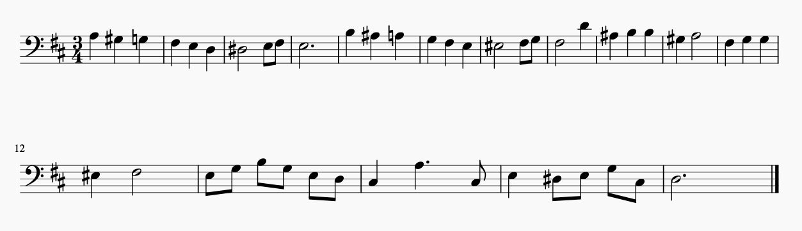
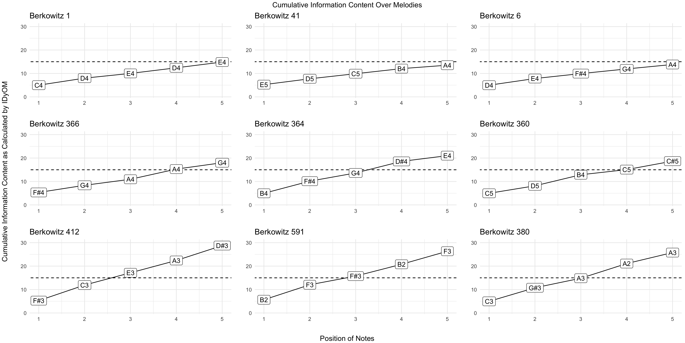

# Computation Chapter

## Rationale

Music theorists use their experience and intuitions to build appropriate curricula for their aural skills pedagogy.
Teaching aural skills typically starts with providing students with simpler exercises, often employing a limited number of notes and rhythms, and then slowly progressing to more difficult repertoire. 
This progression from simpler to more difficult exercises is evident in aural skills textbooks.
Of the major aural skills textbooks such as the @ottmanMusicSightSinging2014, @berkowitzNewApproachSight2011, @karpinskiManualEarTraining2007, and @clelandDevelopingMusicianshipAural2010, each is structured in a way that musical material presented earlier in the book is more manageable than that nearer the end.
In fact, this is true of almost any étude book: open to a random page in a book of musical studies and the difficulty of the study will likely scale accordingly to its relative position in the textbook.
But it is not a melody's position in a textbook that makes it difficult to perform: this difficulty comes from the structural elements of the music itself.

Intuitively, music theorists have a general understanding of what makes a melody difficult to dictate.
Factors that might contribute to this complexity could range from the number of notes in the melody, to the intricacies of the rhythms involved, to the scale from which the melody derives, or even more intuitively understood factors such as how tonal the melody sounds.
Although given all these factors, there is no definitive combination of features that perfectly predicts the degree to which pedagogues will agree how complex a melody is.
In many ways, questions of melodic complexity are very much like questions of melodic similarity: it depends on both who is asking the question and for what reasons [@cambouropoulosHowSimilarSimilar2009].

Examining the melodies presented in Figures X and Y, most aural skills pedagogues will be able to successfully intuit which melody is more complex, and presumably, more difficulty to dictate.

* FIGURE 1 -- Melody with 8 Bars, functional accidentals (V/V, V/IV)

* FIGURE 2 -- Same sets of notes rearranged 

While I reserve an extended discussion of what features might characterize why one melody is more difficult to dictate than the other  for this chapter, I assume that these melodies differ in their ability to be dictated in some fundamental way when performed in a similar fashion.
Additionally, many readers of this dissertation can draw from anecdotal evidence of their own as to how students at various stages of their aural training might fair when asked to dictate both melodies.
For some, melody Y might be overwhelmingly difficult.

In fact, melody Y might be overwhelmingly difficult for the vast majority of musicians to dictate.
From a pedagogical standpoint, educators need to be able to know how difficult melodies are to dictate in order to ensure a degree of fairness when assessing a student's performance.
While of course with each student there are inevitably many variables at play in aural skills instruction ranging from personal abilities, to the goals of the instructor in the scope of their course, I find it fair to claim that pedagogues assume that students will be expected to pass pre-established benchmarks throughout their aural skills education.
As students progress, they are expected to be able to dictate more difficult melodies, yet exactly what makes a melody complex and thus difficult to dictate is often left to the expertise and intuition of a pedagogue.
Intuition is an important skill for teachers to cultivate, but when it comes to determining objective measures of judgment, research from decision making science tends to suggest that no matter the expertise, collective and objective knowledge tends to outperform a single person's judgment  [@kahnemanThinkingFastSlow2012; @loggAlgorithmAppreciationPeople2019; @meehlClinicalStatisticalPrediction1954].
Having more clearly defined performance benchmarks also helps remove biases in grading that teachers may or may not be explicitly aware of.
Recent research has suggested that even aural skills pedagogues are open to the idea of looking for more standardization in aural skills assessments [@paneyTeachingMelodicDictation2014].

In this chapter I survey and examine how tools from computational musicology can be used to help model an aural skills pedagogue's notion of complexity in melodies.
First, I establish that theorists agree on the differences in melodic complexity using results from a survey of 40 aural skills pedagogues.
Second, I explore how both static and dynamic computationally derived abstracted features of melodies can and cannot be used to approximate an aural skills pedagogue's intuition. 
Third and finally, I use evidence afforded by research in computational musicology to posit that the distributional patterns in a corpus of music can be strategically employed to create a more linear path to success among students of aural skills.
I demonstrate how combining evidence from the statistical learning hypothesis, the probabilistic prediction hypothesis, and a newly posited distributional frequency hypothesis, it is possible to explain why some musical sequences in a melody are easier to dictate than others.
Using this logic, I then create a new compendium of melodic incipits, sorted by their perceptual complexity, that can be used for teaching applications.

## Agreeing on Complexity

Returning to melodies X and Y from above, an aural skills pedagogue most likely has an intuition to which of the two melodies X or Y would be easier to dictate.
Melody X exhibits a predictable melodic syntax and phrase structure, the chromatic notes resolve within the conventions of the Common Practice period, and many of the melodic motives outline and imply a harmony based on tertian harmony.
On the other hand, Melody Y's syntax does not conform to the conventions of the Common Practice period and does not imply any sort of underlying harmony.
The duration of the rhythms appear irregular and the melody implies an uneven phrase structure.
Yet both melodies X and Y have the exact same set of notes and rhythms.
Though despite these content similarities, it would be safe to assume that melody X is probably much easier to dictate than melody Y assuming both were to be played in a similar fashion. 

In fact, aural skills pedagogues tend to agree for the most part on questions of difficulty of dictation.
To demonstrate this, I surveyed 40 aural skills pedagogues who all have taught aural skills at the post-secondary  level.
In this survey, participants were asked the questions presented in TABLE X and TABLE Y using a sample of 20 melodies found in the a commonly used sight-singing text book [@berkowitzNewApproachSight2011].
I present the details of the survey below.

### Methods

To select the melodies used in this survey, I randomly sampled 30 melodies from a corpus of melodies (N = 481) from a subset of the Fifth Edition of the Berkowitz "A New Approach to Sight Singing" [@berkowitzNewApproachSight2011] in order to ensure a representative sampling of melodies that might be used in a pedagogical setting.
After piloting the randomly sampled melodies on a colleague, I again randomly sampled half of this sub-set and then added in five more melodies that were not in the new set from earlier sections of the book in order to be more representative of materials students might find in the first two semesters of their aural skills pedagogy. 
I ran the survey from January 31st of 2019 until March 7th, 2019.
The survey comprised of two sets of questions.

Six questions asked about the teaching background of respondents and can be found in \@ref(surveyQuestions1).
These questions were followed by asking participants to make five ratings over the 20 different melodies.
The five questions can be found in \@ref(fig:surveyQuestions2). 
To encourage participation, two $30 cash prize was offered to two participants. 
The survey had questions that specifically were designed to gauge their appropriateness for use in a melodic dictation context.
Participants were recruited exclusively online and all provided consent to partaking in the data collection as approved by the Louisiana State University Institutional Review Board. 

The table below contains the questions used in the demographic questionnaire.


```{r surveyQuestions1, echo=FALSE, fig.cap="Survey Questions",fig.align='center', out.width="100%"}
`Demographic Questions` <- c("What is your age, in years?", "What is your educational status? (e.g. Master's Student, Doctoral Student, Completed Doctorate)", "How many years have you been teaching Aural Skills at the University level? Please do not include any Music Theory classes in your answer.", "Which type of syllable system do you prefer to use? (e.g. Movable-Do, Fixed-Do, La-Based Minor, Numbers)", "On which instrument have you gained the most amount of professional training? (e.g. Piano, Voice, Marimba, Flute)", "What is the title of the last degree you received? (e.g. DMA Piano Pedagogy, PhD Music Theory, BA Music)", "At what institution are you currently teaching? If you are not currently teaching, but have taught in the past, please list the most recent institution at which you taught.")
DT_survey1 <- data.frame(`Demographic Questions`)

knitr::kable(
DT_survey1
  )
```

The table below contains the questions regarding the ratings of the melodies. 
Participants either responded using ordinal categories or moved a slider that sat atop a 100 point scale. 
The surevey can be found at https://musiccog.lsu.edu/dictation_survey/aural_survey.html. 


```{r surveyQuestions2, echo=FALSE, fig.cap="Item Questions",fig.align='center', out.width="100%"}
`Item Questions` <- c("During which semester of Aural Skills would you think it is appropriate to give this melody as a melodic dictation?",
"How many times do you think this melody should be played in a melodic dictation considering the difficulty you noted in your previous question? Assume a reasonable tempo choice from 70-100BPM.",
"Please rate how difficult you believe this melody to be for the average second-year undergraduate student at your institution. The far left should indicate 'Extremely Easy' and the far right should indicate 'Extremely Difficult'.",
"Please rate this melody's adherence to the melodic grammar of the Common Practice Period. The far left should indicate 'Not Well Formed' and the far right should indicate 'Very Well Formed'.",
"Is this melody familiar to you?")
DT_survey2 <- data.frame(`Item Questions`)

knitr::kable(
DT_survey2
  )
```


Of the respondents, the average amount of years teaching aural skills was 8.76 years ($SD = 7.60, R: 21-29$).
I plot the breakdown of the respondent's age, educational status below in Figure \@ref(fig:surveyageeducation).
Of the 40 respondents, all reported used some sort of movable system other than 2 who used a fixed system.
The sample represented over 30 different institutions.

```{r surveyageeducation, echo=FALSE, fig.cap="Demographic Breakdown of Sample",fig.align='center', out.width="80%"}
knitr::include_graphics("img/ageedsurveydistribution.png")
```

Overall, the sample seems to reflect a wide range of experience of teaching aural skills. 
The sample has both younger and older individuals, as well as a range of experience.
In the figures below, I list the 20 melodies sampled.

```{r berk3, echo=FALSE,fig.cap="Berkowitz 3 | Rank 1", fig.align='center', out.width="100%"}
knitr::include_graphics("img/survey_melodies/Berkowitz3.png")
```

```{r berk9, echo=FALSE,fig.cap="Berkowitz 9 | Rank 2",fig.align='center', out.width="100%"}
knitr::include_graphics("img/survey_melodies/Berkowitz9.png")
```

```{r berk26, echo=FALSE,fig.cap="Berkowitz 26 | Rank 3",fig.align='center', out.width="100%"}
knitr::include_graphics("img/survey_melodies/Berkowitz26.png")
```

```{r berk59, echo=FALSE,fig.cap="Berkowitz 59 | Rank 4",fig.align='center', out.width="100%"}
knitr::include_graphics("img/survey_melodies/Berkowitz59.png")
```

```{r berk70, echo=FALSE, fig.cap="Berkowitz 70 | Rank 5", fig.align='center', out.width="100%"}
knitr::include_graphics("img/survey_melodies/Berkowitz70.png")
```

```{r berk74, echo=FALSE, fig.cap="Berkowitz 74 | Rank 6",fig.align='center', out.width="100%"}
knitr::include_graphics("img/survey_melodies/Berkowitz74.png")
```

```{r berk75, echo=FALSE, fig.cap="Berkowitz 75 | Rank 7", fig.align='center', out.width="100%"}
knitr::include_graphics("img/survey_melodies/Berkowitz75.png")
```

```{r berk88, echo=FALSE,fig.cap="Berkowitz 88 | Rank 8",fig.align='center', out.width="100%"}
knitr::include_graphics("img/survey_melodies/Berkowitz88.png")
```

```{r berk156, echo=FALSE,fig.cap="Berkowitz 156 | Rank 9",fig.align='center', out.width="100%"}

```

```{r berk282, echo=FALSE,fig.cap="Berkowitz 282 | Rank 10",fig.align='center', out.width="100%"}
knitr::include_graphics("img/survey_melodies/Berkowitz282.png")
```

```{r berk294, echo=FALSE, fig.cap="Berkowitz 294 | Rank 11",fig.align='center', out.width="100%"}
knitr::include_graphics("img/survey_melodies/Berkowitz294.png")
```

```{r berk312, echo=FALSE,fig.align='center', fig.cap="Berkowitz 312 | Rank 12", out.width="100%"}

```

```{r berk334t, echo=FALSE, fig.cap="Berkowitz 334 | Rank 13", fig.align='center', out.width="100%"}
knitr::include_graphics("img/survey_melodies/Berkowitz334t.png")
```

```{r berk379, echo=FALSE,fig.align='center', fig.cap="Berkowitz 379 | Rank 14", out.width="100%"}

```

```{r berk382, echo=FALSE, fig.cap="Berkowitz 382 | Rank 15", fig.align='center', out.width="100%"}
knitr::include_graphics("img/survey_melodies/Berkowitz382t.png")
```

```{r berk417tx, echo=FALSE,fig.cap="Berkowitz 417 | Rank 16",fig.align='center', out.width="100%"}
knitr::include_graphics("img/survey_melodies/Berkowitz417tx.png")
```

```{r berk607tx, echo=FALSE,fig.cap="Berkowitz 607 | Rank 17",fig.align='center', out.width="100%"}
knitr::include_graphics("img/survey_melodies/Berkowitz607tx.png")
```

```{r berk622, echo=FALSE,fig.cap="Berkowitz 622 | Rank 18",fig.align='center', out.width="100%"}
knitr::include_graphics("img/survey_melodies/Berkowitz622.png")
```

```{r berk627, echo=FALSE,fig.cap="Berkowitz 627 | Rank 19", fig.align='center', out.width="100%"}

```

```{r berk629, echo=FALSE, fig.cap="Berkowitz 629 | Rank 20",fig.align='center', out.width="100%"}
knitr::include_graphics("img/survey_melodies/Berkowitz629.png")
```

### Agreement Among Peagogues 

In order to assess the degree to which pedagogues agree on a melody for melodic dictation, I first plot the mean ratings for each melody across the entire sample along with their standard error of the means in  Figure \@ref(fig:diffplot).
The $x$ axis uses the rank of the melodies, not their index position in the Berkowitz textbook.
I chose to use use this rank order metric as the number of a melody in a textbook is presumed to be best conceptualized as an ordinal variable.
For example, it would be correct to assume that Melody 200 is more difficult than melody 2, but not by a factor of 100.

```{r diffplot, echo=FALSE, fig.cap="Average Difficulty",fig.align='center', out.width="100%"}
knitr::include_graphics("img/difficulty_plot.png")
```

From Figure \@ref(fig:diffplot), there is an increasing linear trend from ratings of melodies being less difficult to more difficulty across the sample.
Using an intraclass coefficient calculation of agreement using a two-way model (both melodies and raters treated as random effects), the sample reflects an interclass correlation coefficeint of .79.
According to @kooGuidelineSelectingReporting2016, this reflects a good degree of agreement between raters. 
This trend across the sample appears in the opposite direction when plotting the mean values to the fourth question in Figure \@ref(fig:grammarplot) from the survey reflecting the melody's adherence to the melodic grammar of the Common Practice period. 

```{r grammarplot, echo=FALSE, fig.cap="Average Grammar Ratings",fig.align='center', out.width="80%"}
knitr::include_graphics("img/grammar_plot.png")
```

While similar trends appear here, yet in the opposite direction as expected, there is a clear breaking of linear trend in the far right potion of the graph that shows melodies that were sampled from the chapter of the corpus that contains atonal melodies.
Using an intraclass coefficient calculation of agreement using a two way model both melodies and raters treated as random effects, the sample reflects an interclass coeffiecent of .65, which according to @kooGuidelineSelectingReporting2016 indicates a moderate degree of agreement among raters.
This lower agreement rating is most likely due to the subjectiveness of this question.
In their free text responses, many participants expressed difficulty in surmising what this meant.

The trends from Figure \@ref(fig:diffplot) and Figure \@ref(fig:grammarplot) occur in the opposite direction.
As the index or rank of the melody increases, so does the difficulty for the rating as would be expected.
As the index or rank of the melody increases, its adherence to subjective ratings of melodic grammar of the Common Practice period decreases.
Taken together, I ran a correlation on every one of the twenty melodies between a single rater's judged difficulty and its judged adherence to tonal expectations of the common practice era.
The correlations for all 20 melodies are plotted here in Figure \@ref(fig:gramcor).
From this chart, we see this trend is not uniform across all melodies.

```{r gramcor, echo=FALSE, fig.cap="Strength of Relationship Between Difficulty and Subjective Tonal Grammar",fig.align='center', out.width="100%"}
knitr::include_graphics("img/grammar_difficulty_correlation_plot.png")
```

Overall, the sample exhibited an acceptable degree of inter-rater reliability as measured by the interclass correlation coefficient.
Plotting the respondent's answers across the textbook the melodies were taken from, with the book progressing from less to more difficult, it does appear that aural skills pedagogues tend to agree on how difficult a melody to be used in a dictation setting. 

Central to my argument, there appears to a linear trend of difficulty across the sample based on the melodies rank in the sample.
In fact, although I presented the data above as ordinal using rank in the textbook, when I ran a mixed-effects linear regression predicting melody difficulty with both rank order as a variable as well as the actual index number of the melody from the Berkowitz, the index model significantly outperforms the rank order model.
Using the lme4 package [@batesFittingLinearMixedEffects2015], I fit two linear mixed effects models predicting difficulty of melody with subject and item both as random effects in the model, with the only difference in models being a melody rank or melody index.
When comparing models, the index model (BIC = 6706.3) provided a better fit to the data ($\chi$=5.38, $p<.05$) than the rank model (BIC = 6711.7).

Taken together, both anecdotal and empirical evidence for this survey suggest that aural skills pedagogues tend to agree on how difficult a melody is for use in an aural skills setting.
This sense of difficulty or complexity tracks as the book progresses, but to attribute the cause of a melody being difficult as its position in the book would be putting the cart before the horse. 
Having now formally established this almost intuitive notion, the remaining portion of this chapter investigates how computationally derived tools can be used to model these commonly held intuitions. 
In order to provide a sense of validity to the measure, I carry forward ratings from the survey reported and use the expert answers as the ground truth for the the resulting models.

## Modeling Complexity

The ability to quantify what theorists generally agree to be melodic complexity depends on distilling complexity into its component parts.
Earlier, when comparing melodies X and Y, some of the features put forward that might contribute to complexity were features such as note density, the melody's rhythm, what scale the melody draws its notes from, and how tonal the melody might be perceived. 
Some combination of these component features presumably make up the construct of complexity.

Attempting to use features of a melody to to predict how well a melody is remembered has a long history.
In 1933, Ortmann put forward a set of melodic determinants that he asserted predicted how well a melody was remembered.
These features such as a melody's repetition, pitch-direction, contour (conjunct-disjunct motion), degree, order, and implied harmony (chord structure) were deemed to affect the melody's ability to be remembered [@ortmannTonalDeterminantsMelodic1933].

Since Ortmann, pedagogues such as Taylor and Pembrook have expanded on this research, finding significant effects of musical features such as length, tonality, as well as type of motion as well as an effect of experimental condition [@taylorStrategiesMemoryShort1983].
Following up on Taylor's investigation, @pembrookInterferenceTranscriptionProcess1986 found evidence corroborating Ortmann's initial claims that his four major determinants (repetition, note direction, conjunct-disjunct motion, degree of disjunctivness) had a significant main effects on an individual's ability to take dictation, yet note that these values do not exhaustively explain the findings.
In their discussion they also note the problems of completely isolating the effects certain musical features as when you change one parameter, others are also subject to change.
When looking at changes in structural elements of melodies, there is a collinearity issue among features.
Not only does this problem exist within features of melodies, but also among participants.
In reflecting on other factors that might contribute to their results, the authors note

> Clearly, a complete hierarchy of determinants would constitute a very long
list, because not only would the many melodic structures be included, but also
their interactions with subject and environmental variables. The ones included
in the present study (musical experience, melodic carryover, and response
method) provided evidence that the melodic determinants are not constant;
rather, they vary as a function of the subject and environmental factors, which
in turn can have significant effects on music discrimination and memory. (p. 33)

The authors later in the article go on to stress that future work should both replicate their findings as well as expand their modeling parameters.
They call for both a larger sample, a broader spectrum of musical experiences, and to investigate more musical features.

Since then, some, but not many researchers have employed using features of the melodies to predict a behavioral measure in experimental settings.
Not using as extensive of a battery as Ortman, Taylor, or Pembrook, researchers in music psychology  such as as @akiva-kabiriMemoryTonalPitches2009,  @dewittRecognitionNovelMelodies1986, @eerolaExpectancySamiYoiks2009, @schulzeWorkingMemorySpeech2012a have used the number of notes in a melody as a successful predictor of difficulty in melodic perception and discrimination tasks. 
Expanding on just using frequency of note counts, @harrisonModellingMelodicDiscrimination2016 instead of looking at single measures of melodic complexity, addressed the melodic collinearity issue noted by Taylor and Pembrook by using data reductive techniques to derive a single complexity measure found to be predictive in their statistical modeling deriving these measures from the FANASTIC toolbox [@mullensiefenFantasticFeatureANalysis2009]. 
Following this research, @bakerPerceptionLeitmotivesRichard2017 also incorporated a similar measure of complexity in their model of leitmotiv recognition in which they predicted recall rates in a recognition paradigm.

Each of these examples operationalizes some feature of the melody with a quantitative, numerical proxy that is assumed to be able to be mapped to perception.
Ortman referred to them as determinants, others such as Müllensiefen refer to them as features [@mullensiefenFantasticFeatureANalysis2009].
Since the word feature refers to a 'distinctive attribute', I will use this terminology throughout the rest of the chapter, though note that other terms have been used. 

### What Are Features?

A feature can be either a quantitative or qualitative observable feature of a melody that is assumed to be perceptually salient to the listener.
Features are often difficult to quantify with the traditional tools of music analysis.
Often, these features come inspired from other domains like computational linguistics.

To given an example of a feature that is not related to just the number of notes, perhaps one of the most popular features in perception research in recent decades is the normalized pairwise variability index or nPVI.
The nPVI began as a measure of rhythmic variability in language [@grabeDurationalVariabilitySpeech2002].
Shown below, the nPVI quantifies the amount of durational variability in language.
It works by comparing the variability of vowel length compared to syllable length 

$$nPVI = 100 * [\sum_{k=1}^{m-1} | \frac{d_k - d_{k+1}}{(d_k + d_{k+1})/2}/(m-1)] $$

where $M$ is the number of vowels in an utterance and $d_k$ is th duration of the $k^{th}$ item and has been used in musical contexts [@vanhandelRoleMeterCompositional2010].

In linguistics, the nPVI has been used to delineate quantitative differences between stress and syllable timed languages.
Recently in the past decade, music science researchers have used the nPVI to attempt to investigate claims about the relationship between speech and music [@danieleINTERPLAYLINGUISTICHISTORICAL2004; @patelStressTimedVsSyllableTimed2003; @vanhandelRoleMeterCompositional2010].
While results are mixed regarding the nPVI's predictive ability and there have been recent calls to limit the measure's use [@condit-schultzDeconstructingNPVIMethodological2019], it does serve as a very good example of a computational derived measure.
Just like summarizing the range of a melody by subtracting the distance between the lowest and highest notes, the nPVI summarizes a phrase and importantly assumes that this measure is representative of the entire phrase the calculation was performed upon.

In computational musicology, features of melodies can generally be classified into two main types: static and dynamic features.
Static features compute a summary measure over the entire melody while dynamic features calculate values for each event onset in a melody.
One of the most complete set of static computational measures as applied to music perception come from Daniel Müllensiefen's' Feature ANalysis Technology Accessing STatistics (In a Corpus) or FANTASTIC toolbox [@mullensiefenFantasticFeatureANalysis2009].
According to FANTASTIC's technical report, 

> "FANTASTIC is a program...that analyzes melodies by computing features. The aim is to characterise a melody or a melodic phrase by a set of numerical or categorical values reflecting different aspects of musical structure. This feature representation of melodies can then be applied in Music Information Retrieval algorithms or computational models of melody cognition." (pp. 4)

Drawing from fields both central and peripheral to music science, FANTASTIC computes a collection of 38 features to analyze features of melodies and joined a large and continuing tradition of analyzing music computationally [@lomaxCantometricsApproachAnthropology1977 ;@eerolaExpectancySamiYoiks2009; @huronHumdrumToolkitReference1994; @lartillotMatlabToolboxMusical2007; @lomaxCantometricsApproachAnthropology1977; @mcfeeLibrosaAudioMusic2015; @steinbeckStrukturUndAhnlichkeit1982].
Additionally, FANTASATIC also provides a framework for comparing the features of a melody with a parent corpus from which the melody is assumed to belong similar to a sample-population relationship.

### Back to the Classroom

Returning to the Aural Skills classroom, many of these features can be used to approximate the previously established intuitions of complexity as agreed upon by theorists.
Below in Figure \@ref(fig:corfeature), I plot the the mean difficulty and grammar ratings given by experts for each melody in the experimental sample against each the output of FANTASTIC's features by correlating the two measures.
Additionally, \@ref(fig:corfeaturetable) displays the five strongest positive and negatively correlated features of FANTASTIC's output with the ground truth, expert ratings. 

```{r corfeature, echo=FALSE, fig.cap="FANTASTIC and Expert Ratings",fig.align='center', out.width="100%"}
knitr::include_graphics("img/FantasticExpertPlot.png")
```

```{r corfeaturetable, echo=FALSE, fig.cap="Strongest Correlated Features"}
readr::read_rds("img/strongfeatures.rds")
```

From Figure \@ref(fig:corfeature) and Table \@ref(fig:corfeaturetable), there are some features that share a strong relationship with the ground truth of the expert intuitions.
The top five features that correlate most strongly with the expert ground truths are related to the intervallic content of a melody.
The first two features, ```i.abs.std``` and ```i.abs.mean``` are derived measures using absolute interval distance computations.
The other top three features, ```step.cont.loc.var```, ```i.entropy```, and ```p.entroy``` are related to entropy measures. 
Of the negatively correlated features, two linguistically derived measures ```mean.Yules.K``` and ```mean.Simpsons.D``` both correlate with perceived difficulty, as does a measure of ```tonalnesss``` which in FANTASTIC is based on the Krumhansl key profiles [@krumhanslCognitiveFoundationsMusical2001].

One problem in tackling this problem is that although many of these variables correlate strongly with our target variables-- both grammar and difficulty ratings-- one aspect not apparent in this analysis is the correlation between each of the features. 
In order to demonstrate this, in Figure \@ref(fig:featurecorrelations) I visualize how a sample often features from the FANTASTIC toolbox correlate with one another with mode additionally included to highlight the breakdown of the corpus. 

```{r featurecorrelations, echo=FALSE, fig.cap="Problems of Melodic Collinearity",fig.align='center', out.width="100%"}
knitr::include_graphics("img/FANTASTIC_collin.png")
```

Among these variables, we see that there is a very high degree of correlation between many of the variables.
For example, the two features inspired from linguistics-- ```mean.Yules.K``` and ```mean.Simpsons.D``` -- exhibit an alarming degree of correlation.
We also see in this dataset evidence of the inappropriateness of including some variables such as ```d.median```, a measure relating rhythm.

Here in \@ref(fig:featurecorrelations) we see computational evidence of claims made by @taylorStrategiesMemoryShort1983 when reviewing exactly what features might contribute to the degree of difficulty from a melodic dictation.
Given this collinearlity problem, it becomes very difficult to be able to isolate the effect of of one feature of the melody. 
One way to begin to understand these relationship would be to be to build statistical models that area able to partition covariance structures such as the general linear model when used in the context of multiple regression.
Another method, as mentioned above, could instead take a more exhaustive, but less explanatory approach forward and follow past research [@bakerPerceptionLeitmotivesRichard2017; @harrisonModellingMelodicDiscrimination2016], that uses data reductive techniques such as principal components analysis to obtain more accurate predictive measures of complexity. 

```{r univariatecow, echo=FALSE, fig.cap="Univariate Feature Models",fig.align='center', out.width="100%"}
knitr::include_graphics("img/univariate_cow.png")
```

In Figure \@ref(fig:univariatecow), I plot eight features extracted via the FANASTIC Toolbox.
The figure plots linear models of each feature compared against the expert ratings of difficuty. 
I additionally list the Pearson correlation coeffecient for each model.
From the plot, it is evident that some features correlate much stronger with the ground truth features than others.
For example, ```pitch.entropy``` correlates with the ground truth data $r = .84$.
Not only that, but the model is not being driven completely by outliers.
While some points fall below the regression line, extreme values are not driving this effect. 
A similarly strong relatioship is evident with the ```step.cont.local.var``` variable.
In line with work by Dowling, this provides further evidence that countour changes have a significant impact on how people hear melodies [@dowlingScaleContourTwo1978].
In exploring these relationships in multivariate context, when I combined the top four variables from \@ref(fig:univariatecow) in a linear multiple regression model, the model was able to predict a high degree of variance $F(4,15) = 30.47, p < .05, R^2 = .89$.
While this model is explicitly exploratory, this dataset will serve as a foundation to build future theoriest to test.

Relating again back to its implication for aural skills pedagogy, the above analysis suggests that features as derived from the FANTASTIC toolbox can provide a meaningful step forward in helping standardize the assessment of aural skills pedagogy.
If pedagogues were able to employ tools such as the FANTASTIC toolbox, pedagogues could not only select melodies for their own work that is able to hold certain features constant, but the use of this research could also be used  generate melodies based on the desired difficulty parameter measures in order to design course curricula that would foster a  more stable curricular path among students.
Additionally, student could also work at slowly challenging themselves if this were to be incorporated into an online pedagogical learning application or website. 

Although this approach has been relatively successful at modeling expert ratings, using FANTASTIC's various linear combinations of these features does have important limitations.
One of the most obvious limitations is that FANTASTIC's measures tacitly assume listens recall melodies in some sort of perceptual suspended animation. 
Illuminating this problem using a more tangible example, again returning to melody's X and Y, when the full set of FANTASTIC features are computed on both, THIS FACT HERE ABOUT WHAT IS SAME.
This computation arises from computing a summary measure over the melody and not modeling it in terms of real time perception. 
In order to have more phenomenologically appropriate model that incorporates computationally derived features, it is important to also consider dynamic models of music perception when modeling difficulty. 
Following up on another finding from this section, it also is worth of mention that the variables with the strongest predictive powers tend to be those associated with information content.
In the next section, I explore how using a dynamic approach such as Marcus Pearce's implementation [@pearceConstructionEvaluationStatistical2005; @pearceStatisticalLearningProbabilistic2018a] of a multiple viewpoints model [@conklinMultipleViewpointSystems1995], might provide more insights into understanding the aural skills classroom.

### Dynamic 

The Information Dynamic of Music (IDyOM) model of Marcus Pearce is a computational model of auditory cognition [@pearceStatisticalLearningProbabilistic2018a].
IDyOM is based on the assumption put forward by Leonard Meyer that musical style can be understood as a complex network or probabilistic relationships that underlie a musical style and implicitly understood by a musical community [@pearceAuditoryExpectationInformation2012; @pearceConstructionEvaluationStatistical2005; @pearceStatisticalLearningProbabilistic2018a].
Unlike measures from FANTASTIC, which calculate summary statistics based on melodic features, IDyOM works by calculating measures of expectancy of an event based on a predefined set of musical parameters that the model was was trained on. 
As mentioned in Chapter 2, the IDyOM model relies on two important theoretical assumptions based on two neural mechanisms involved in musical enculturation: the statistical learning hypothesis and probabilistic prediction hypothesis.
According to Pearce, the Statistical Learning Hypothesis (SLH) states that:

> musical enculturation is a process of implicit statistical learning in which listeners progressively acquire internal models of the statistical and structural regularities present in the musical styles to which they are exposed, over short (e.g., an individual piece of music) and long time scales (e.g., an entire lifetime of listening). p.2 (Pearce, 2018)

The logic here is that the more an individual is exposed to a musical style, the more they will implicitly understand its internal syntax and rules.
The SLH leads the corroborating probabilistic prediction hypothesis which Pearce states as: 

> while listening to new music, an enculturated listener applies models learned via the SLH to generate probabilistic predictions that enable them to organize and process their mental representations of the music and generate culturally appropriate responses. p.2 (Pearce, 2018).

IDyOM works by providing the model with a musical corpus that it assumes is representative of a genre or musical style.
This musical corpus then serves as training data to approximate either a listener's ground truth.
After establishing this corpus, IDyOM then learns both long term and short term expectations of events using a variable-order Markov model in order to best optimize its predictive abilities in line with theoretical frameworks provided by @conklinMultipleViewpointSystems1995.
The expectations that IDyOM calculates are based on a probability distribution of the proceeding events, which is then quantified in terms of information content [@shannonMathematicalTheoryCommunication1948].
As detailed in a summary review article on IDyOM by Pearce, IDyOM has been successful at predicting 

> Western listeners’ melodic pitch expectations in behavioral,
physiological, and electroencephalography (EEG) studies using a range of experimental designs, including the probe-tone paradigm visually guided probe-tone paradigm a gambling paradigm, continuous expectedness ratings, and an implicit reaction-time task to judgments of timbral change. 

Peace notes some of IDyOM successes in modeling beyond expectation, including successes in modeling emotional experiences in music, recognition memory, perceptual similarity, phrase boundary perception and metrical inference.
Importantly in reviewing IDyOM's capabilities regarding memory for musical pitches, Pearce also claims that 

> A sequence with low IC is predictable and thus does not need to be encoded in full, since the predictable portion can be reconstructed with an appropriate predictive model; the sequence is compressible and can be stored efficiently. Conversely, an unpredictable sequence with high IC is less compressible and requires more memory for storage. Therefore, there are theoretical grounds for using IDyOM as a model of musical memory.

Peace notes four studies [@bartlettRecognitionTransposedMelodies1980; @cohenRecognitionTransposedTone1977; @cuddyMusicalPatternRecognition1981; @halpernAgingExperienceRecognition1995] that show that more complex melodies are more difficult to hold in memory. 
This theoretical assertion and select empirical findings have important ramifications for the aural skills classroom. 
In a dictation setting, melodies that are more expected should tax memory less, thus making them easier to remember and dictate. 
If I assume that more expected melodies are easier to remember, then it follows that the information content measures of expectedness can then be used as a stand in measure of melodic memory.
This notion is not new to music psychology and was discussed by David Huron relating exposure to musical material as following similar laws to the the Hick-Hyman hypothesis [@hickRateGainInformation1952; @hymanStimulusInformationDeterminant1953] which Huron paraphrases as "processing of familiar stimuli is faster than processing of unfamiliar stimuli” [@huronSweetAnticipation2006, pp. 63]" which now a decade later can be further investigate using tools from computational musicology. 
Combining the Hick-Hyman hypothesis together with the above statistical learning hypothesis and probabilistic prediction hypothesis, I then put forward a new hypothesis: the frequency facilitation hypothesis. 

## Frequency Facilitation Hypothesis

The frequency facilitation hypothesis (FFH) makes two important assumptions that rely on both the statistical learning hypothesis and the perceptual facilitation hypothesis.
The first, as stated above, is that humans learn melodies via the statistical learning hypothesis.
In line with Huron's reading of the Hick-Hyman Law, melodic information that listeners are more familiar with will consequently be processed more quickly.
More expected notes will tax memory processing less than unexpected notes.
This assertion would also be predicted by the probabilistic prediction hypothesis.
Thus, given a sequence any set of notes, the frequency facilitation hypothesis posits that the efficiency in which a melody is processed in memory is proportionally related to its degree of expectedness when quantified in information content.
Specifically, measures of expectation derived from computational models of auditory cognition like IDyOM should be able to serve as a proxy for musical information.
This falls within the bounds of Pearce's assertion that using the expectancy measures from a melody could be used as a sort of memory proxy [@pearceStatisticalLearningProbabilistic2018a].

This hypothesis generates testable predictions that can be investigated to verify its verisimilitude. 
Important to aural skills pedagogy, the primary prediction from this hypothesis would be that melodic patterns that occur more frequently in a corpus will be be easier to remember than those occurring less frequently.
These frequency patterns should then directly relate to the amount of information content calculated by IDyOM.
If this relationship does exist, then it can be used to create strategies that would then create a more linear path to success for students learning to take melodic dictation.
In the final section of this chapter, I investigate this claim by conducting an analysis on a corpus of sight singing melodies to demonstrate this claim.
I then take the findings from this corpus analysis and how how it can be applied in the aural skills classroom.

### Corpus Analysis

In order to investigate frequency facilitation hypothesis, I conducted a corpus study using N = 622 melodies from the above using the Fifth Edition of the Berkowitz "A New Approach to Sight Singing" [@berkowitzNewApproachSight2011].
The FFH predicts that more frequently occurring patterns will result in lower information content-- a general byproduct of quantifying musical feature tokens with information content in a multiple viewpoints framework-- and that these lower information content measures, when quantified, will be able to predict load on memory. 

In order to examine this I first extracted a series of the most frequently occurring melodic tri-grams from a subset of the _MeloSol_ corpus after transposing each melody to C major via the ```solfa``` tool in humdrum.
I plot the resulting distributions of the top 1,000 patterns of each fixed order predictions below in \@ref(fig:bitriquint) and \@ref(fig:bitriquint2).

```{r bitriquint, echo=FALSE, fig.cap="Distribution of m-grams",fig.align='center', out.width="100%"}
knitr::include_graphics("img/trigrams.png")
```

```{r bitriquint2, echo=FALSE, fig.cap="Less Predictive Power",fig.align='center', out.width="100%"}
knitr::include_graphics("img/bitriquint.png")
```

From \@ref(fig:bitriquint), we see that when plotted in terms of their frequency distributions, a small amount of the patterns make up for a very large the distribution of the corpus.
As evident from \@ref(fig:bitriquint), we see that with the addition of more tokens added to the n-grams, this results in avisual representation of why and how statistical predictions become more unreliable with higher order predictions [@conklinMultipleViewpointSystems1995]. 
Intuitively, melodic patterns from the high frequency distribution of the table would seemingly be easier to remember and then dictate than those from the tails of the distributions.

Following up on this analysis, I then trained an IDyOM model on the same corpus of melodies and thus was able to calculate the average information content for the first five notes of each melody in the corpus.
In this computation, I explicitly assume that the underlying corpus of data is representative of an individual's personal expectations of musical material. 
In Figure \@ref(fig:quintdist), I visualize the cumulative information content that the first five notes of each of melodies that that the corpus was trained on. 
I chose to additionally split the corpus into quintiles to further highlight the progressive changes in information content when these incipits are sorted based on their cumulative information content.

```{r quintdist, echo=FALSE, fig.cap=" ",fig.align='center', out.width="100%"}

```

This observation may seem tautological, as this relationship would result from how information content is calculated since more expected patterns have less information content.
The novel assertion here is connecting the cumulative information content to memory load.
For example, in Figure \@ref(fig:tridensity), we see that when split into three sections, random samples from the the corpus when partitioned into three sections, even just the opening of the first five notes of each melody increase per group.

```{r tridensity, echo=FALSE, fig.cap="Average Information Content of First Five Notes of Melodies",fig.align='center', out.width="100%"}
knitr::include_graphics("img/tri_distribution.png")
```

To visualize what this might look like in a melodic dictation context, we could imagine randomly sampling melodies from even smaller sections.
If quantified using information content measures, these five grams would then fill up the finite bin of memory faster than that were more unexpected, or had more information content associated with them.
I visualize this difference in Figure \@ref(fig:cumplot) where I plot similar length five grams filling up the window of memory at different rates based on their cumulative information content. 

```{r cumplot, echo=FALSE, fig.cap="Cumlative Information Content in Melodic Incipts",fig.align='center', out.width="100%"}

```

Lastly, to further investigate this claim of cumulative information content, I calculated various information content measures for each melody used the survey above then used the resulting data to plot it against the measures of expert ratings for difficulty for the classroom.
In Figure \@ref(fig:modelcomparison), the resulting visualization shows measures of information content to be very good predictors of difficulty ratings.
I believe that this gives credence to thinking more about using computational measures in designing appropriate curricular measures.

```{r modelcomparsion, echo=FALSE, fig.cap="Model Comparison",fig.align='center', out.width="100%"}
knitr::include_graphics("img/model_comparsion_gg.png")
```


### Implications 

If true, the frequency facilitation hypothesis would have direct implications for the aural skills classroom, specifically for melodic dictation.
If measures of information content could be used as a more reliable proxy for load on memory, then a more linear path to learning patterns could result in better strategies for learning to take dictation.
For example, the first practical application of this could be that information content could be a more accurate proxy for the limits of musical memory as opposed to using older measures asserted by the literature that follow in the George Miller 7 +- 2 tradition which attempts to logically substitute items in memory for musical notes.
As discussed in [Working Memory and Melodic Dictation], using measures of information content could provide an ecologically acceptable work around to the problems of chunking within music.
For example, if this measure proved to be useful in pedagogical applications, pedagogues would have a very powerful tool to create curricula that was designed in a much more linear path to help students learn.

One of the major challenges in both teaching and learning aural skills beyond the identification of scale degrees is then identifying them in a more ecological, melodic context.
Presenting incipits of melodies could be then be used as a very small intermediate step in teaching melodic dictation where students can then exhibit more frequent successes in the aural skills classroom in trying to dictate progressively difficulty snippets.
If they learn the more frequent ones first, they will find them easier, but more important begin to recognize these patterns in longer exercises.

Instead of picking melodies for practice one-by-one, pedagogues could instead give students a large compendium of small dictation exercises that were ordered to increase in their melodic information content over the course of instruction.
In this type of application, students would not be learning to increase their melodic information capacity limit per se, but could provide a valuable means to give students multiple, smaller attempts to learn to take dictation, rather than being overwhelmed with longer melodies that are given to study on the premise of more ecological validity.
This could be done from the level of scale degree identification to that of full melodies. 
Future work should investigate this experimentally and look to model it using similar methodologies that have been employed in music psychology testing paradigms [@harrisonApplyingModernPsychometric2017; @wolfGradesReflectDevelopment2014].
Finally, if useful, this could and is  type of modeling could also be used in future computational models of melodic dictation as explored in the final chapter of this dissertation. 

### Limitations of FFH 

This conceptualization of calculating the information content of melodies is not without its limitations.
One of the core assumptions to this approach is that statistical learning does in fact take place.
While this assumption is ubiquitous in much the music psychology literature, statistical learning as a concept has been critiqued in other related fields and deserves mentioning.
Statistical learning rests on the premise that organisms are able to implicitly learn and track the statistical regularities in their environments.
In this case of auditory learning, there is research to assert this claim from both the field of implicit learning and statistical learning as discussed by @perruchetImplicitLearningStatistical2006.
For example, extensive evidence as reviewed by @cleeremansComputationalModelsImplicit2008 show many examples of this, especially worth highlighting is that people have been show to learn variable order n-gram patterns [@remillardImplicitLearningFirst2001].

Though this assertion is importantly contrasted by work such as @jamiesonApplyingExemplarModel2009] who claim that explaining these phenomena as resulting in statistical learning is not necessary.
Rather, @jamiesonApplyingExemplarModel2009 assert that employing memory models like that of Minerva 2 can accurately model behavioral patterns in individual responses without the theoretical framework of statistical learning.
They instead note that similar results can be obtained from individuals making similarity judgments. 
This notation is important to highlight because as noted by @perruchetImplicitLearningStatistical2006, statistical learning depend on the tacit assumption that people might be performing real-time calculations on incoming stimuli in real time.

Another important caveat in the corpus analysis above is that the corpus analysis was done using fixed order search patterns, whereas the calculations from IDyOM are based on variable order Markov-Models.
While differences in these computations might prove meaningful, only with future experimental evidence where we corroborate with behavioral evidence would this be worth further looking into.

## Conclusions

In this chapter I demonstrated how tools from computational musicology can be used as an aide in aural skills pedagogy.
After first establishing the extent to which aural skills pedagogues on various melody parameters, I then show how two types of computationally derived features can stand in for a pedagogues intuition.
First, using the FANTASTIC toolbox, I show how different combinations of static abstracted features can help explain theorists agreed upon complexity.
This first will help with selection of melodies and also provides insights as to which features of the melodies contribute most to perceived difficulty.
Second, I demonstrated how assumptions derived from the IDyOM framework can serve as a basis for the intuitions of why smaller sequences of notes within melodies are more or less difficult to dictate.
Using the logic that sequences that are easier to process are more expected, and that computed measures of information content can be used as a proxy for memory, I show that it follows that given the sequence of an $n$ length melody, the ease of dictation that it loads on memory is relative to both its degree of  quantified in terms of information content. 
This chain of thinking then allowed me to put forward a new sequence of melody segments that can be arranged, like other theory textbooks, in terms of their increasing complexity.
I argued that using this smaller incipit based approach will allow students to not be overwhelmed in their learning by taking a more linear path to dictation, before moving on to more more ecologically valid melodies.
I finish by discussing how this might be implemented in the classroom.


