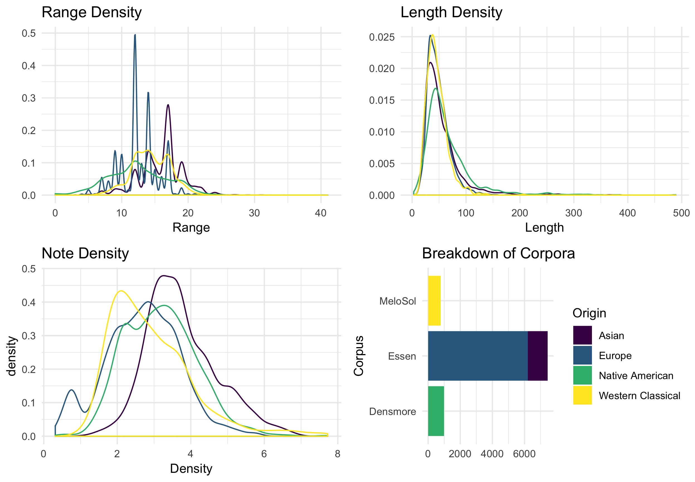
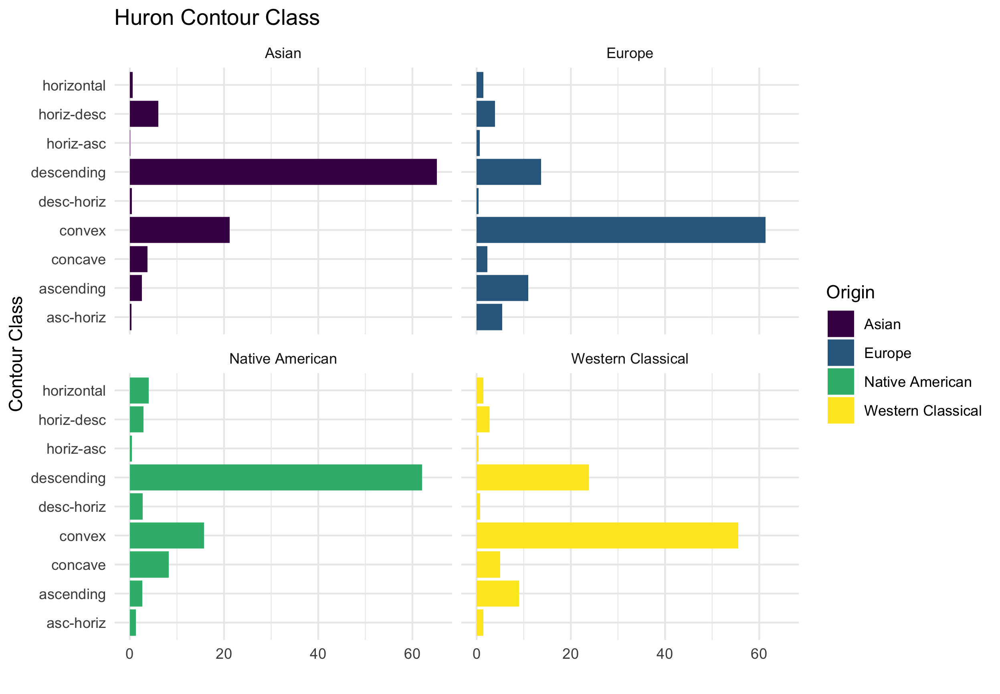
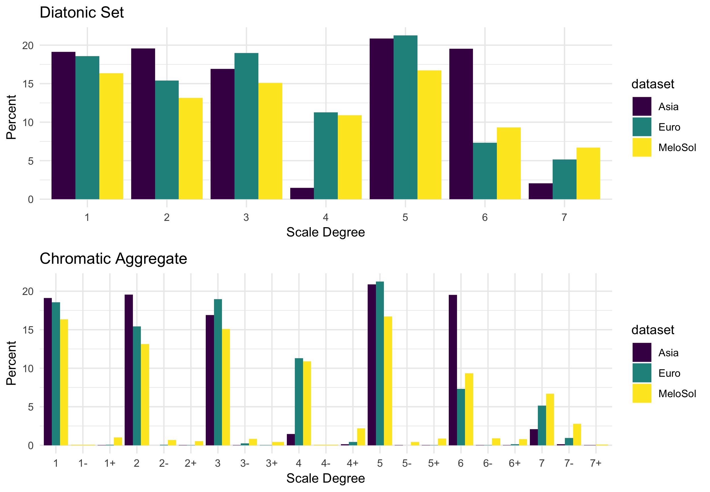

# Hello, Corpus {#chapterfour}

## Rationale 

One of the essential features of any scientific discovery is the ability to reproduce the finding.
Given a new claim about reality, in order to be able to demonstrate that the claim is true, the new phenomenon should remain invariant when reproduced.
If the phenomenon satisfies pre-established criteria for causality, this evidence can be used to corroborate its generating theories.
This type of rationale is often associated with scientific methodologies and needs to be adopted here as many questions in music research are better suited for these methods.
As noted by scholars like Allen Forte, "In virtually any historic period one finds an interaction between music and science and mathematics" [@forteMusicComputingPresent1967].
Music was one of the seven liberal arts belonging to the quadrivium along with astronomy, geometry, and arithmetic.
In fact, many disciplinary differences in musical study more likely to result from geopolitical divides as to how scholars conceptualize the study of music based on their location, rather than the content and form of their research [@parncuttSystematicMusicologyHistory2007].
It should then come as no surprise that studies in music will often interface with diverse methodologies. 

Returning to a phenomenon's invariance under different conditions, one of the most effective ways to investigate claims about the state of reality is to reproduce previously made claims using new data.
One contribution that a researcher can make towards either bolstering or refuting claims and their resulting theories would be to generate more materials in which to examine previous claims under new conditions.
In order to accomplish this, in this chapter I introduce a new corpus of sight-singing melodies based on the pedagogical text _A New Approach to Sight Singing_ [@berkowitzNewApproachSight2011].
The corpus contains 783 monophonic melodies that have been digitally encoded in the kern format [@huronHumdrumToolkitReference1994] and contain both melodies specifically composed for use in the Aural Skills classroom and examples of melodies from the Western canon.
Due to the fact that the corpus contains melodic data from a sight-singing anthology first published by Sol Berkowitz, for ease of reference I will refer to this corpus as the _MeloSol_ corpus.
After introducing the corpus, I compare the _MeloSol_ corpus with the _Essen Folk Song Collection_ [@schaffrathEssenFolkSong1995] as well as a portion of the _Densmore_ collection [@shanahanDensmoreCollectionNative2014] in order to highlight variability between these musical corpora.
I end by highlighting important considerations in the underlying representations of what the data represent and what these assumptions entail for future work in computational musicology. 

## History

The use of computers to study music has been been ongoing for over the past fifty years.
As reviewed by @hewlettComputingMusicology1991, early approaches to using computers in music research began in the mid 1960s and due to the high effort and cost of computation, projects pursued by researchers at this time tended to focus on questions that might have global relevance.
The use of computers to study music at this time was not by any means an uncommon area of study and throughout the second half of the 20th century, research in computational musicology grew in relation to the computing abilities afforded by the available technologies [@nettheimBibliographyStatisticalApplications1997].
During this time, not only was there progress made on computing power, but during this time many new digital music encoding frameworks were created.
As discussed by @wigginsFrameworkEvaluationMusic1993, the design and development of these encoding frameworks has impact on the degree that the systems can be assessed.
According to Wiggins and colleagues, a musical, digital encoding framework can be evaluated on the two orthogonal dimensions of expressive completeness and structural generality. 
Considering how a system is developed in order to encode encode musical information then becomes paramount given that the level of granularity of encoding data will determine the types of questions that could eventually be asked in a computational analysis.
For example, data encoded in MIDI or CHARM format is able to store micro-time variations in performance practice, which lends itself to the ability to do performance based analyses on this data.
If this data were instead to have been encoded using a frequency spectrum as would be stored in an MP3 or WAV file, this type of analysis could not be carried out as accurately due to the task of automating the detection of pitch onsets.

On a higher level of abstraction, this problem of how to encode a melody becomes exacerbated when considering meta-research issues such as the the tools-to-theories heuristic put forward by Gigerenzer [@gigerenzerToolsTheoriesHeuristic1991].
Gigerenzer claims that much of both the novelty and authority given to the trajectory of a research path is determined by the tools a group decides is valid and not the generation of new data or theories.
Contextualizing this problem for digital music encoding, again choosing how to represent the data reflects ontological and epistemological assumptions about the data itself.
Not only does committing to an encoding system come with the inevitable elimination of important musical features, but over time the establishing of canonical assumptions about the nature of methods might lead to researchers choosing questions and methods based on the convenience of answering those questions, rather than commitment to the question itself. 
This type of problem would only be exacerbated in high pressure, performance based research environments. 
Further, the technology used to be able to query or test this data would provide an additional constraint on the analysis.

Currently there is a large amount of variability in types of encoding available as well as tools that can be used for computer based analysis including music21 [@cuthbertMusic21ToolkitComputerAided2010] and David Huron's Humdrum [@huronHumdrumToolkitReference1994] toolbox.
While there are differences in the advantages between various types of encoding and tools used to analyze this data, parsers such as the MeloSpySuite are constantly being developed to serve as digital music's Rosetta stone, resulting in a current eco-system that allows for moving between encoding formats [@frielerIntroducingJazzomatProject2013]. 

While many of the encoding formats throughout the past 50 years have fallen out of favor, the kern format of encoding data developed by David Huron has persisted as a choice for many computational musicologists since its initial development in 1994.
The kern format (often stylized as ```**kern```) was developed in tandem with the Humdrum Toolbox for music analysis that according to Humdrum user guide [@huronHumdrumToolkitReference1994] is

> a set of command-line tools that facilitates musical analysis, as well as a generalized syntax for representing sequential streams of data. Because it’s a set of command-line tools, it’s program-language agnostic. Many have employed Humdrum tools in larger scripts that use PERL, Ruby, Python, Bash, LISP, and C++.

Humdrum files, unlike that of anything used in MEI are human readable and non-hierarchical, thus mirroring Western notated music's sequential nature.
Because of this, editing kern files using the humdrum tool set and humdrum extras developed by Craig Sapp [@sappHumdrumExtras2008] can be done with short, UNIX scripts as opposed to similar analyses in music21. 
Since moving between digitally encoded ecosystems is not nearly as difficult and much of encoding is can be left to the jurisdiction of the researcher, I have chosen to encode this data set using the kern format. 

## MeloSol Corpus

In this next section, I introduce a new corpus of melodies encoded in the kern format.
The melodies come from the 5th edition of _A New Approach to Sight Singing_ written by Sol Berkowitz, Gabriel Fontrier, Leo Kraft, Perry Goldstein, and Edward Smaldone, [@berkowitzNewApproachSight2011]. 
This corpus includes 783 melodies from the first and last chapters of the book.
The first chapter contains melodies from five different sections and the fifth chapter contains "Melodies from the Literature" and is made up of four sections.
Melodies from the first chapter have all been specifically composed for use in sight-singing contexts.
Melodies from the fifth chapter are small excerpts from examples of both excerpts from Western Classical Music canon and traditional folk songs of various countries.
Some excerpts from the literature have been slightly modified for singablilty.

The information for each melody is recorded in the meta-data of the kern file. 
In addition to having a key signature in each kern file, I have also added an explicit key to each kern file.
Each section of the book contains melodies that would be considered tonal, except for melodies in the fifth section of the first chapter and intermittent melodies in the fourth section of the fifth chapter which contain atonal melodies.
If a melody is decidedly atonal or modal, this is documented in the metadata.
Atonal melodies are given the explicit key of C major so that they can be analyzed and parsed as if they were part of a _fixed-do_ system.
This encoding decision is reflected in the Key Distribution panel of Figure  \@ref(fig:melosoldescriptivepanel).

```{r melosoldescriptivepanel, echo=FALSE, fig.cap="Descriptive Statistics of MeloSol Corpus",fig.align='center', out.width="100%"}
knitr::include_graphics("img/melosoldescriptpanel.png")
```

Figure \@ref(fig:melosoldescriptivepanel) shows basic descriptive statistics of the _MeloSol_ corpus.
The figure highlights general features of the corpus that might be of interest to future researchers.
In sum, the corpus represents 783 unique melodies comprising 49,730 data tokens.
Of these 49,730 tokens, 36,641 are currently kern interpretable using the humdrum toolbox.
The dataset also exists in a MIDI, csv, and xml format for analysis with other tool sets.
All data was manually encoded via MuseScore then converted and cleaned using the humdrum extras toolkit [@sappHumdrumExtras2008; @wernerMuseScore2019]. 

## Comparison of Corpora 

In order to give a brief overview of the corpus and contextualize it in the context of other corpora, in this next section I  compare the _MeloSol_ corpus with the _Essen Folk Song Collection_ [@schaffrathEssenFolkSong1995], as well as the _Densmore_ collection [@shanahanDensmoreCollectionNative2014] and provide a brief corpus analysis.
All three corpora here contain vocal melodies.
The Berkowitz corpus was specifically designed for pedagogical purposes, whereas the _Essen_ and _Densmore_ are more ecologically reflective of melodies originating from a diversity of sources.
Given that these corpora consist of vocal melodies, there presumably would be differences between the corpora on a large scale structure.
I then further investigate differences at the group level by investigating melodies of Asian origin from the _Essen_ collection and those of Native American from the _Densmore_.
These groupings reflect differences in geographic location and are not taken to be reflective of a cultural aggregate.

Another important reason for comparing these corpora is that the _Essen_ is one of the most heavily cited corpora in the field of computational musicology and is often taken as a proxy to represent the underlying expectational structure of Western music.
Much of the research that assumes this makes claims about general level musical features such as the melodic arch [@huronMelodicArchWestern1996; @shanahanExaminingEffectOral2019] or that the implicitly learned patterns of a musical style can be represented using a corpus of digitized melodies [@demorestQuantifyingCulture2015; @pearceStatisticalLearningProbabilistic2018a].
In this context, the underlying assumption in this inference is that a corpus--- in this case a folk song collection--- is a sample of the larger population of Western music.
This assumption tacitly borrows the underlying logic from the Frequentist schools of statistical thought [@dienesUnderstandingPsychologyScience2008]; the corpus is taken to be a sample of the population. 
This assumption is furthered when analyses are done using the null hypothesis significance testing framework. 

If researchers adopt this underlying assumption, it should follow that in order to continually find support for these theories and hypotheses, new evidence should be put forward that uses a similar population, but with different samples.
Doing so would require the creation of new samples from a parent population, very much akin to the _MeloSol_ corpus.
Like the _Essen_, the _MeloSol_ corpus contains melodies in the Western, tonal tradition constrained by vocal performance.
Alternatively, researchers could adopt different research epistemologies other than a general Frequentist approach, such as using Bayesian or Likelihood methods that do not assume a sample-population relationship, but rather take the data as the model itself.
Regardless of what methodology is chosen, providing more evidence for previous claims depends on, as noted above, finding new evidence for old claims with new data. 

### Corpus Analysis

In order to compare the _Essen_ collection with the _MeloSol_ corpus, I first plot general level descriptive features of all corpora in Figure \@ref(fig:compdesc).
Creating these visualizations demonstrates size differences between the corpora.
As noted in the bottom right panel of \@ref(fig:compdesc), then _Essen_ collection is much larger than that of the _MeloSol_ or the _Densmore_ collection. 

```{r compdesc, echo=FALSE, fig.cap="Descriptive Features of MeloSol Corpus",fig.align='center', out.width="100%"}

```

From the above panels, it appears that the _MeloSol_ corpus has much more variability in the range or tessitura of melodies.
This difference is most likely reflective of the nature of the _MeloSol_ melodies which were composed for didactic use, and thus were the product of composition with a notational system.
Interestingly, both sets from the _Essen_ Collection tend to have much more defined peaks.
Though a post-hoc interpretation, these peaks might serve as the basis for a study on physical affordances drawing together work on melody transmission [@shanahanExaminingEffectOral2019] and the cognitive affordance provided via notation [@lerdahlCognitiveConstraintsCompositional1992].
Melodies between the four data sets also tend to have overlapping density distributions in terms of both length and note density.

Secondly, I then overlay emergent properties from the corpora--- standardized for size--- using density plots.
The underlying logic in the following exploratory analysis would be if the _MeloSol_ and European subsets of the _Essen_ are samples of large subset of properties found in Western music, there should be some degree of overlap between the emergent elements.
From the panels below, the key comparisons will be to look between the blue and yellow distributions.
Interestingly, looking at the panels plotting Tonalness as well as Tonal Spike, two measures of tonality derived from the FANTASTIC toolbox used to complete this analysis, the underlying distributions tend to follow a similar distribution
Inspecting some of the features further, the Densmore collection shows a marked departure in interval entropy from the other three distributions and also shows more variability in terms of contour variation as calculated by the FANTASTIC stepwise.contour.global.variation metric [@mullensiefenFantasticFeatureANalysis2009].

```{r compemergent, echo=FALSE, fig.cap="Emergent Features",fig.align='center', out.width="100%"}
knitr::include_graphics("img/corporaemergent.png")
```

The addition of the _MeloSol_ corpus also provides an opportunity to investigate and replicate other claims made in the musicological literature.
For example, in Figure \@ref(fig:comphuron), I have reproduced the first level analysis David Huron puts forward in [@huronMelodicArchWestern1996].
From the figure, there appears to be similar patterns between the European subset of the _Essen_ collection and that of the _MeloSol_ corpus.
The most prominent phrase type in both corpora is the convex contour, followed secondly by the descending contour pattern.
Future versions of the _MeloSol_ corpus could be used to add phrase marks and examine the extent to which Huron's claims hold in a categorically different, yet grammatically similar corpus. 
Lastly, in Figure \@ref(fig:krum), I plot standardized key profiles for the _Essen_ and _MeloSol_ corpora as presented in this chapter [@krumhanslCognitiveFoundationsMusical2001].
The _Densmore_ collection is not included here as it does not come with explicit key data.


```{r comphuron, echo=FALSE, fig.cap="Replication of Analysis 1, Huron 1994",fig.align='center', out.width="100%"}

```


```{r krum, echo=FALSE, fig.cap="Tonal Hierarchy of Corpora",fig.align='center', out.width="100%"}

```

An overall view shows that the three corpora exhibit relatively similar distribution profiles.
As with previous research, the tonic and dominant scale degree occur most frequently.
There appears to be a general lack of scale degree four and seven in the Asian subset of the _Essen_ and a large degree of the supertonic.
There is also a large amount of the sixth scale degree here, a topic addressed by @brinkmanLeadingSixthScale2018, though in the context of European music.
As a corpus, the _MeloSol_ corpus shows a high percentage of the leading tone, a musical feature synonymous with Western classical music.
Inspecting the chromatic aggregate, the _MeloSol_ corpus also has the highest representation of all scale degree sevens.
Overall, finding similar distributional patterns in scale degrees with a new corpus provides further support of the stability of the existence of tone distribution profiles.

### Discussion

Surveying how the _MeloSol_ corpus compares to that of the _Essen_ and _Densmore_ Folk song collections, I've demonstrated various ways to investigate what properties of music remain invariant under different analyses.
While the _MeloSol_ corpus does not exactly reflect the global level parameters of that of the European subset of the _Essen_ Collection, there appears to be evidence that some properties are the same.
Thinking about this problem begs the question if the computational musicology community does assume a sample-population relationship between corpus and population.
If this is true, considering how to reproduce findings in a meaningful way is important for the health of the field.
If true, the community would be able to continue doing analyses such as that of @huronMelodicArchWestern1996, but then needs to consider such a claim could replicate.

Huron later addressed this issue [@huronVirtuousVexatiousAge2013] suggesting that the proliferation of "Big Data" will eventually lead computational musicology to an "ironic" state where statistical inference tools are no longer applicable because researchers will have access to an entire population.
This assertion again implicitly assumes the Frequentist epistemological framework of samples and population, but Frequentism is not the only framework available to the empirical research community [@dienesUnderstandingPsychologyScience2008].
It is my assertion that these assumptions are yet to be made explicit in computational music analyses.

For example, studies such as @frielerTellingStoryDramaturgy2016 fit a series of models on solos from a jazz corpus.
The solos are taken to represent the larger population of jazz and the authors further subdivide the jazz into its various genre divisions such as post-bop, traditional, and cool.
While jazz might be the population and the genre divisions to be sub-populations, each solo is then further sampled from an individual.
In this case, many of the individuals represented in their corpus are deceased, thus theoretically making the population exhaustive and theoretically accessible.
At this point, practically replicating these results would either depend on finding undiscovered archive recordings or the generation of new material based on estimating parameter values of a style in order to recreate new stimuli following in the example of the music generation literature. 
For example, @sturmTakingModelsBack2017 developed an artificial intelligence using deep learning to create folk songs based on 30,000 transcriptions.
As discussed in follow up work [@sturmMachineLearningResearch2019], this research brings with it implications and assumptions about the state of a musical style.
If a population is limited by time, presumably all data will follow the path that Huron predicted and lead us to an "ironic" state of population hermeneutics.
If populations are not bound by time, the field of computational musicology needs to consider adopting other frameworks to situate itself.
Further, future work might consider if accessing the population parameters is the end research goal in question.
Questions of style analysis seek to generalize beyond a population so new works might created.
Regardless of the choice, future work from this should make this clear. 

## Conclusions

In this, chapter I presented the _MeloSol_ corpus, new database of monophonic singing melodies.
Comparing the corpus to others used in the literature, I demonstrated how the _MeloSol_ corpus might be used for future research.
Throughout the chapter, I additionally described how the use of corpora in computational musicology often, though not directly, adopts the assumptions of a sample, population relationship.

\cleardoublepage

