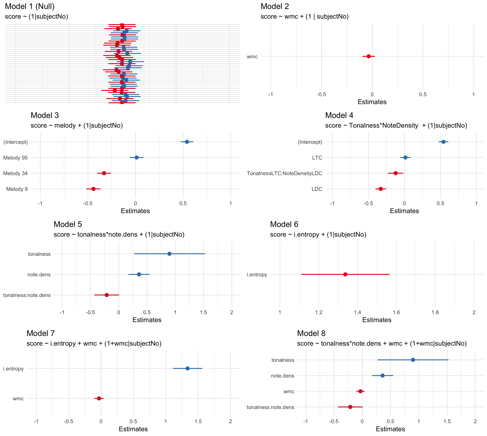

# Experiment

## Rationale 

Using experiments to understand factors that contribute to an individual's ability to remember melodic material are by no means new [@ortmannTonalDeterminantsMelodic1933].
This is not a simple problem as noted in the section [Context, Literature, and Rationale], as both individual differences as well as musical features are difficult to quantify and subsequently model.
Capturing variability at both the individual and item level is not only riddled with measurement problems, but this variability problem is exacerbated when realizing many of the statistical ramifications of measuring so many variables in a single experiment.
Many variables leads to many tests, which leads to inflated type I error rates, as well as massive resources needed in order to detect even small effects. 

Fortunately, dealing with high levels of variability at both the individual and item level is not a problem exclusive to work on melodic dictation.
Work from field of linguistics has developed more sophisticated methodologies that are able to accommodate the above challenges and provide a more elegant way of handling these types of problems [@baayenMixedeffectsModelingCrossed2008].
In this chapter, I synthesize work from the previous chapters of this dissertation in an experiment investigating melodic dictation.
Unlike work in the past literature, I take advantage of statistical methodologies that are able to better accommodate problems in experimental design using paradigms that accommodate for both individual and item level differences.
By using mixed effects modeling, I put forward a more principled way of modeling data that more ecologically reflects melodic dictation. 
I show how it is possible to combine both tests of individual ability and as well as musical features in order to predict performance.
Additionally, I discuss the intricacies associated with scoring and relate these practices back to  the classroom.

## Introduction 

Despite its near ubiquity in Conservatory and School of Music curricula, research surrounding topics concerning aural skills is not well understood. 
This is peculiar since almost any individual seeking to earn a degree in music usually must enroll in multiple aural skills classes that cover a wide array of topics from sight-singing melodies, to melodic and harmonic dictation– all of which are presumed to be fundamental to any musician’s formal training. 
Skills acquired in these classes are meant to hone the musician’s ear and enable them not only to think about music, but to borrow Karpinski’s phrase, to “think in music” [@karpinskiAuralSkillsAcquisition2000, p.4; @bestMusicCurriculaFuture1992]. 
The tacit assumption behind these tasks is that once one learns to think in music, these abilities should transfer to other aspects of the musician’s playing in a deep and profound way. 
The skills that make up an individual’s aural skills encompass many abilities, and are thought to be reflective of some sort of core skill. 
This logic is evident in early attempts to model performance in aural skills classes where @harrisonEffectsMusicalAptitude1994 created a latent variable model to predict an individual’s success in aural skills classes based on musical aptitude, musical experience, motivation, and academic ability. 
While their model was able to predict a large amount of variance (73%), modeling at this high, conceptual level does not provide any sort of specific insights into the mental processes that are required for completing aural skills related tasks. 
This trend can also be seen in more recent research that has explored the relationship between how well entrance exams at the university level are able to predict success later on in the degree program. 

@wolfGradesReflectDevelopment2014 noted multiple confounds in their study attempting to assess ability level in university musicians such as inflated grading, which led to ceiling effects, as well as a broad lack of consistency in how schools are assessing the success of their students. 
But even if the results at the larger level were to be clearer, this again says nothing about the processes that contribute to tasks like melodic dictation.
Rather than taking a bird’s eye view of the subject, this chapter will primarily focus on descriptive factors that might contribute to an individual’s ability dictate a melody.

Melodic dictation is one of the central activities in an aural skills class. 
The activity normally consists of the instructor of the class playing a monophonic melody a limited number of times and the students must use both their _ear_, as well as their understanding of Western Music theory and notation, in order to transcribe the melody without any sort of external reference. 
No definitive method is taught across universities, but many schools of thought exist on the topic and a wealth of resources and materials have been suggested that might help students better complete these tasks [@berkowitzNewApproachSight2011; @clelandDevelopingMusicianshipAural2010; @karpinskiManualEarTraining2007; @ottmanMusicSightSinging2014]
The lack of consistency could be attributed to the fact that there are so many variables at play during this process. 
Prior to listening, the student needs to have an understanding of Western music notation at least to the level of understanding the melody being played. 
This understanding must to be readily accessible, since as new musical information is heard, it is the student’s responsibility, in that moment, to essentially follow the Karpinski model and encode the melody in short term memory or pattern-match to long term memory [@ouraConstructingRepresentationMelody1991a] so that they can identify what they are hearing and transcribe it moments later into Western notation [@karpinskiAuralSkillsAcquisition2000; @karpinskiModelMusicPerception1990].
Regardless, performing some sort of aural skills task requires both long term memory and knowledge for comprehension, as well as the ability to actively manipulate differing degrees of complex musical information in real time while concurrently writing it down. 

Given the complexity of this task, as well as the difficulty in quantifying attributes of melodies, it is not surprising that scant research exists for describing these tasks.
Fortunately, a fair amount of research exists in related literature which can generate theories and hypotheses explaining how individuals dictate melodies. 
Beginning first with factors that are less malleable from person to person would be individual differences in cognitive ability. 
While dictating melodies is something that is learned, a growing body of literature suggests that other factors can explain
unique amounts of variance in performance via differences in cognitive ability. 
For example, @meinzDeliberatePracticeNecessary2010 found that measures of working memory capacity (WMC)
were able to explain variance in an individual’s ability to sight read above and beyond that of sight reading experience and
musical training. 
@colleyWorkingMemoryAuditory2017 recently suggested an individual’s WMC could also help explain differences beyond musical training in tasks related to tapping along to expressive timing in music. 
These issues become more confounded when considering other recent work by @swaminathanRevisitingAssociationMusic2017 that suggests factors such as musical aptitude, when considered in the modeling process, can better explain individual differences in intelligence between musicians and nonmusicians implying that there are selection biases at play within the musical population. 
They claim there is a selection bias that “smarter" people tend to gravitate towards studying music, which may explain some of the differences in memory thought to be caused by music study [@talaminiMusiciansHaveBetter2017]. 
Knowing that these cognitive factors can play a role warrants attention from future researchers on controlling for variables that might contribute to this process, but are not directly intuitive and have not been considered in much of the past
research. 
This is especially important given recent critique of models that purport to measure cognitive ability but are not grounded in an explanatory theoretical model [@kovacsProcessOverlapTheory2016].

### Memory for Melodies

The ability to understand how individuals encode melodies is at the heart of much of the music perception literature.
Largely stemming from the work of Bregman [@bregmanAuditorySceneAnalysis2006], Deutsch and Feroe, [@deutschInternalRepresentationPitch1981], and Dowling's [@bartlettRecognitionTransposedMelodies1980; @dowlingExpectancyAttentionMelody1990; @dowlingPerceptionInterleavedMelodies1973; @dowlingScaleContourTwo1978] work on memory for melodies has suggested that both key and contour information play a central role in the perception and memory of novel melodies. 
Memory for melodies tends to be much worse than memory for other stimuli, such as pictures or faces, noting that the average area under the ROC curve tends to be at about .7 in many of the studies they reviewed, with .5 meaning chance and 1 being a perfect performance [@halpernMemoryMelodies2010]. 
Halpern and Bartlett also note that much of the literature on memory for melodies primarily used same-different experimental paradigms to investigate individuals’  melodic perception ability similar to the paradigm used in [@halpernEffectsTimbreTempo2008].

### Musical Factors

Not nearly as much is known about how an individual learns melodies, especially in dictation settings. 
The last, and possibly most obvious, variable that would contribute to an individual’s ability to learn and dictate a melody would be the amount of previous exposure to the melody and the complexity of the melody itself. 
A fair amount of research from the music education literature examines melodic dictation in a more ecological setting [@buonviriEffectsMusicNotation2015; @buonviriEffectsPreparatorySinging2015; @buonviriEffectsTwoListening2017; @buonviriExplorationUndergraduateMusic2014; @buonviriMelodicDictationInstruction2015; @unsworthAutomatedVersionOperation2005], but most take a descriptive approach to modeling the results using between-subject manipulations.
Some rules of thumb regarding how many times a melody should be played in a dictation setting have been proposed by Karpinski [@karpinskiAuralSkillsAcquisition2000, p.99] that account for chunking as well as the idea that more exposure would lead to more complete encoding.
For example, he suggests using the formula $P = (Ch/L) + 1$ where $P$ is the number of playings, $Ch$ is the number of chunks in the dictation (with chunk defined as a single memorable unit), and $L$ = the limit of a listener's short term memory in terms of chunks, a number between 6 and 10.
This definition requires expert selection of what a chunk is, and does not take into account any of the Experimental factors put forward in the taxonomy presented in this dissertation's [Context, Literature, and Rationale].

Recently, tools have been developed in the field of computational musicology to help with operationalizing the complexity of melodies. 
Both simple and more complex features have been used to model performance in behavioral tasks. 
For example @eerolaPerceivedComplexityWestern2006 found that note density, though not consciously apparent to the participants, predicted judgments of human similarity between melodies not familiar to the participants. 
Both @harrisonModellingMelodicDiscrimination2016 and @bakerPerceptionLeitmotivesRichard2017 used measures of melodic complexity created from data reductive techniques to successfully predict difficulty on melodic memory tasks.

Note density would be an ideal candidate to investigate because it is both easily measured and the amount of information that can be currently held in memory as measured by bits of information has a long history in cognitive psychology [@cowanWorkingMemoryCapacity2005; @millerInformationMemory1956; @pearceStatisticalLearningProbabilistic2018a].
In terms of more complex features, much of this work largely stems from the work of Müllensiefen and his development of the FANTASTIC Toolbox -@mullensiefenFantasticFeatureANalysis2009, and a few papers have claimed to be able to predict various behavioral outcomes based on the structural characteristics of melodies.
For example, [@kopiezAufSucheNach2011] claimed to have been able to predict how well songs from The Beatles’ album _Revolver_ did on popularity charts based on structural characteristic of the melodies using a data driven approach.
Expanding on an earlier study, @mullensiefenRoleFeaturesContext2014 found that the degree of distinctiveness of a melody when compared to its parent corpus could be used to predict how participants in an old/new memory paradigm were able to recognize melodies.
These abstracted features also have been used in various corpus studies [@jakubowskiDissectingEarwormMelodic2017; @janssenPredictingVariationFolk2017; @rainsfordDistinctivenessEffectRecognition2019; @rainsfordMUSOSMUsicSOftware2018]
 that again use data driven approaches in order to explain which of the 38 features that FANTASTIC calculates can predict real-world behavior. 

While helpful and somewhat explanatory, the problem with either data reductive or data driven approaches to this modeling is that they take a post-hoc approach with the assumption that listeners are even able to abstract and perceive these features. 
Doing this does not allow for any sort of controlled approach.
Without experimentally manipulating the parameters, which is then further confounded when using some sort of data reduction technique.
This is understandable seeing as it is very difficult to manipulate certain qualities of a melody without disturbing
other features [@taylorStrategiesMemoryShort1983]. 
For example, if you wanted to decrease the “tonalness” of a melody by adding in a few more chromatic pitches, you inevitably will increase other measures of pitch and interval entropy. 
In order to truly understand if these features are driving changes in behaviour, each needs to be altered in some sort of controlled and systematic way while simultaneously considering differences in training and cognitive ability.

In order to accomplish this, I put forward findings from an experiment modeling performance on melodic dictation tasks using both individual and musical features. 
A pilot study was run (N=11) in order to assess musical confounds that might be present in modeling melodic dictation. 
Results of that pilot study are not reported here. 
Based on the results of this pilot data, a follow up experiment was conducted to better investigate the features in question.

The study sought to answer three main hypotheses:

1. Are all experimental melodies used equally difficult to
dictate?
2. To what extent do the musical features of Note Density
and Tonalness play a role in difficulty of dictation?
3. Do individual factors at the cognitive level play a role
in the melodic dictation process above and beyond musical
factors?

## Methods

### Participants

Forty-three students enrolled at Louisiana State University School of Music completed the study. 
The inclusion criteria in the analysis included reporting no hearing loss, not actively taking medication that would alter cognitive performance, and individuals whose performance on any task performed greater than three standard deviations from the mean score of that task. 
Using these criteria, two participants were dropped for not completing the entire experiment. 
Thus, 41 participants met the criteria for inclusion. 
The eligible participants were between the ages of 17 and 26 (M = 19.81, SD = 1.93; 15 women). 
Participants volunteered, received course credit, or were paid $10.

### Materials 

Four melodies for the dictation were selected from a corpus of N=115 melodies derived from the A New Approach to Sight Singing aural skills textbook [@berkowitzNewApproachSight2011]. 
Melodies were chosen based on their musical features as extracted via the FANTASTIC Toolbox [@mullensiefenFantasticFeatureANalysis2009]. 
After abstracting the full set of features of the melodies, possible melodies were first narrowed down by limiting the corpus to melodies lasting between 9 and 12 seconds and then indexed to select four melodies that were chosen as part of a 2 x 2 repeated measures design including a high and low tonalness and note density condition. 
Melodies, as well as a table of their abstracted features can be seen in \@ref(tab:expfeaturetable) and \@ref(fig:b34), \@ref(fig:b95),\@ref(fig:b112), and \@ref(fig:b9) . 
Melodies and other sounds used were encoded using MuseScore 2 using the standard piano timbre and all set to a tempo of quarter = 120 beats per minute and adjusted accordingly based on time signature to ensure they all were same absolute time duration. 
The experiment was then coded in jsPsych [@deleeuwJsPsychJavaScriptLibrary2015] and played through a browser offline with high quality headphones.

```{r expfeaturetable, echo=FALSE}

Melodies <- c("34","112","9","95")
Tonalness <- c(0.947,0.984,0.710,0.764)
`Note Density` <- c(1.666,3.73,1.75,3.911)
Design <- c("High Tonal, Low Note Density", "High Tonal, High Note Density", "Low Tonal,  Low Note Density", "Low Tonal,  High Note Density") 

featureDT <- data.frame(Melodies, Tonalness, `Note Density`, Design)

knitr::kable(featureDT,booktabs = TRUE, caption = "Melodic Features for Experimental Melodies", digits = 2,
             col.names = c("Melody Number", "Tonalness", "Note Density", "Feature Category"))
```

```{r b34, echo=FALSE, fig.cap="Melody 34",fig.align='center', out.width="100%"}

```

```{r b95, echo=FALSE, fig.cap="Melody 95",fig.align='center', out.width="100%"}
knitr::include_graphics("img/Berkowitz95.png")
```

```{r b112, echo=FALSE, fig.cap="Melody 112",fig.align='center', out.width="100%"}

```

```{r b9, echo=FALSE, fig.cap="Melody 9",fig.align='center', out.width="100%"}
knitr::include_graphics("img/BerkowitzNo9.png")
```


### Procedure 

Upon arrival, participants sat down in a lab at their own personal computer. 
Multiple individuals were tested simultaneously although individually. 
Each participant was given a test packet that contained all information needed for the experiment. 
After obtaining written consent, participants navigated a series of instructions explaining the nature of the experiment and were given an opportunity to adjust the volume to a comfortable level.
The first portion of the experiment that participants completed was the melodic dictation. 
In order to alleviate any anxiety in performance, participants were explicitly told that “unlike dictations performed in class, they were not expected to get perfect scores on their dictations”. 
Each melody was played five times with 20 seconds between hearings and 120 seconds after the last hearing [@paneyEffectDirectingAttention2016].  
After the dictation portion of the experiment, participants completed a small survey on their Aural Skills background, as well as the Bucknell Auditory Imagery Scale C [@halpernDifferencesAuditoryImagery2015]. 
After completing the Aural Skills portion of the experiment, participants completed one block of two different tests of working memory capacity [@unsworthAutomatedVersionOperation2005] and Raven’s Advanced Progressive Matrices, and a Number Series task as two tests of general fluid intelligence (Gf) [@ravenManualRavenProgressive1994; @thurstonePrimaryMentalAbilities1938] resulting in four total scores.

Exact details of the design can be found in Chapter 3.
After completing the cognitive battery, participants finished the experiment by compiling the self-report version of the Goldsmiths Musical Sophistication Index [@mullensiefenMusicalityNonMusiciansIndex2014], the Short Test of Musical Preferences [@rentfrowReMiEveryday2003], as well as questions pertaining to the participant's socio-economic status, and any other information needed to control for such as hearing loss and use of medication that might affect performance. 

### Scoring Melodies

Melodies were scored by counting the amount of notes in the melody and multiplying that number by two. 
Half the points were attributed to rhythmic accuracy and the other
half to pitch accuracy. 
Points were not deducted for notating the melody in the incorrect octave. 
Points for pitch could only be given if the participant correctly notated the rhythm. 
For example, in Melody 34 in Figure \@ref(fig:b34) there were 40 points possible (20 notes * 2).
If a participant was to have put a quarter note on the second beat of the third measure, and have everything else correct, they would have scored a 19/20. 
Only if the correct rhythms of the measures were accurate could pitch points be
awarded. 
In cases where there were more serious errors, for example if the second half of the second bar was not notated, points would have been deducted in both the pitch and rhythm sub-scores. 
Dictations were scored all melodies independently by two raters and then cross referenced for inter rater reliability ($\kappa$ = .96) which suggests a high degree of inter-rater reliability [@kooGuidelineSelectingReporting2016].

##  Results

### Data Screening

Before conducting any analyses, data was screened for quality.
List-wise deletion was used to remove any participants where not all variables were present. 
This process resulted in removing four participants: two did not complete any of the survey materials and two did not have any measures of working memory capacity due to computer error.
After list-wise deletion, thirty-nine participants remained. 

### Modeling

In order to model the data and investigate the  hypotheses, I fit a series of linear mixed effects models using the R programming language [@R-base] and the _lme4_ and _LmerTest_ [@batesFittingLinearMixedEffects2015;@lmerTest] packages to predict scores from the dictation exercise using both individual and musical variables.
Variables are added at each step and tests of significant model improvement are presented in Table \@ref(tab:modeltable).
P-values were obtained by likelihood ratio tests between models.
I report AIC and BIC measures for each model ran. 
Models were ran sequentially moving from a null model to a theoretical, statistical model predicted by variables discussed above. 

After establishing a null model (Model 1, ```null_model```), I then added individual level predictors (```wmc_model``` (Model 2) and ```gf_model```, and ```cognitive_model```) carrying forward only measures of working memory capacity. 
No cognitive variables resulted in a significant increase in model fit.
Next, I modeled musical level features.
Ideally each musical model that I ran would have allowed musical features to have random slopes since presumably individuals would perform differently on each melody.
This was not possible due to the size of the dataset, though future experiments should incorporate this parameter.
The first musical model (Model 3) treated each melody as a categorical fixed effect.
The second musical model (Model 4) used the categorical features as predictors, which included an interaction effect.
The third musical model (Model 5) used the continuous FANTASTIC measures as fixed effects, which included an interaction effect.
In order to investigate claims put forward in the third chapter of this dissertation, I also ran a model (Model 6) using only interval entropy as calculated by FANTASTIC.
Finally, I ran two models that accounted for both musical and individual level predictors.
Model 7 extends Model 6, with the addition of working memory capacity as fixed effect, allowing for random slopes.
Model 8 extends Model 5, with the addition of working memory capacity as a fixed effect, allowing for random slopes. 
I depict the fixed effects for all models in \@ref(fig:megrid).
Tables for each model are presented in Tables \@ref(tab:memodeltable1) through \@ref(tab:memodeltable8).
Distributions for average scores of the melodies are found in Figure \@ref(fig:eboxplot) and density scores of these items are found in Figure \@ref(fig:edistribution).

```{r eboxplot, echo=FALSE, fig.cap="Item Difficulty Distribution",fig.align='center', out.width="100%"}
knitr::include_graphics("img/melody_difficulty.png")
```

```{r edistribution, echo=FALSE, fig.cap="Between Melody Differences",fig.align='center', out.width="100%"}
knitr::include_graphics("img/melody_differences.png")
```

```{r megrid, echo=FALSE, fig.cap="Fixed Effects of Models",fig.align='center', out.width="100%"}

```


```{r memodeltable1, echo=FALSE}
#--------------------------------------------------
me_model_table1 <- readRDS("img/metable1.RDS")

knitr::kable(
  me_model_table1, booktabs = TRUE,
  caption = 'Model 1 | Null Model', digits = 2, linesep = "",
  col.names = c("Predictors","Estimates", "CI", "p")
) %>% kable_styling(full_width = T, latex_options = "hold") 

```

```{r memodeltable2, echo=FALSE}
#--------------------------------------------------
me_model_table2 <- readRDS("img/metable2.RDS")

knitr::kable(
  me_model_table2, booktabs = TRUE,
  caption = 'Model 2 | WMC Model', digits = 2, linesep = "",
  col.names = c("Predictors","Estimates", "CI", "p")
) %>% kable_styling(full_width = T, latex_options = "hold")

```

```{r memodeltable3, echo=FALSE}
#--------------------------------------------------
me_model_table3 <- readRDS("img/metable3.RDS")

knitr::kable(
  me_model_table3, booktabs = TRUE,
  caption = 'Model 3 | Melody Model', digits = 2, linesep = "",
  col.names = c("Predictors","Estimates", "CI", "p")
) %>% kable_styling(full_width = T, latex_options = "hold")

```

```{r memodeltable4, echo=FALSE}
#--------------------------------------------------
me_model_table4 <- readRDS("img/metable4.RDS")

knitr::kable(
  me_model_table2, booktabs = TRUE,
  caption = 'Model 4 | Feature Category Model', digits = 2, linesep = "",
  col.names = c("Predictors","Estimates", "CI", "p")
) %>% kable_styling(full_width = T, latex_options = "hold")

```

```{r memodeltable5, echo=FALSE}
#--------------------------------------------------
me_model_table5 <- readRDS("img/metable5.RDS")

knitr::kable(
  me_model_table5, booktabs = TRUE,
  caption = 'Model 5 | Feature Continuous Model', digits = 2, linesep = "",
  col.names = c("Predictors","Estimates", "CI", "p")
) %>% kable_styling(full_width = T, latex_options = "hold")

```

```{r memodeltable6, echo=FALSE}
#--------------------------------------------------
me_model_table6 <- readRDS("img/metable6.RDS")

knitr::kable(
  me_model_table6, booktabs = TRUE,
  caption = 'Model 6 | Interval Entropy Model', digits = 2, linesep = "",
  col.names = c("Predictors","Estimates", "CI", "p")
) %>% kable_styling(full_width = T, latex_options = "hold")

```

```{r memodeltable7, echo=FALSE}
#--------------------------------------------------
me_model_table7 <- readRDS("img/metable7.RDS")

knitr::kable(
  me_model_table7, booktabs = TRUE,
  caption = 'Model 7 | Inteval Entropy Experimental Model', digits = 2, linesep = "",
  col.names = c("Predictors","Estimates", "CI", "p")
) %>% kable_styling(full_width = T, latex_options = "hold")

```

```{r memodeltable8, echo=FALSE}
#--------------------------------------------------
me_model_table8 <- readRDS("img/metable8.RDS")

knitr::kable(
  me_model_table8, booktabs = TRUE,
  caption = 'Model 8 | Feature Continuous Experimental Model', digits = 2, linesep = "",
  col.names = c("Predictors","Estimates", "CI", "p")
) %>% kable_styling(full_width = T, latex_options = "hold")

```

```{r modeltable, echo=FALSE}
anova_model_table <- readRDS("img/anova_model_table.RDS")

knitr::kable(
  anova_model_table, booktabs = TRUE,
  caption = 'Linear Mixed Effects Model Fits', digits = 2, linesep = ""
) %>%  kable_styling(latex_options = c("scale_down"))

```

## Discussion

In this chapter, I investigated the extent to which both individual differences and abstracted musical features could be used to model results in melodic dictations. 
In order to examine $H1$, I ran a linear mixed effects model in order discern any differences in melody difficulty. 
As noted in Figure \@ref(fig:megrid), both a significant main effect of Tonalness and Note Density was found, as well as a small interaction between the two variables suggesting evidence supporting rejecting $H2$’s null hypothesis.
The interaction emerged from differences in melody means in the low density conditions with the melody with higher tonalness actually scoring higher in terms of number of errors.
Subsequent adding of individual level predictors did result in a better fitting model. 

While I expected to find an interaction, Melody 34 was hypothesized to be the easiest of the four conditions. 
With Melody 9 there was a clear floor effect, which was also to be expected as when I chose the melodies, I had no previous experimental data explicitly looking at melodic dictation to rely on. 
Future experiments should use abstracted features from Melody 9 as a baseline in order to avoid floor effects.

The main effect of note density was expected and exhibited a large effect size. 
While it would be tempting to attribute this finding exactly to the Note Density feature extracted by FANTASTIC, the high and low density conditions could also be operationalized as having compound versus simple meter. 
Given the large effect of note density, I plan on taking more careful steps in the selection of our next melodies in order to control for any effects of meter and keep the effects limited to one meter if at all possible.

Somewhat surprisingly, the analysis incorporating the cognitive measures of covariance did not yield any significant results. 
While other researchers and the third Chapter of this dissertation have noted the importance of baseline cognitive ability [@schellenbergMusicCognitiveAbilities2013], the task specificity of doing melodic dictation as I designed the experiment might not be well suited to capture the variability needed for any effects. 
Hence, this chapter would not be able to reject $H3$’s null hypothesis. 
Considering that other researchers have found constructs like working memory capacity and general fluid intelligence to be important factors of tasks of musical perception, a more refined design might be considered in the future to find any sort of effects.
Taken as a whole, these findings suggest that aural skills pedagogues should consider exploring the extent to which computationally extracted features can guide the difficulty expected of melodic dictation exercises.

## Conclusions

This chapter demonstrated that abstracted musical features such as tonalness and note density can play a role in predicting how well students do in tasks of melodic dictation. 
While the experiment failed to yield any significant differences in cognitive ability predicting success at the task, future research plans should not fail to take these effects into consideration. 
One important caveat in this modeling is that the models reported here are subject to change given other scoring procedures.
There is a high degree of variability in how melodic dictations are scored [@gillespieMelodicDictationScoring2001], and modeling how different scoring procedures lead to differing results should be considered for future research.
Importantly, if a researcher adopted this paradigm for investigating melodic dictation, what is most important is that there is some sort of external reference a single scorer can compare themselves to.
Without having a pre-defined metric, scoring and thus grading will be subjected to the scorer's explicit or implicit biases.
Given all that has been put forward here, the research thus far still does not explain the underlying processes for melodic dictation.
In this chapter, I have put forward two factors that help describe what contributes to this process using a principled experimental framework.

\cleardoublepage
