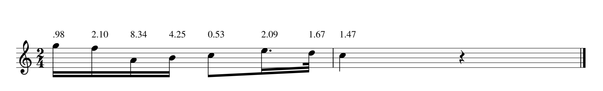
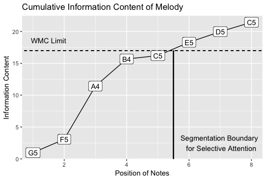
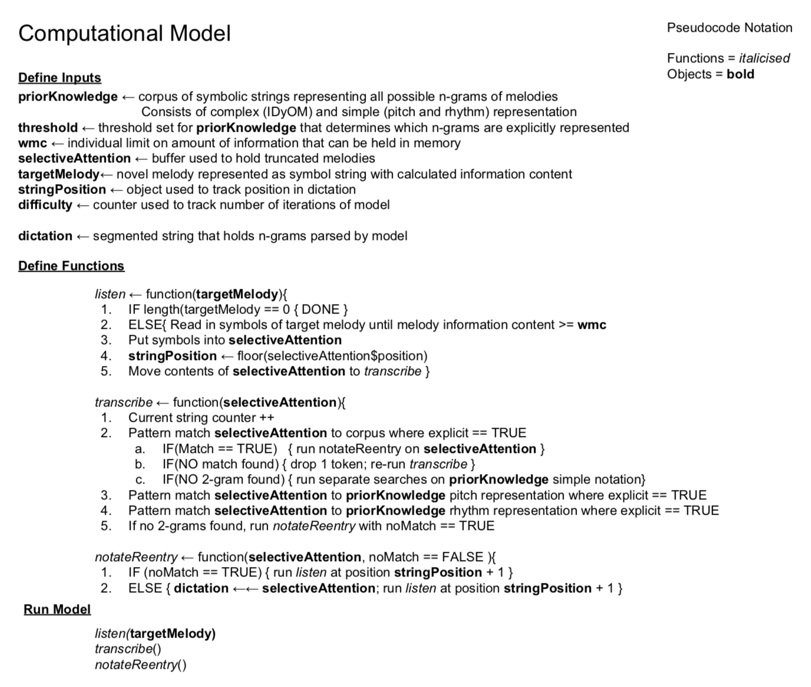
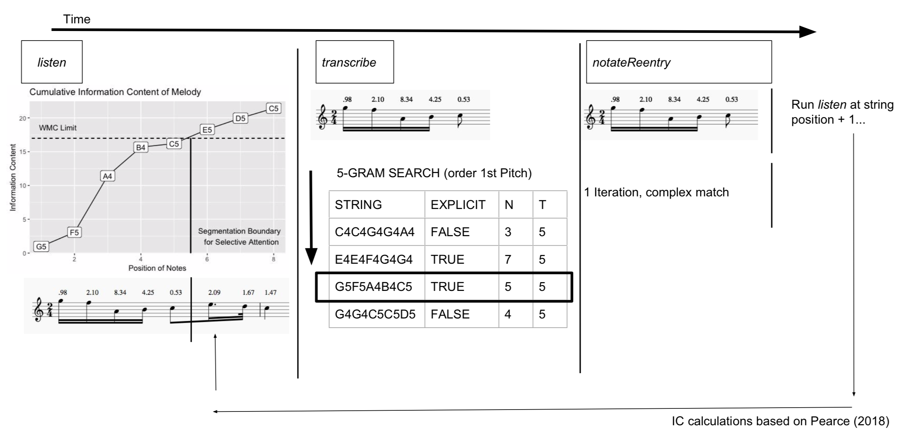

# Computational Model 

## Levels of Abstraction

In his 2007 article _Models of Music Similarity_ [@wigginsModelsMusicalSimilarity2007], Geraint Wiggins distinguishes between _descriptive_ and _explanatory_ models in describing the modeling of human behavior. 
Descriptive models assert what will happen in response to an event.
For example, as discussed in the previous chapter, as the note density of a melody increases and the tonalness of a melody decreases, a melody may become harder to dictate.
While the increase in note density is assumed to drive the decrease in dictation scores, merely stating that there is an established relationship between one variable and the other says nothing about the inner workings of this process.
An explanatory model on the other hand not only describes what will happen, but additionally notes why and how this process occurs.
For example, much of the work musical expectation demonstrates that as an individual's exposure to a musical style increases, so does their ability to predict specific events within a given musical texture [@pearceStatisticalLearningProbabilistic2018a].

Not only does more exposure predict more accurate responses, but many of these models of musical expectation derive their underlying predictive power from the brain's ability to implicitly track statistical regularities in musical perception [@saffranStatisticalLearningTone1999;@margulisRepeatHowMusic2014].
The _how_ derives from the tracking of statistical regularities in musical information and the _why_ derives from evolutionary demands; Organisms that are able to make more accurate predictions about their environment are more likely to survive and pass on their genes [@huronSweetAnticipation2006]. 

Wiggins writes that although there can be both explanatory and descriptive theories, depending on the level of abstraction, a theory may be explanatory at one level, yet descriptive at another.
Using the mind-brain dichotomy, he asserts that the example of a theory of musical expectation could be explanatory at the level of behavior as noted above, but says nothing about what is happening at the neural level.
Both descriptive and explanatory theories are needed: descriptive theories are used to test explanatory theories and by stringing together different layers of abstraction, we can arrive at a better understanding of how the world works.

Returning to melodic dictation, under Wiggins' framework the Karpinski model of melodic dictation [@karpinskiAuralSkillsAcquisition2000; @karpinskiModelMusicPerception1990] qualifies as a descriptive model.
The model says what happens over the time course of a melodic dictation-- specifying four discrete stages discussed in earlier chapters-- but does not explicitly state _how_ or _why_ this process happens. 
In order to have a more complete understanding of melodic dictation, an explanatory model is needed. 

In this chapter I introduce an explanatory model of melodic dictation. 
The model is inspired by work from both computational musicology and cognitive psychology.
From computational musicology I draw on the work of Marcus Pearce's IDyOM [@pearceConstructionEvaluationStatistical2005] and from cognitive psychology I draw from Nelson Cowan's Embedded Process model of working memory [@cowanEvolvingConceptionsMemory1988; @cowanMagicalMysteryFour2010] to explain the perceptual components.
In addition to quantifying each step, the model incorporates flexible parameters that could be adjusted in order to accommodate  individual differences, while still relying on a domain general process.
By relying on cognitive mechanisms based in statistical learning, rather than a rule based system for music analysis [@lerdahlGenerativeTheoryTonal1986; @narmourAnalysisCognitionBasic1990; @narmourAnalysisCognitionMelodic1992; @temperleyCognitionBasicMusical2004] this model allows for the heterogeneity of musical experience among a diversity of music listeners.

## Model Overview 

The model consists of three main modules, each with its own set of parameters:

1. Prior Knowledge
2. Selective Attention
3. Transcription and Re-entry

Inspired by Bayesian computational modeling, the _Prior Knowledge_ module reflects the previous knowledge an individual brings to the melodic dictation.
The _Selective Attention_-- somewhat akin to Karpinski's extractive listening-- segments incoming musical information by using the window of attention as conceptualized as the limits of working memory capacity as a sensory bottleneck to constrict the size of musical chunk that an individual could to transcribe.
Once musical material is in the focus of attention, the _Transcription_ function pattern matches against the _Prior Knowledge's_ corpus of information in order to find a match of explicitly known musical information.
The _Transcription_ function will recursively truncate what musical information is in _Selective Attention_ if no match is found. 
In addition to _Transcription_, there is also a _Re-entry_ function that will restart the entire loop.
This process reflects, but does not actually mirror the exact cognitive process used in melodic dictation, yet seems to be phenomenologically similar to the decision making process used when attempting notate novel melodies.
Based on both the prior knowledge and individual differences of the individual, the model will scale in ability, with the general retrieval mechanisms in place.
The exact details of the assumptions, parameters, and complete formula of the model are discussed below.

## Verbal Model 

Below I describe my model's assumptions, parameters, as well as the steps taken when the model is run.
After detailing the inner workings of each of the assumptions and the modules, described in roughly the order that they occur, I present the model using pseudocode with the terminology described below.
I discuss the issues of assumptions and representations as they arise in describing the model. 

### Model Representational Assumptions

In order to write a computer program that mirrors the melodic dictation process, how the mind perceives and represents about musical information must be defined _a priori_.
Before delving into questions of representation, this model assumes that the musical surface^[As conceptualized as either a Schenkerian foreground [@schenkerFreieSatz1935] or defined by @lerdahlGenerativeTheoryTonal1986] as represented by the notes via Western musical notation are salient and can be perceived as distinct perceptual phenomena.
Although there is work that suggests that different cultures and levels of experience might not categorize melodic information universally [@mcdermottIndifferenceDissonanceNative2016], other work suggests that experiencing pitches as discrete, categorical phenomena is categorized as a statistical human universal [@savageStatisticalUniversalsReveal2015].
For the purposes of this model I assume that individuals do in fact perceive the musical surface similarly to the written score. 

Knowing that it is melodic information or melodic data that needs to be represented, the question then becomes what is the best way in which to represent it.
This issue becomes increasingly complex when considering literature suggesting that the human mind represents musical information in a variety of different forms [@krumhanslCognitiveFoundationsMusical2001; @levitinCurrentAdvancesCognitive2009].

For the purposes of this model and further examples I choose to represent musical information using both the pitch (note and scale degree) and timing (rhythm and inter-onset-interval) representation described in @pearceStatisticalLearningProbabilistic2018a.
Future research comparing this model's output using different representations will also contribute to conversations regarding pedagogy in that if one form of data representation mirrors human behavior better than others, it would provide more than evidence in support of the pedagogy of one system over another. 
How the model represents musical information is the first important parameter value that needs be chosen before running the model and this establishes the _Prior Knowledge_.

### Contents of the Prior Knowledge

The _Prior Knowledge_ consists of a corpus of digitally represented melodies taken to reflect the implicitly understood structural patterns in a musical style that the listener has been exposed to.
The logic of representing an individual's prior knowledge follows the assumptions of both the Statistical Learning Hypothesis (SLH) and the Probabilistic Prediction Hypothesis (PPH), both core theoretical assumptions of the Information Dynamic of Music (IDyOM) model of Marcus Pearce [@pearceConstructionEvaluationStatistical2005; @pearceStatisticalLearningProbabilistic2018a].
Using a corpus of melodies to represent an individual's prior knowledge relies on the Statistical Learning Hypothesis which states:

> musical enculturation is a process of implicit statistical learning in which listeners progressively acquire internal models of the statistical and structural regularities present in the musical styles to which they are exposed, over short (e.g., an individual piece of music) and long time scales (e.g., an entire lifetime of listening). p.2 (Pearce, 2018)

The logic here is that the more an individual is exposed musical material, the more they will implicitly understand it which leads the corroborating probabilistic prediction hypothesis which states: 

> while listening to new music, an enculturated listener applies models learned via the SLH to generate probabilistic predictions that enable them to organize and process their mental representations of the music and generate culturally appropriate responses. p.2 (Pearce, 2018).

Taken together and then quantified using Shannon information content [@shannonMathematicalTheoryCommunication1948], it then becomes possible using the IDyOM framework to have a quantifiable measure that reliably predicts the amount of perceived unexpectedness in a musical melody that can change pending on the musical corpus that the model is trained on.
As a model IDyOM has been successful mirroring human behavior in melodies in various styles [@pearceStatisticalLearningProbabilistic2018a], harmony-- outperforming [@harrisonDissociatingSensoryCognitive2018] sensory models of harmony [@bigandEmpiricalEvidenceMusical2014]--, and is also being developed to handle polyphonic materials [@sauvePredictionPolyphonyModelling2017]. 

Stepping beyond the assumptions of IDyOM, the prior knowledge also needs to have a implicit/explicitly known parameter which indicates whether or not an pattern of music-- or n-gram^[n-grams refer to the amount of musical objects in a string. For example a bi-gram or 2-gram, would be an interval. Tri-grams or 3-grams would consist of two intervals and so on.] pattern-- is explicitly learned.
This threshold can be set relative to the entire distribution of all n-grams in the corpus. 

### Modeling Information Content 

Having established that the models' first parameters to be decided are the representation of strings and the implicit/explicit threshold, the next decision that has to be made is how the model decides segmentation for the second stage of _Selective Attention_.
Although there has been a large amount of work on different ways to segment the musical surface using rule based methods [@lerdahlGenerativeTheoryTonal1986; @margulisModelMelodicExpectation2005; @narmourAnalysisCognitionBasic1990; @narmourAnalysisCognitionMelodic1992], which rely on matching a music theorist's intuition with a set of descriptive rules somewhat like the boundary formation rules put forward in _A Generative Theory of Tonal Music_, as noted by Pearce [@pearceStatisticalLearningProbabilistic2018a], rule based models often fail at when applied to music outside the Western art music canon.
Additionally, since melodic dictation is an active memory process, rather than a semi-passive process of listening, this model needs to be able to quantify musical information on two conditions.
The first is that it must be dependent on prior musical experience.
The second is that it should allow for a movable boundary for selective attention so that musical information that is memory can be actively maintained while carrying out another cognitive process, that of notating the melody. 

In order to create this metric, I rely on IDyOM's use of information content [@shannonMathematicalTheoryCommunication1948] which quantifies the information content of melodies based on corpus of materials.
For example, when trained against a corpus of melodies, this excerpt in Figure 7.1 from the fourth movement of Schubert's _Octet in F Major_ (D.803) lists the information content of the excerpt calculated for each note atop the notation^[The following musical examples is taken from @pearceStatisticalLearningProbabilistic2018a reflects a model where IDyOM was configured to predict pitch with an attribute linking melodic pitch interval and chromatic scale degree (pitch and scale degree) using both the short-term and long-term models, the latter trained on 903 folk songs and chorales (data sets 1, 2, and 9 from table 4.1 in [@schaffrathEssenFolkSong1995] comprising 50,867 notes.]
Appearing in Figure 7.2, I plot the cumulative information content of the melody, along with both an arbitrary threshold for the limits of working memory capacity and where the subsequent segmentation boundary for musical material to be put in the _Selective Attention_ buffer would be.
These values chosen show a small example of how the _Selective Attention_ module works.
The advantage of operationalizing how an individual hears a melody like this is that melodies with lower information content, derived from an understanding of having more predictable patterns from the corpus, will allow for larger chunks to be put inside of the selective attention buffer. 
Additionally, individuals with higher working memory capacity would be able to take in more musical information.

```{r, echo=FALSE, fig.cap="Cadential Excerpt from Schubert's Octet in F Major",fig.align='center', out.width="100%"}

```

```{r, echo=FALSE, fig.cap="Cumulative Information in Schubert Octet Excerpt",fig.align='center', out.width="75%"}

```

It is important to highlight that the notes above the melody here are dependent on what is current in the _Prior Knowledge_ module.
A corpus of _Prior Knowledge_ with less melodies would lead to higher information content measures for each set of notes, while a prior knowledge that has extensive tracking of the patterns would lead to lower information content. 
This increase in predictive accuracy mathematically reflects the intuition that those with more listening experience can process greater chunks of musical information. 

### Setting Limits with Transcribe

With each note then quantified with a measure of information content, it then becomes possible to set a limit on the maximum amount of information that the individual would be able to hold in memory as defined by the _Selective Attention_ module.
A higher threshold would allow for more musical material to be put in the attentional buffer, and a lower threshold would restrict the amount of information held in an attentional buffer.
By putting a threshold on this value, this serves as something akin to a perceptual bottleneck based on the assumption that there is a capacity limit to that of working memory [@cowanEvolvingConceptionsMemory1988; @cowanMagicalMysteryFour2010].
Modulating this boundary will help provide insights into the degree to which melodic material can be retained between high and low working memory span individuals.

In practice, notes would enter the attentional buffer until the information content from the melody is equal to the memory threshold.
At this point, the notes that are in the attentional buffer are segmented and will be actively maintained in the _Selective Attention_ buffer.
In theory, the maximum of the attentional buffer should not be reached since the individual performing the dictation would still need mental resources and attention to actively manipulate the information in the attentional buffer for the process of notating.

### Pattern Matching

With subset of notes of the melody represented in the attentional buffer, whether or not the melody becomes notated depends on whether or not the melody or string in the buffer can be matched with a string that is explicitly known in the corpus.
Mirroring a search pattern akin to Cowan's Embedded Process model [@cowanEvolvingConceptionsMemory1988; @cowanMagicalMysteryFour2010], the individual would search across their long term memory, or _Prior Knowledge_ for anything close to or resembling the pattern in the _Selective Attention_ buffer.
Cowan's model differs from other more module based models of working memory like those of @baddeleyWorkingMemory1974 by positing that working memory should be conceptualized as a small window of conscious attention.
As an individual directs their attention to concepts represented in their long term memory, they can only spotlight a finite amount of information where categorical information regarding what is in the window of attention not far from retrieval.
An example of this bottle necking is given after a formal statement of the model. 
Using this logic, longer pattern strings n-grams would be less likely to be recalled exactly since they occur less frequently in the prior knowledge.

When searching for a pattern match, the _Transcription_ module is at work.
If a pattern match that has been moved to _Selective Attention_ is immediately found, the contents of _Selective Attention_ would be considered to be notated.
The model would register that a loop had taken place and document the n-gram match.
Of course, finding an immediate pattern match each time is highly unlikely and the model needs to be able to compensate if that happens.

If a pattern is not found in the initial search that is _explicitly_ known, one token of the n-gram would be dropped off the string and the search would happen again.
This recursive search would happen until an explicit long term memory match is made.
Like humans taking melodic dictation, the computer would have the best luck finding patterns that fall within the largest density of a corpus of intervals distribution.
Additionally, like students performing a dictation, if a student does not explicitly know an interval, or a 2-gram, the dictation would not be able to be completed. 
If this happens, both the model and student would have to move on to the next segment via the _Re-entry_ function.

Eventually there would be a successful explicit match of a string in the _Transcription_ module and that section of the melody would be considered to be dictated.
The model here would register that one iteration of the function has been run and the chunk transcribed would then be recorded.
After recording this history, the process would happen again starting at either the next note from where the model left off, the note in the entire string with the lowest information content, or n-gram left in the melody with that is most represented in the corpus.
This parameter is defined before the model is run and the question of dictation re-entry certainly warrants further research and investigation. 

This type of pattern search is also dependent on the way that the _Prior Knowledge_ is represented.
In the example here, both pitch and rhythmic information are represented in the string.
Since there is probably a very low likelihood of finding an exact match for every n-gram with both pitch and rhythm, this pattern search can happen again with both rhythms and pitch information queried separately.
If not found, exact pitch-temporal matches are found and the search is run again on either the pitch or rhythmic information separately; this would be computationally akin to Karpinski's proto-notation that he suggests students use in learning how to take melodic dictation [@karpinskiAuralSkillsAcquisition2000, p.88].
This feature of the model would predict that more efficient dictations would happen when pitch and interval information is dictated simultaneously.
Running the model prioritizing the secondary search with either pitch or rhythmic information will provide new insights into practical applications of dictation strategies. 
Using this separate search feature as an option of the model seems to match with the intuitions strategies that someone dictating a melody might use.

### Dictation Re-Entry

Upon the successful pattern match of a string, the _Selective Attention_ and _Transcription_ module would need too then be run again.
This process is done via the _Re-entry_ function. 
As noted above, re-entry in the melody could be a highly subjective point of discussion.
The model could either re-enter at the last note where the function successfully left off, the note in the melody with the lowest information content, the n-gram most salient in the corpus, or theoretically any other type of way that could be computationally implemented.
Entering at the last note not transcribed is logical from a computational standpoint, but this linear approach seems to be at odds with anecdotal experience.
Entering at the note with the lowest information content seems to provide a intuitive point of re-entry in that it would then be easier to transcribe.
Entering at the most represented n-gram seems to match the most with intuition in that people would want to tackle the easier tasks first, but this rests on the assumption that humans are able to reliably detect the sections of a melody that are easiest to transcribe based on implicitly learned statistical patterns.
For example, some people might instead choose to go to the end of a melody after successful transcription of the start of the melody.
This might be because this part of the melody is most active in memory due to a recency effect, or it could be that that cadential gestures are more common in being represented in the prior knowledge.

### Completion 

Given the recursive nature of this process, if all 2-grams are explicitly represented in the _Prior Knowledge_ then the target melody should be transcribed.
If only represented using such a small chunk, the model will have to loop over the melody many times, thus indicating that the transcriber had a high degree of difficulty dictating the melody.
If there is a gap in explicit knowledge in the prior knowledge, only patches of the melody will be recorded and the melody will not be recorded in its entirety.
An easier transcription will result in less iterations of the model with larger chunks.
Though the current instantiation of the model does not incorporate how multiple hearings might change how a melody is dictated, one could constrain the process to only allow a certain number of iterations to reflect this.
Of course as a new melody is learned it is slowly being introduced into long term memory and could be completely be capable of being represented in long term memory without being explicitly notated at the end of a dictation with time running out and thus not possible to be completed.
This of course then would be imposing some sort of experimental constraint on the process and since this is meant to be a cognitive computational model of melodic dictation this caveat would complicate the model.
Future research could be done to optimize the choices that the model makes in order to satisfy whatever constraints are imposed and could be an interesting avenue of future research, but are beyond the initial goals of the model.

### Model Output

The model then outputs each n-gram transcribed and can be counted as a series with less attempts mapping to an easier transcription. 
I believe that this lines with many intuitions about the process of melodic dictation.
It first creates a linear mapping of attempts to dictate with difficulty of the melody.
It relies on a distinction between explicit and implicit statistical knowledge.
It is based on the Embedded Process Model from working memory and attention, so is part of a larger generative model, giving more credibility that this _could_ be how melodic dictation works. 

## Formal Model 

Below I present the computational model in pseudocode as described in Figure 7.3.
First listed are the defined inputs, the functions needed to run the algorithm, and then the sequence the model runs.
To aid distinguishing between functions and objects, I put functions in italics and objects in bold.
Below the model in Figure 7.4, I provide a brief walk through of one iteration of the model.

### Computational Model 

```{r, echo=FALSE, fig.cap="Formal Model",fig.align='center', out.width="100%"}

```

### Example

```{r, echo=FALSE, fig.cap="Model Example",fig.align='center', out.width="100%"}

```

The example above shows one iteration of the model run using the musical example from above using a hypothetical corpus for the pattern matching.
Using the model above, the following inputs were defined _a priori_:

* The **Prior Knowledge** is a hypothetical corpus of symbolic strings representing all n-grams of melodies
* The **Threshold** is set to **five** exact matches in the **Prior Knowledge**
* The **WMC** is set at 17 
* The **Target Melody** is the Schubert excerpt from above
* The **String Position** object is used to track the position in the dictation
* The **Difficulty** object starts at 0
* The **Dictation** object is ```NULL``` to begin, and each new n-gram successfully transcribed is annexed to it

Figure 7.4 progresses from left to right over the course of time.
The algorithm begins by first running the ```listen()``` function on the **Target Melody**.
First the model checks that there are notes to transcribe; this being the first loop of the model, this is statement will be ```FALSE``` so the next step is taken.
Notes of the **Target Melody** are read in to the **Selective Attention** buffer until the information content of the melody exceeds that of the working memory threshold.
This is depicted graphically in the leftmost panel of Figure 7.4.
Each note unfolding over time fills up the **Selective Attention** working memory buffer.
When the amount of information reaches the perceptual bottleneck-- as indicated by the dashed line-- the **Selective Attention** buffer stops receiving information.
At this point the model will mark where in the melody it stopped taking in new information for later.
Here the contents in **Selective Attention** are moved to the ```transcribe()``` function.

With the contents of **Selective Attention** passed to ```transcribe()```, the model adds one to the counter indicating the first search is about to run.
Moving to the middle panel of Figure 7.4, the symbol string of notes in the first column are indexed against the **Prior Knowledge**.
Only if a five note pattern has appeared more than or equal to  five times, as determined by the **Threshold** input, will the corresponding ```EXPLICIT``` column be ```TRUE```.
In this case, this pattern has occurred over the threshold of 5 and thus a successful match is found.
It is at this step that the search resembles that of Cowan's model of working memory as active attention.
The pattern being searched for is compared against a vast amount of information, with cues from the contents of what is in **Selective Attention** grouping similar patterns together.
At the neural level, this is most likely a much more complex process, but to show this grouping I note that this search is at least organized by the first pitch.
I assume it would be reasonable that patterns starting on G as $\hat{5}$^[As determined by being calculated against the corpus with both pitch and scale degree information] might happen together.
Since this string does have a ```TRUE``` match with ```EXPLICIT```, the contents of **Selective Attention** are considered notated.
At this point the model would record the 5-gram, along with the string that it was matched with.
the function would then re-run the ```listen``` function via the ```notateReentry()``` function at the next point in the melody as tracked by the **String Position** object.

If there were not to have been an exact match, the model would remove one token from the melody and performed the search again on the knowledge of all 4-grams and add one to the **Difficulty** counter.
This process would happen recursively until a match is found.
If no match is found in either the complex representation, or that of the two rhythm and pitch corpora, the fifth step of ```transcribe()``` would trigger ```notateReentry()``` to be run without documenting the n-gram currently being dictated.
This would be akin to a student not being able to identify a difficult interval, thus having to restart the melody at a new position.
Decisions about re-entry warrant further research and discussion, but this model for the sake of parsimony, assumes linear continuation. 
As notated in §7.3.5, other modes of re-entry could be incorporated into the model. 

This looping process would occur again and again until the entire melody is notated.
With each iteration of each n-gram notated, the difficulty counter would increase in relation to the representation of that string in the corpus. 
This provides an algorithmic implementation of a theorist's intuition that less common n-grams or intervals (2-grams) are going to lead to higher difficulty in dictation.
Also worth noting is steps 3 and 4 in the ```transcribe()``` function are akin to Karpinski's proto-notation.
Further research might consider advantages in the order of searching the **Prior Knowledge** corpora. 

## Conclusions

In this chapter, I presented an explanatory, computational model of melodic dictation.
The model combines work from computational musicology and work from cognitive psychology.
In addition to being a complete model that explicates every step of the dictation process, the model seems to match phenomenological intuitions as to the process of melodic dictation.
Given the current state of the model, it makes predictions about the dictation process and can eventually be implemented and tested against human behavioral data to provide evidence in support of its verisimilitude.
For example, the model predicts: 

* Segments of melodies are likely successfully to be dictated relative to the frequency distribution of their prior knowledge. 
* Higher working memory span individuals will be able to dictate bigger chunks of melodies, and thus perform better at dictation
* Using an _atomistic_ dictation will result not as effective dictations than attempting to identify larger patterns
* Determining the difficulty of melodies of equal length is predictable from the frequency the melody's cumulative n-gram distribution.
* Some _atonal_ melodies will be easier to dictate than tonal melodies if they consist of patterns that are more frequent in a listener's prior knowledge
* Higher exposure to sight-singing results in more explicitly learned patterns, thus the ability to identify larger patterns of music

Although many of these hypotheses might seem intuitive to any instructor that has taught aural skills before, work from this dissertation provides a theory as to why each appears to be true.
Future research beyond this dissertation will explore further predictions of this work in more detail. 
Most importantly from a pedagogical standpoint, the model and underlying theory gives exact language as to how and why melodic dictation works, which can serve as a valuable pedagogical and research contribution. 


